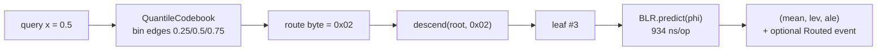
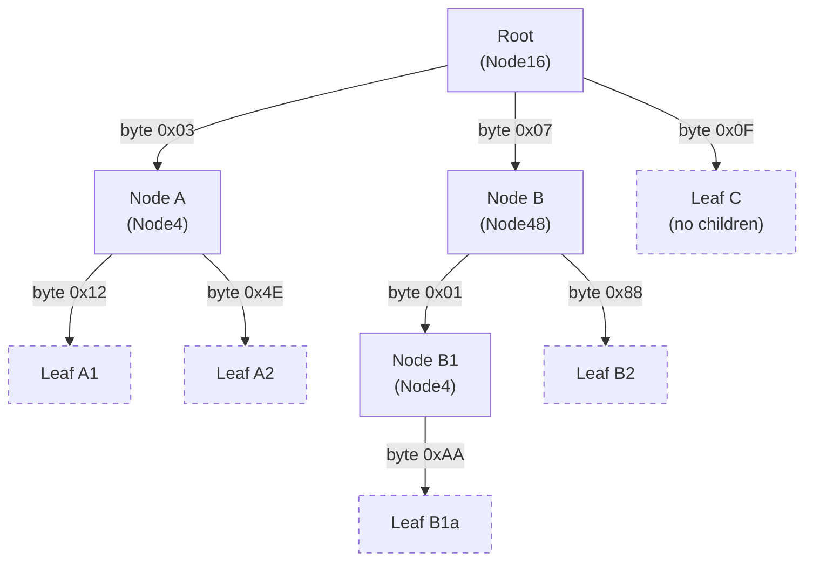
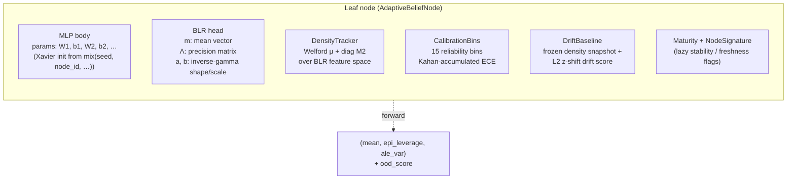
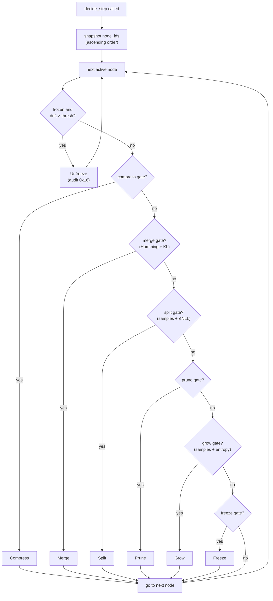
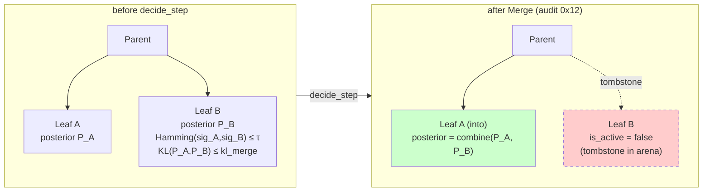
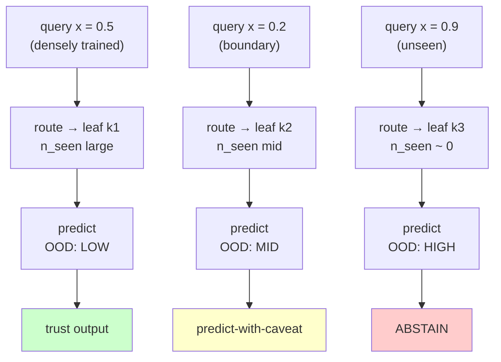

<div class="reading-time">&#128337; ~35 min read</div>

::: {.callout-tip appearance="minimal"}
## TL;DR
ABNG (Adaptive Belief Network Graph) is an experimental architecture that treats Bayesian belief as an *architectural primitive*, not a bolt-on. Each node in an adaptive tree carries its own Bayesian Linear Regression posterior, routing is a traceable walk through learned bytes, and the graph itself adapts to evidence via six structural actions (Grow / Split / Merge / Prune / Compress / Freeze). This article covers *what* the architecture is and *why* the design choices fit together. The follow-up articles cover the determinism story (Part 2) and the empirical evidence (Part 3).
:::

::: {.callout-warning}
## Two prototype disclaimers up front
**ABNG is a research-stage prototype**, not a product. It has unit tests, property tests, fuzz coverage, a working CLI, and zero published benchmarks. It is also built on top of **CJC-Lang**, a research compiler that is itself still pre-1.0 — twenty-one Rust crates, roughly 96K lines of code, an actively evolving language definition. Anything ABNG inherits from the substrate inherits the substrate's caveats. This piece is a design exploration meant for scrutiny, not a launch.
:::

::: {.callout-note}
## This is Part 1 of a three-part series
- **Part 1 (this article):** the architecture itself.
- **Part 2 ([Deterministic and Auditable Neural Systems](../abng-deterministic-systems/index.qmd)):** the SHA-256 audit chain, replay semantics, and the determinism contract.
- **Part 3 ([Benchmarking Experimental Bayesian Graph Networks](../abng-benchmarks/index.qmd)):** the demo catalog, scaling benchmarks, and honest limitations.

Each part stands alone. Read in order for the full picture; read just Part 1 if you only care about the architectural shape; read Part 3 if you want the empirical evidence first.
:::

## Where the cracks show

There's a recurring discomfort with most modern neural networks: they are confidently wrong without telling you, their decisions are hard to audit after the fact, and their compute graphs are fixed at design time even when the data isn't. We have partial fixes for each — Bayesian layers, attention visualizations, mixture-of-experts, conformal wrappers — but they tend to be bolted onto architectures that did not begin with these properties in mind.

This article describes **ABNG (Adaptive Belief Network Graph)**, an experimental architecture that tries the opposite: design *from* those constraints — posterior belief at every node, traceable routing, structural adaptation — and see what falls out.

If you came looking for a "transformer killer," this isn't that. It's a sketch of a different shape of computation, with all the unfinished edges that implies.

Modern architectures produce accurate point estimates, but they share a small set of recurring discomforts.

**Epistemic opacity.** A model returns a number, and you have no principled way to know whether it is confident, guessing, or extrapolating beyond the data it saw at training time. Calibrated uncertainty exists as a layer you bolt on — temperature scaling, MC dropout, deep ensembles, conformal prediction — not as a property of the architecture itself.

**Structural rigidity.** Once you fix a transformer's depth, width, and head count, the compute graph is set. Mixture-of-Experts adds conditional routing, but the expert population is still fixed. The model does not grow, prune, or specialize in response to evidence; the engineer does, by retraining.

**Auditability and reproducibility tax.** When a model trained over months produces a strange output, the lineage of that decision is essentially unrecoverable. And two "identical" training runs produce two different artifacts. Tolerable for research; painful for any system that must be replayed, audited, or proven correct. *These two cracks are covered in depth in Part 2 — this article focuses on the architectural shape.*

None of these are catastrophic alone. Together, they constrain where you can use modern ML responsibly, and they have driven a small zoo of partial fixes: Bayesian neural networks, probabilistic graphical models, neural state-space models, liquid networks, conformal prediction, active inference. Each addresses one or two pieces of the problem.

ABNG is an attempt to take a coherent run at several of them at once, by treating *the model itself as an evolving belief state*.

## Belief states, used precisely

"Belief state" gets used loosely in ML. The term appears in at least four incompatible senses across the literature: the posterior over latent variables in a probabilistic graphical model, a sufficient statistic for prediction in control theory, a state estimator in a POMDP, and the Bayesian posterior of a model conditional on data. The shared word across these senses is genuinely misleading.

ABNG uses the fourth sense — specifically, the Bayesian posterior of a Bayesian Linear Regression head at each routed leaf. Each node in an adaptive graph carries a small per-node MLP that produces features, with a **Bayesian Linear Regression (BLR) head** on top — a Normal-Inverse-Gamma posterior over (weights, noise variance) that is updated in closed form as data arrives, with no variational machinery required. Routing uses the same `Node4` / `Node16` / `Node48` / `Node256` child layout as Adaptive Radix Trees (Leis, Kemper & Neumann, 2013), holding belief-graph children indexed by quantile-encoded feature bytes rather than database keys.

As observations flow through the graph:

- **Routing** is a traceable walk through learned bytes, not an opaque attention pattern.
- **Each leaf** separately reports *epistemic* uncertainty (the model's uncertainty about its own parameters, from the BLR posterior) and *aleatoric* uncertainty (irreducible noise in the data, from the inverse-gamma component).
- **The graph itself** can grow, split, merge, prune, compress, or freeze nodes — each action a deterministic function of per-node statistics under an installed `DecisionPolicy`.

The "deterministic function" property has two important consequences that get developed throughout the article: the same observations always produce the same structural decisions, and every state change can be appended to a verifiable log. The log mechanism itself — SHA-256 hash-chained audit events, byte-identical replay — is the centrepiece of Part 2; this article focuses on what the architecture *does* and treats the audit chain as a black-box "every action is recorded" property.

## A guided tour: one observation flows through the graph

Before diving into mechanism details, here's what happens end-to-end when ABNG processes a single query `x = 0.5` on a trained 4-leaf graph:

**Routing.** A 1-D `QuantileCodebook` (bin edges at `0.25 / 0.5 / 0.75`) bucketizes `0.5` into byte `0x02`. The trie root has 4 bound children at bytes `0x00..0x03`; `descend` walks one step and returns leaf #3.

**Per-leaf forward pass.** Leaf #3 has its own MLP (initialized deterministically from `mix(seed, node_id, layer_idx, kind_bit)` via SplitMix64) that produces feature vector `φ` from `x`. Its BLR head then computes:

- `mean = mᵀφ` (point estimate)
- `epistemic_leverage = φᵀΛ⁻¹φ` (dimensionless ≥ 0)
- `aleatoric_var = b/(a−1)` (units of y², requires a > 1)

**Output.** A `(mean, lev, ale)` triple. On the benchmark hardware (Intel i7-11390H @ 3.40 GHz, Windows MSVC release build), `blr_predict` returns in **934 nanoseconds per call** — the Cholesky triangular solve dominates.

**Audit (optional).** If `Routed` events are enabled, one event with body `(leaf_id=3, matched_prefix=1)` is appended — 41 bytes including the SHA-256 chain advance. Off by default to avoid log explosion under heavy inference.



That's the entire inference path. Sub-microsecond, traceable, optionally auditable. The rest of the article unpacks each piece.

## The architectural neighbourhood

Before getting into ABNG's specifics, it helps to know the neighbourhood. The architectures below are the ones whose ideas ABNG either borrows from, competes with, or is most likely to be confused with.

### Transformers

**Core idea.** Compute a weighted combination of every token against every other token via dot-product attention, repeated across many layers. Parameter-heavy, embarrassingly parallel, structurally identical across an entire training run.

**Strengths.** Best-in-class on language, vision, code. Massively parallel. Empirically scales smoothly with parameters and data.

**Weaknesses.** Attention is `O(n²)` in sequence length. Attention maps are increasingly understood to be unreliable as faithful explanations of model behaviour. No built-in uncertainty. Fixed compute graph.

### State-Space Models (Mamba, S4, S5)

**Core idea.** Replace attention with a discretized linear (or input-conditioned) state-space recurrence that compresses a sequence into a fixed-size hidden state. The Mamba family added *selective* state, where transition matrices depend on the input, recovering much of attention's expressivity at linear cost.

**Strengths.** Linear scaling in sequence length. Fast inference, especially streaming. Hidden state is bounded.

**Weaknesses.** Less proven on knowledge-heavy benchmarks. Structured state imposes assumptions that may or may not fit the task.

### Graph Neural Networks (GNNs)

**Core idea.** Pass messages along the edges of an explicit graph; each node aggregates messages from its neighbours. Topology is given as input, not learned.

**Strengths.** Encodes relational structure natively. Strong on molecules, citation networks, traffic, knowledge graphs.

**Weaknesses.** Over-smoothing with depth. Expressivity is bounded by Weisfeiler-Lehman tests in vanilla forms. Topology is fixed per input.

### Bayesian Neural Networks (BNNs)

**Core idea.** Replace point-estimate weights with full posterior distributions, typically approximated by variational families, MCMC samples, or deep ensembles.

**Strengths.** Principled uncertainty by construction. Integration with decision theory is clean.

**Weaknesses.** Variational posteriors are usually mean-field Gaussian, a known poor match for actual posterior geometry. MCMC doesn't scale to deep networks. Ensembles are expensive.

### Liquid Neural Networks

**Core idea.** Continuous-time dynamics — each neuron's state evolves according to an ODE whose parameters depend on inputs. Very small parameter counts.

**Strengths.** Compact. Strong on small robotics and time-series tasks (Hasani et al.'s famous "19-neuron lane-keeping" result).

**Weaknesses.** Scaling to large modern workloads is unproven. Training stability for stiff dynamics is a known headache.

### Neural Operators (FNO, DeepONet)

**Core idea.** Learn mappings between *function spaces* rather than between finite-dimensional vectors.

**Strengths.** Discretization-invariant. Strong on PDE surrogates, inverse problems, climate modelling.

**Weaknesses.** Specialized to operator-learning tasks. Spectral methods have known issues at sharp discontinuities.

### Comparison table

| Family | Core mechanism | Native uncertainty | Structural adaptation | Best at |
|---|---|---|---|---|
| **Transformer** | Dense attention | No | No | Language, vision, code |
| **State-Space Model** | Linear/selective recurrence | No | No | Long sequences |
| **Graph Neural Network** | Message passing | No (Bayesian variants exist) | No (topology is input) | Relational data |
| **Bayesian Neural Network** | Weight posteriors | **Yes (defining)** | No | Small, uncertainty-critical tasks |
| **Liquid Neural Network** | Continuous-time ODE state | No | No | Compact controllers |
| **Neural Operator** | Function-space mapping | No | No | PDE surrogates |
| **ABNG (this article)** | Routed per-node Bayesian heads on an adaptive tree | **Yes (per-node BLR posterior)** | **Yes (Grow/Split/Merge/Prune/Compress/Freeze)** | *Hypothesis: scientific & safety-critical ML; empirically unverified* |

The last column for ABNG is, deliberately, a hypothesis — not a result. The rest of the table reflects what each family actually demonstrates in the literature today.

## Routing and the adaptive tree

The first job is to turn a real-valued input into a deterministic walk through the graph.

ABNG installs a **`QuantileCodebook`** once, before any node is added. For each input dimension `d`, the codebook holds a sorted list of bin boundaries — empirically chosen quantiles of that dimension over a calibration set. At inference time, each feature value is bucketized into one of `n_bins ∈ {2, 4, 8, 16, 32, 64, 128, 256}` bins, producing a single byte per dimension. The result is a fixed-length *route key* — a sequence of bytes derived deterministically from the input.

Why a discrete byte route instead of a learned soft router? Two reasons. First, it makes the routing path *traceable*: you can write the exact byte sequence into an audit event and replay the descent later. Second, the byte representation aligns naturally with the Adaptive Radix Tree (ART) children layout that ABNG uses for its graph topology.

The graph itself is a tree. Each node carries an `AdaptiveChildren` payload that takes one of five forms — `None`, `Node4`, `Node16`, `Node48`, `Node256` — and **auto-promotes** to the next size when full. This is mechanically identical to ART's well-known children layout; ABNG borrows the structure and replaces the database-key payload with belief-graph children indexed by route-key bytes.



Descent is a one-pass loop:

```python
def descend(graph, route_key):
    node = graph.root
    matched_prefix = []
    for byte in route_key:
        child = node.children.get(byte)
        if child is None:
            break  # longest-prefix match; stop here
        matched_prefix.append(byte)
        node = child
    return RouteEvidence(leaf=node, matched_prefix=matched_prefix)
```

If the route key runs out of bound children before reaching a configured depth, descent stops at the deepest matching node — *longest prefix wins*.

**The tradeoff this routing scheme makes**: discrete bins introduce discontinuities at codebook bin edges. Two inputs `x = 0.499` and `x = 0.501` may route to different leaves and produce arbitrarily different outputs. This is a *fundamental* property of any architecture that uses discrete routing, not a fixable bug. ABNG accepts it in exchange for traceability and replay. The smoothness story for ABNG is "piecewise within a leaf, discontinuous at boundaries"; the smoothness story for soft routers (MoE, attention) is "smooth everywhere but unverifiable."

## Per-leaf Bayesian heads (NIG conjugacy)

A leaf node carries five distinct pieces of state, and it is worth seeing them laid out before discussing how they're used:



**The MLP body.** Each leaf has its own small MLP, deterministically initialized. Weights are sampled from a Xavier-uniform distribution whose seed is derived as `mix(graph.seed, node_id, layer_idx, kind_bit)` using SplitMix64. Biases start at zero. The MLP feeds into the BLR head; you can think of it as a *learned feature extractor specialized to this leaf's slice of input space*.

**The BLR head.** Where the Bayesian machinery actually lives. ABNG uses the Normal-Inverse-Gamma conjugate model for Gaussian-noise linear regression: the prior over weights is `N(m, σ²Λ⁻¹)` and the prior over noise variance is `IG(a, b)`. Given a new data point `(φ, y)` — where `φ` is the MLP feature vector — the update is closed-form:

$$
\Lambda_{\text{new}} = \Lambda + \phi\phi^\top, \quad
m_{\text{new}} = \Lambda_{\text{new}}^{-1}(\Lambda m + \phi y),
$$

$$
a_{\text{new}} = a + \tfrac{1}{2}, \quad
b_{\text{new}} = b + \tfrac{1}{2}\!\left(y^2 + m^\top \Lambda m - m_{\text{new}}^\top \Lambda_{\text{new}} m_{\text{new}}\right).
$$

This is textbook conjugate Bayesian linear regression (Bishop 2006 §3.3; Murphy 2012 §7.6) — *established research*, no novelty claim. The interesting bit is that ABNG implements it in determinism-preserving Rust: hand-rolled Cholesky and triangular-solve (~30 LOC, Kahan-compensated, no FMA), `BLR.state_hash()` exposed for audit verification, and a `feature_version_hash` stamped at init so a stale-feature update is rejected with a typed error instead of silently corrupting the posterior.

::: {.callout-tip appearance="minimal"}
## Worked example: a single leaf's posterior tightens over 10 observations
Suppose a leaf starts at its NIG prior `(m₀, Λ₀, a₀, b₀)` and receives 10 training pairs `(φ₁, y₁), …, (φ₁₀, y₁₀)` sequentially. Each observation triggers one closed-form NIG update. After step `k`, the posterior tuple is:

$$\Lambda_k = \Lambda_0 + \sum_{i=1}^{k} \phi_i \phi_i^\top, \quad a_k = a_0 + \tfrac{k}{2}, \quad b_k \uparrow \text{ monotonically}.$$

Epistemic leverage `φᵀΛ⁻¹φ` is monotone *decreasing* at the same probe point as `k` grows — verified empirically by `tests/test_abng_tabular_gp.rs::tabular_uncertainty_shrinks_with_more_data`, which asserts `lev_at_64_obs < lev_at_16_obs`.

Per the benchmark: `blr_state_update_direct` (just the NIG math) costs **3,845 ns per step**; the graph-level `blr_update` (with audit-chain overhead) costs **28,997 ns**. That ~7.5× ratio — 87% of the per-step cost is the determinism premium, not the Bayesian math — is one of the most striking measurements in the codebase. *Part 2 returns to this number.*
:::

**Predictions** from the BLR return three numbers:

```python
def blr_predict(blr, phi):
    mean = blr.m @ phi
    # solve Λ x = φ once, reuse for leverage and predictive variance
    x = cholesky_solve(blr.L, phi)
    epistemic_leverage = phi @ x          # dimensionless ≥ 0
    aleatoric_var = blr.b / (blr.a - 1.0) # ≥ 0; aleatoric noise scale (a > 1)
    return mean, epistemic_leverage, aleatoric_var
```

These three numbers fully characterize the predictive distribution. Integrating out the noise variance gives a **Student-t** with `2a` degrees of freedom, location `mᵀφ`, and scale `(b/a)(1 + φᵀΛ⁻¹φ)`. In the asymptotic `a → ∞` regime that approaches a Gaussian with variance `aleatoric_var · (1 + epistemic_leverage)`.

The middle return value is *deliberately* a dimensionless leverage, not a variance, because mixing units silently is one of the easiest probabilistic mistakes to make.

**Density tracker, calibration bins, drift baseline.** These three structures don't enter the forward path directly; they accumulate evidence that drives the structural-decision policy in the next section.

- The **density tracker** maintains a running diagonal-Gaussian estimate over the leaf's feature space. Mahalanobis distance from this distribution is the *density score* — high values mean "this input is unusual for this leaf."
- The **calibration bins** are a 15-bin reliability diagram, with Expected Calibration Error (ECE) accumulated via Kahan compensation. A node whose ECE stays below a threshold across three consecutive observation windows is considered *calibration-stable*.
- The **drift baseline** is a frozen snapshot of the density tracker captured when the leaf becomes mature. The L2 z-shift between the current density and the baseline is the *drift score*.

The three combine into a composite `ood_score = max(density_score, prefix_distance, epistemic_z)`. This composite is an *engineering heuristic* (if any of three independent OOD-suggestive signals fires, abstain), not a probabilistic anomaly score with a clean posterior interpretation. It's defensible because each component is itself well-grounded, but readers expecting a fully Bayesian abstain criterion should treat this as **reasonable extrapolation**, not established research.

## When the graph adapts itself

So far the graph is fixed. The interesting move is letting it change.

ABNG defines six **structural actions**:

| Action | Effect |
|---|---|
| **Grow** | Add a new child leaf at an unbound route-key byte. |
| **Split** | Take a leaf with sufficient evidence and partition it into two children. |
| **Merge** | Combine two sibling leaves into one (NIG-aware: precisions sum, means precision-weighted, IG params combined). |
| **Prune** | Mark a low-evidence leaf as inactive. |
| **Compress** | Collapse a chain of equivalent sub-trees into a `Dense` node. |
| **Freeze** | Stop updating a mature, calibrated leaf to protect it from drift. |

Each action is gated on a deterministic condition computed from per-node statistics. The engine that fires them is `decide_step`:

```python
def decide_step(graph, policy):
    # SNAPSHOT INVARIANT: iterate over node ids captured at call entry.
    # Actions inside this loop append new nodes / mark existing ones inactive,
    # but they do NOT change the targets of this iteration.
    snapshot = sorted(graph.nodes.keys())
    for node_id in snapshot:
        node = graph.nodes[node_id]
        if not node.is_active: continue

        # 1. Drift-trip auto-unfreeze BEFORE the action ladder
        if node.is_frozen and drift_score(node) > policy.drift_unfreeze:
            unfreeze(graph, node_id)
            continue

        # 2. Fixed fall-through order — at most ONE action per node per call
        if try_compress(graph, node_id, policy): continue
        if try_merge(graph, node_id, policy):    continue
        if try_split(graph, node_id, policy):    continue
        if try_prune(graph, node_id, policy):    continue
        if try_grow(graph, node_id, policy):     continue
        try_freeze(graph, node_id, policy)
```

Three properties are worth emphasizing:

1. **Determinism is structural.** The node iteration order is `NodeId` ascending. The action order is fixed. The triggers are pure functions of the graph state and the policy thresholds.

2. **At most one action per node per call.** If Compress and Split both fire on the same node, Compress wins because it comes first in the fall-through; Split waits for the next `decide_step` call.

3. **The snapshot-at-call-entry invariant.** Actions taken inside `decide_step` do *not* feed back into that same call's iteration set. Without this, a single call could chain-fire actions across newly-created descendants — non-deterministic, hard to reason about, and impossible to replay.

Gates are not just thresholds. The triggers were sharpened in Phase 0.4 to genuine quality conditions:

- **Merge** requires both Hamming-similar signatures *and* KL-divergence between posteriors below `kl_merge`.
- **Split** requires both sample-count *and* a deterministic bootstrap held-out ΔNLL gain ≥ `nll_split_gain` (with SplitMix64 seeding the bootstrap).
- **Grow** requires both sample-count *and* route-key entropy at the candidate depth > `H_grow`.



::: {.callout-tip appearance="minimal"}
## Worked example: adaptive Merge of two similar leaves
Two sibling leaves train on similar data. Their BLR posteriors and `NodeSignature`s converge to within the Hamming-similarity threshold and KL-divergence threshold. The `signature_stable_calls` counter passes the maturity threshold.

On the next `decide_step` call, both Merge gates pass. The NIG-aware `BlrState::combine` runs: `Λ_into += Λ_absorbed`, precision-weighted-mean of `m`, sum of `a`, careful combination of `b`. The absorbed leaf gets `is_active = false` but stays in the arena (preserving `NodeId` stability for replay). The action_counts vector increments at index 2 (Merge).



The graph **shrinks itself** when evidence says it should. No retraining, no human intervention, deterministic from the same seed every time. The full demo is at `tests/test_abng_adaptive_triggers_cjcl.rs`, and it crucially asserts that the audit chain *still verifies* after the Merge — structural mutation doesn't break tamper-detection.
:::

The "never reorder, only tombstone" property is what keeps `NodeId` references stable across the entire training history. New nodes are appended; old nodes are deactivated but never removed. This is what makes byte-identical replay possible even after thousands of structural events.

## Where ABNG sits in the recombination space

ABNG is best understood as a **deliberate recombination**, not a new family. Three lineages meet in the design:

1. **Graph Neural Networks** give it the per-node feature-vector mental model and the message-passing intuition. But ABNG's graph is a *learned routing tree*, not an input-supplied topology, and it changes shape during training under the structural decision policy.

2. **Bayesian Neural Networks** give it the calibrated-uncertainty target. ABNG localizes the Bayesian machinery: instead of a global weight posterior, each leaf node carries a small **Bayesian Linear Regression head** with a Normal-Inverse-Gamma prior, updated in closed form. Strictly speaking this places ABNG closer to a **routed mixture of Bayesian Linear Regression experts** — what the older literature on Bayesian committee machines and products of local experts (Tresp 2000; Cao & Fleet 2014) was reaching for — than to a full Bayesian Neural Network. The uncertainty estimate is local, conditional on routing, *not* a posterior over the whole model.

3. **Mixture-of-Experts** gives it the conditional-compute intuition: only the routed leaf produces a prediction, and only that leaf's posterior is updated. But MoE routers learn a soft gating function and the expert population is fixed; ABNG's router walks a discrete, deterministic tree over quantile-encoded features, and the population of experts (leaves) is itself adaptive — Grow, Split, Merge, Prune, Compress, Freeze. (A reader who tracks Adaptive Computation Time, Pondernet, or Universal Transformers will recognize the dynamic-compute family resemblance, but ABNG adapts at the *training-graph* level rather than the per-token-inference level.)

ABNG combines these lineages with two further commitments that are uncommon in any of them — a SHA-256 audit chain over every state mutation, and a bit-identical reproducibility contract enforced from the substrate level. *Part 2 covers both in detail.*

::: {.callout-tip appearance="minimal"}
## What Makes This Different?
Most architectures pick *one* axis: transformers go all-in on scale, SSMs on sequence-length efficiency, GNNs on relational structure, BNNs on uncertainty, Liquid NNs on compactness, Neural Operators on function-space learning. ABNG instead picks **three secondary axes** that are usually treated as bolt-ons — calibrated belief, structural adaptation, and bit-identical reproducibility — and makes them load-bearing. The cost is that ABNG is not yet competitive with the headliners on their *own* axes. The hypothesis is that the *combination* matters more than topping any single chart.
:::

## Theoretical advantages — for the architecture itself

This article focuses on the *architectural* advantages of ABNG. The determinism / audit advantages are covered in Part 2; the empirical evidence in Part 3.

### Native uncertainty tracking

**Claim.** Every prediction comes with separately-reported epistemic and aleatoric uncertainty, computed from a closed-form posterior, with no sampling or variational machinery.

**Tradeoff.** The uncertainty is **local** — it is the posterior of the BLR *conditional on the routing decision*. A clean global predictive distribution would require integrating over routing uncertainty, which ABNG approximates with the composite `ood_score` heuristic but does not perform exactly. The BLR posterior also assumes Gaussian noise and linear features (after the MLP body); model-misspecification effects show up as a systematically inflated `b` term. Calibration depends on enough samples per leaf: sparsely-routed leaves stay broadly uncertain regardless of the global model's quality.

**Tag.** *Established* at the local-BLR level (Bishop 2006 §3.3; Murphy 2012 §7.6). *Reasonable extrapolation* for the graph-level predictive interpretation.

### Probabilistic reasoning at the routing level

**Claim.** Because routing is discrete and traceable, you can ask probabilistic questions about the *routing decision itself* — "what fraction of inputs route to this leaf?", "what's the entropy of the route distribution at depth 3?" — and get exact answers.

**Tradeoff.** The Routed events are **opt-in** and off by default, because per-descent logging at high observation rates can dwarf the model's actual training data. The probabilistic questions answerable from the log are also **structural** (about routing), not **predictive** (about model outputs) — the latter still requires running the model.

**Tag.** *Reasonable extrapolation* — the mechanism is real and shipped, but its use as a routing-analysis tool is so far an internal-debugging affordance.

### Adaptive memory through structural decisions

**Claim.** The graph grows when it needs capacity, splits when a leaf becomes heterogeneous, merges when two leaves become equivalent, prunes when a leaf is unused, freezes when a leaf is mature, and unfreezes when drift demands it.

**Tradeoff.** The *deterministic firing* of structural actions is guaranteed; the *quality* of those actions depends on the policy thresholds, which require tuning per dataset. Mis-tuned thresholds produce visible failure modes: too-tight `kl_merge` prevents legitimate consolidation, too-loose `H_grow` causes runaway proliferation. There is no default policy that works across radically different data distributions, and there is currently no automatic threshold-tuning beyond hand-rolled grid search.

**Tag.** *Reasonable extrapolation* — the mechanism works in unit tests and small-scale demos; performance at production scale is *speculative*.

### Sparse computation at inference

**Claim.** Each prediction touches exactly one leaf, regardless of how large the graph has grown. Inference cost is `O(d_route)` for the tree descent + `O(d_feat²)` for the BLR predict, independent of total node count.

**Tradeoff.** *Inference* is sparse, but *training* is not as sparse as it looks. The whole graph's structural-decision policy runs on `decide_step`, which is `O(n_active_nodes)`. The audit chain advance is global. Concrete benchmark numbers: inference is sub-microsecond per call (934 ns for BLR predict, 118 ns for tree descent); `decide_step` is sub-millisecond at 10K active nodes. *Part 3 covers the full scaling story.*

**Tag.** *Established* at the per-inference level.

## What this architecture cannot do

Two failure modes are **fundamental** — they cannot be fixed without giving up another property the architecture is built around. The rest are tunable or planned (covered in Part 3).

### Routing discontinuity at codebook bin edges

Two inputs `x = 0.499` and `x = 0.501` may quantize into different codebook bins and route to different leaves. The prediction surface has *discontinuities* at every bin edge — a small input perturbation can produce an arbitrarily different output. The mitigations (wider bins, output smoothing, soft routing) each give up another property: traceability, audit-replay coverage, or determinism.

**Severity.** *Fundamental.* This is the single biggest reason ABNG will lose to FNO on smooth-PDE benchmarks. Worth knowing upfront.

### The high-dimensional input problem

As input dimensionality grows past ~32, the route key (one byte per dimension) gets long, routing entropy explodes, and the architecture either grows leaves indefinitely or wastes most of the tree on noise dimensions. There is no native dimensionality reduction.

**Severity.** *Moderate.* This restricts ABNG's natural domain to low-dimensional scientific / tabular workloads. ABNG on raw images, audio, or token sequences is not the design target — users would need a deterministic pre-encoder (PCA, fixed random projection, hashed embedding) outside the audit story.

## The follow-ups

This article covered what ABNG *is*. Two questions remain:

**Does the auditability story actually hold up?** The mechanism is a SHA-256 hash-chained log over every state mutation, with byte-identical replay and three-signal spoof detection. That's Part 2 — [Deterministic and Auditable Neural Systems](../abng-deterministic-systems/index.qmd).

**Does any of this actually work?** Nine demo categories, 33+ test files, four scaling benchmarks, one analytical-solution result (PINN on the 1D heat equation: MAE < 0.05 on a known truth). Plus honest gaps: zero external baselines, single-hardware measurements, small-N validation. That's Part 3 — [Benchmarking Experimental Bayesian Graph Networks](../abng-benchmarks/index.qmd).

::: {.callout-tip appearance="minimal"}
## Teaser: calibrated abstain
The architecture exists to enable a specific decision: **abstain when you don't know.** A trained model receives three queries — one densely sampled, one near the training boundary, one never seen. The composite `ood_score = max(density_score, prefix_distance, epistemic_z)` produces three different score tiers, deliberately *over-conservative* (false positives on abstain are accepted in exchange for fewer false negatives). The actual demo at `tests/test_abng_ood_detection_cjcl.rs::ood_cjcl_three_tier_separation` verifies the three-tier separation holds.



The "abstain when ABNG says abstain" policy is the architecture's strongest pitch for safety-critical applications. Whether the threshold is well-calibrated globally — given that calibration is tracked per-leaf, not graph-wide — is one of the open questions Part 3 takes seriously.
:::

If after reading this article you decide the architecture is interesting but probably wrong in three specific ways, this piece has done its job. The full open-source codebase, the test suite, and the working `cjcl abng {inspect, replay, diff, explain, train}` CLI surface are at [`crates/cjc-abng/`](https://github.com/AdamEzzat1/CJC). Parts 2 and 3 sharpen the criticisms; this article was the introduction.

::: {.callout-note}
ABNG lives at [`crates/cjc-abng/`](https://github.com/AdamEzzat1/CJC) in the CJC-Lang repository. The full codebase, the test suite, and the working `cjcl abng {inspect, replay, diff, explain, train}` CLI surface are open source. An earlier single-article version of this material — covering all three parts in one post — is at [the original ABNG belief-states post](../abng-belief-states-first-class/index.qmd). The capabilities-walkthrough version (engineering-changelog genre) is at [the previous ABNG blog post](../abng-experimental-bayesian-graph/index.qmd). This three-part series is the research-commentary version intended for Towards Data Science submission.
:::
