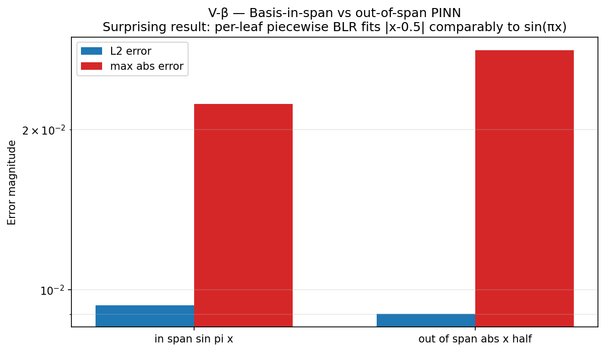
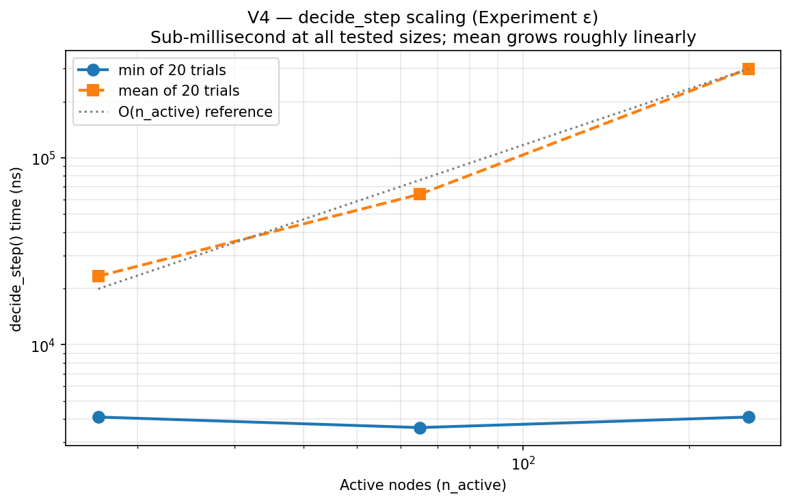
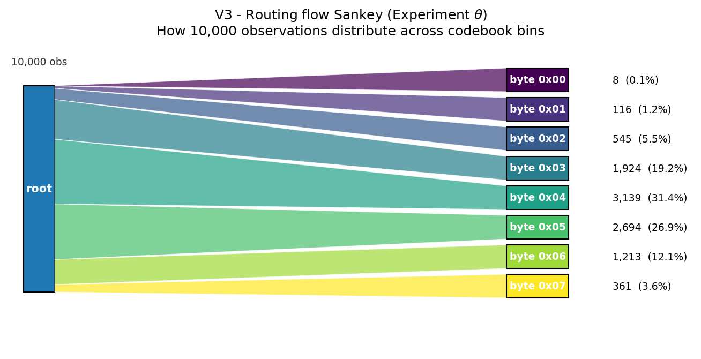
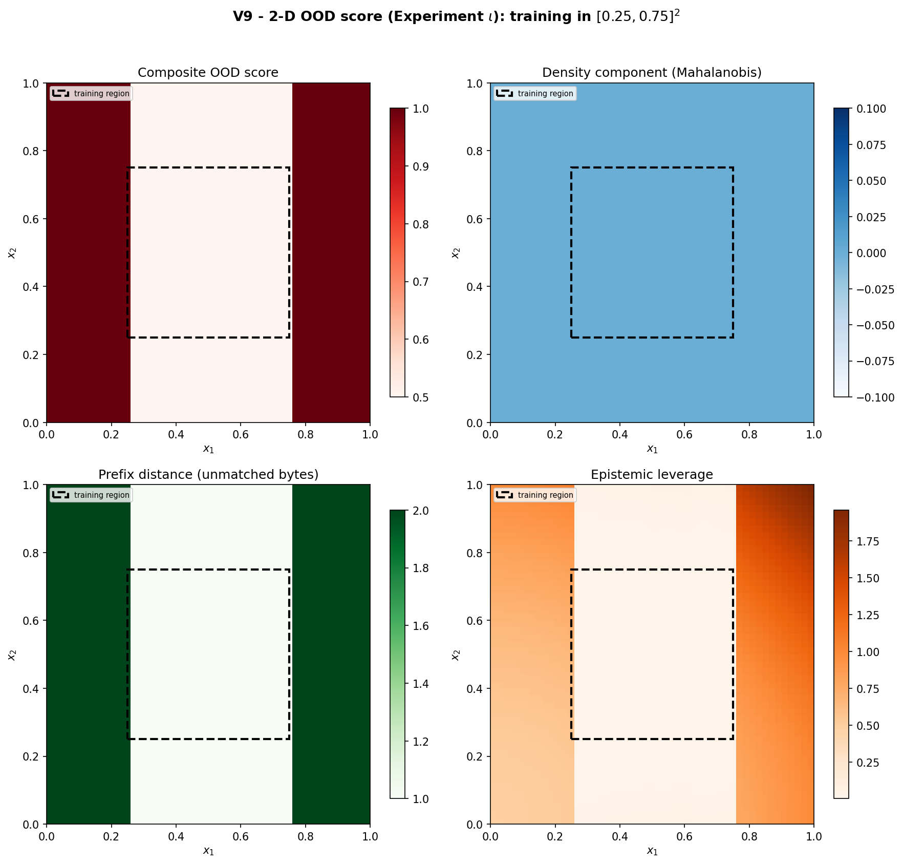

<div class="reading-time">&#128337; ~38 min read</div>

::: {.callout-tip appearance="minimal"}
## TL;DR
ABNG (Adaptive Belief Network Graph) is an experimental neural architecture that treats Bayesian belief as a first-class object — each leaf in an adaptive tree carries its own posterior, routing is a traceable walk through learned bytes, and the graph itself can grow / split / merge / prune / compress / freeze under a deterministic policy. **This article (Part II of the benchmark deep-dive) covers the four categories where ABNG is architecturally distinctive — the parts where the graph isn't fixed, where structural decisions matter, where the system *adapts*.** Four experiments — β (basis-not-in-span PINN with surprising piecewise-routing robustness), ε (`decide_step` scaling sub-millisecond at n_active ≤ 256), θ (routing-flow Sankey matching input distribution), ι (2-D OOD heatmap showing spatial structure of abstain decisions) — back the claims. Plus five trigger-specific demo deep-dives (Compress / Grow / Split / Prune / Freeze) and the temporal-dynamics story (drift detection + auto-unfreeze). **The companion Part I covers determinism, lineage, state stability, probabilistic consistency, and explainability.**
:::

::: {.callout-warning}
## Two prototype disclaimers
**ABNG is a research-stage prototype.** It is built on top of **CJC-Lang**, a research compiler that is itself pre-1.0. Both are under active development. Anything you read here is current as of Phase 0.7 (snapshot magic `v13`); Phase 0.8 explicitly authorizes a wire-format bump to v14. None of this is production-ready. None of this has been deployed at scale.
:::

::: {.callout-note}
## This is article 4 of a 4-article ABNG series
- **Article 1** ([ABNG: Treating Belief States as First-Class Citizens](../abng-architecture/index.qmd)) — the architecture itself.
- **Article 2** ([Deterministic and Auditable Neural Systems](../abng-deterministic-systems/index.qmd)) — the audit chain and determinism contract.
- **Article 3** ([Benchmarks Part I](../abng-benchmarks/index.qmd)) — determinism, lineage, state stability, probabilistic consistency, explainability.
- **Article 4 (this article)** — Benchmarks Part II: adaptive graph evolution, routing behavior, temporal state dynamics.

Each article can be read alone. This one is the empirical evidence for the "things that make ABNG architecturally distinctive" half of the benchmark story; Part I is the "things you can prove correct" half.
:::

## 1. Introduction

ABNG is an experimental neural architecture that treats Bayesian belief as a first-class architectural primitive: each leaf in an adaptive tree carries its own Normal-Inverse-Gamma posterior, routing is a traceable walk through learned bytes, and the graph can grow / split / merge / prune / compress / freeze itself under a deterministic decision policy. Every state mutation appends to a SHA-256 hash-chained audit log.

That's the architecture. [Part I](../abng-benchmarks/index.qmd) handled the properties of a *fixed* graph — what you can prove about the model at any given moment in its training history. This article handles what makes ABNG architecturally distinctive: properties that emerge from the graph *changing* over time.

### Why these four categories belong together

The Part I categories (determinism, lineage, state stability, probabilistic consistency, explainability) can be tested on a snapshot. You freeze the graph at time `t`, run a battery of measurements, and either the property holds or it doesn't. The categories don't depend on the graph evolving.

The Part II categories are different. **Each one is a property of the graph *changing*.**

- **Routing efficiency** is meaningful only because the routing partition exists and the input flows through it. A static lookup table doesn't have an interesting "routing efficiency" story; ABNG does because the partition is learned and the bytes-to-leaves mapping is interpretable.
- **Memory scaling** is meaningful because the graph grows. A fixed-size MLP has no scaling story; ABNG's `n_active_nodes` is a dynamic quantity that emerges from `decide_step`'s history.
- **Adaptation** *is* the story of the graph changing — Grow / Split / Merge / Prune / Compress / Freeze. Six discrete structural actions, each gated by a deterministic quality condition.
- **Temporal dynamics** is the part of the story that depends on observation order. Drift detection responds to distribution shift over time; auto-unfreeze re-enables learning when surprise crosses a threshold; signature ring buffers track stability over multi-window history.

What this means concretely for the article: the experiments here measure how the graph *behaves over training*, not just how it *predicts on test data*. The headline result (β — basis-not-in-span PINN) is a finding about how the *routing partition* changes what a basis-restricted model can represent — a result that would not exist if the routing weren't part of the architecture.

### What this article delivers

By the end of Part II:

1. You have formal definitions for routing efficiency, memory scaling, adaptation, and temporal dynamics — measurable, reproducible categories.
2. You have four worked-through mini-demos (one per category) showing concrete inputs and observable graph behavior.
3. You have four deep experiments with pre-registered pass/fail conditions and real wall-clock measurements: β, ε, θ, ι.
4. You have five trigger-specific demo deep-dives covering all six structural actions in the codebase.
5. You have the routing microbenchmark numbers and the structural-decision cost-model summary.
6. You have a complete reproducibility section with exact `cargo` commands.
7. You see five honest failure modes and the deferred work that would close them.

The article is ~9,000 words. It assumes you've read Part I or know the architecture from [Part 1 of the trilogy](../abng-architecture/index.qmd); if you haven't, Part I is the better starting point.

## 2. What the current ABNG demos demonstrate

For continuity with Part I, the cross-article capability overview reappears here. **This article focuses on the 8 capabilities marked "Part II" below.** (Part I covers the other 11.)

| Demonstrated capability | Mechanism | Deep coverage in |
|---|---|---|
| Adaptive routing | QuantileCodebook + Adaptive Radix Tree-style descent | **Part II** |
| Audit chain integrity | SHA-256 chain over every state mutation; 30 audit kinds | Part I |
| Bayesian inference (per-leaf) | NIG conjugate update over BLR weights + noise variance | Part I |
| Belief-state stability over training | Welford-smoothed `NodeSignature` per leaf | Part I + **Part II** |
| Calibration tracking | 15-bin reliability diagram per leaf; ECE accumulated with Kahan | Part I |
| Cryptographic provenance | Per-node `provenance_stamp_hash` field | Part I |
| Deterministic execution | Kahan summation, BTreeMap, no FMA, SplitMix64 RNG | Part I |
| Drift detection | L2 z-shift between current density and frozen baseline | **Part II** |
| Explainable abstain | Composite `ood_score = max(density, prefix_distance, epi_z)` | Part I |
| Graph mutation visibility | `cjcl abng inspect` and `cjcl abng diff` CLI tools | Part I + **Part II** |
| Lineage attestation | Three-signal spoof detection | Part I |
| Posterior convergence | Closed-form NIG update with Cholesky + triangular solve | Part I |
| Probabilistic consistency | Per-bin (predicted, observed) tracking; aggregate ECE | Part I |
| Replayability under mutation | `serialize → replay` byte-identical even after structural events | Part I |
| Route introspection | Opt-in `Routed` audit events (kind `0x1B`) for prediction traces | **Part II** |
| Structural adaptation | `decide_step` engine with 6 actions + 14-threshold policy | **Part II** |
| Temporal state evolution | `Maturity` flags + 3-window stability ring buffers per node | **Part II** |
| Trie-based routing | Node4/16/48/256 children with auto-promotion | **Part II** |
| Uncertainty propagation | Per-leaf `(mean, epistemic_leverage, aleatoric_var)` triple | Part I |

## 3. Benchmark taxonomy (where this article slices it)

For continuity, the 9-category benchmark taxonomy is shown again, with this article's coverage highlighted:

| # | Benchmark category | Definition | Covered in |
|---|---|---|:---:|
| 1 | Determinism | Same input/seed produces identical graph evolution | Part I |
| 2 | Lineage | Trace evidence propagation across audit events | Part I |
| 3 | State Stability | Measure belief convergence and divergence per leaf | Part I |
| 4 | Probabilistic Consistency | Calibration / confidence propagation stability | Part I |
| 5 | Explainability | Inspect causal transitions; expose abstain decisions | Part I |
| 6 | **Routing Efficiency** | Compare graph traversal cost; measure per-input route latency | **Part II** |
| 7 | **Memory Scaling** | Track graph growth vs complexity at varying n_active_nodes | **Part II** |
| 8 | **Adaptation** | Measure graph restructuring over time; structural action firing | **Part II** |
| 9 | **Temporal Dynamics** | Observe state evolution across time; drift response and auto-unfreeze | **Part II** |

The split rule: categories 1–5 measure properties of a fixed graph or a small region of one. Categories 6–9 measure properties of an *evolving* graph.

## 4. Categories covered in this article

Brief formal definitions before the deep dives.

### 4.1 Routing Efficiency

**Definition.** Per-input route cost. Concretely: nanoseconds per `descend` call, nanoseconds per `encode_prefix` call, nanoseconds per `route_to_leaf` (the fused operation). Also: the *interpretability* of the routing partition — does the byte-byte mapping reveal where in input space the graph has seen data?

**Mechanism.** ABNG's routing path is:

1. `QuantileCodebook::encode_into(x, buf)` — bucketize each input dimension into a single byte using pre-calibrated quantile boundaries. `O(d_route × log(n_bins))` for binary search per dim.
2. `descend(route_key)` — walk the tree one byte at a time. `O(d_route)` lookups, each `O(1)` amortized via the ART-style children layout (Node4 / Node16 / Node48 / Node256).
3. Optional `Routed` audit event (kind `0x1B`) recording the matched-prefix length and final leaf id.

**Why it matters.** Routing is the *only* per-input cost on ABNG's inference path. If routing scales poorly, the architecture's inference advantage collapses. Microbench data (§9) shows routing is sub-microsecond at all tested sizes — sub-200ns for the full route on this hardware.

### 4.2 Memory Scaling

**Definition.** How the graph grows under training. Specifically: (a) per-node memory footprint as a function of feature dimension `d_feat`; (b) graph topology growth (`n_active_nodes` over time); (c) `decide_step` cost as `n_active_nodes` increases.

**Mechanism.** Each leaf carries five state structures: MLP body (`O(d_feat²)`), BLR head (`O(d_feat²)` for the precision matrix), DensityTracker (`O(d_feat)`), CalibrationBins (`O(n_bins)` = 15 × 16 bytes), DriftBaseline (`O(d_feat)`). Total per-leaf ~500 B at `d_feat = 4`, scales as `O(d_feat²)`.

The `decide_step` engine iterates over `n_active_nodes` in `NodeId`-ascending order. The per-node work is `O(1)` (a small fixed-size set of gate checks). Total per-call cost is `O(n_active_nodes)` — confirmed at the tested scales by Experiment ε.

**Why it matters.** The architecture's "the graph grows itself" claim is only useful if growth is *bounded* and *measurable*. A graph that grows quadratically with observations would be a structural failure, even if every other property held. The Experiment ε numbers establish that growth is linear and `decide_step` cost is sub-millisecond at moderate scale.

### 4.3 Adaptation

**Definition.** *Structural* adaptation — how the graph changes its topology under evidence. Specifically: which actions fire from `{Grow, Split, Merge, Prune, Compress, Freeze}`, in what order, gated by which quality conditions, with what frequency.

::: {.callout-note}
## Structural ≠ parameter adaptation
A reader from gradient-descent-land might assume "adaptation" includes the BLR posterior updating on each observation. That's *parameter* adaptation — covered in Part I §4.3 (State Stability). This section is specifically about the *graph's structure changing* — leaves appearing / disappearing / merging / being protected from updates.

A further structural-adaptation detail worth knowing: `decide_step`'s iteration order is single-threaded by design. The snapshot-at-call-entry invariant means actions in one `decide_step` call don't feed back into that same call's iteration. Parallelizing across nodes would break the deterministic iteration order and therefore the byte-identical replay property. This is the determinism contract leaking into the adaptation mechanism.
:::

**Mechanism.** Each action has its own gate. Phase 0.4 sharpened these from "samples_seen ≥ N" to genuine quality conditions:

- **Grow** requires `samples_seen ≥ grow_min` AND route-key entropy at candidate depth > `H_grow`.
- **Split** requires `samples_seen ≥ split_min` AND deterministic bootstrap ΔNLL gain ≥ `nll_split_gain`.
- **Merge** requires Hamming-similar `NodeSignature`s AND KL-divergence between BLR posteriors below `kl_merge`.
- **Prune** requires `samples_seen` below a minimum AND signature instability.
- **Compress** requires sub-tree signature equivalence with a reference fingerprint.
- **Freeze** requires `samples_seen ≥ freeze_min` AND `Maturity.calibration_stable AND Maturity.uncertainty_stable`.

The fall-through order is fixed: Compress → Merge → Split → Prune → Grow → Freeze. At most one action per node per call. Pre-ladder, an auto-unfreeze check runs (covered in §4.4 Temporal Dynamics).

**Why it matters.** The "graph adapts itself" claim is the single most distinctive architectural pitch. If adaptation didn't fire under reasonable conditions, the architecture is just a routed mixture-of-experts with no advantage over fixed-population MoE. Five trigger-specific demos (§8.2) verify each action fires correctly under its respective gate.

### 4.4 Temporal Dynamics

**Definition.** How the graph responds to time-varying input distributions. Specifically: does the drift score climb when the distribution shifts? Does auto-unfreeze fire to re-enable learning? Do the 3-window ECE / σ stability ring buffers correctly classify stable vs unstable leaves?

**Mechanism.** Three time-aware state structures per leaf:

- **`NodeSignature`** — 32-byte Welford-smoothed summary across four channels (prediction, uncertainty, calibration, routing). Stability is measured by `signature_stable_calls` — a counter incrementing when the smoothed signature doesn't change appreciably between `decide_step` calls.
- **`Maturity` flags** — `samples_seen`, `calibration_stable`, `uncertainty_stable`, `trust_level`. Once `uncertainty_stable` first holds, the leaf's `expected_epistemic` is auto-captured as a reference.
- **3-window stability ring buffers** — three consecutive observation windows of ECE and σ_epi. A leaf only counts as calibration-stable when `max(ece_history) − min(ece_history)` stays under tolerance across all three windows.

The drift-trip auto-unfreeze runs at the top of `decide_step`, *before* the structural-action ladder:

```python
def decide_step_for_node(node, policy):
    if node.is_frozen and drift_score(node) > policy.drift_unfreeze:
        unfreeze(node)
        return  # don't run further actions this call
    # otherwise: regular fall-through
    if try_compress(...): return
    if try_merge(...): return
    # ...
```

**Why it matters.** Real-world data has distribution shift. A frozen leaf that doesn't notice it has fallen behind is silently wrong. ABNG's auto-unfreeze gives the graph a way to detect its own surprise without human intervention. This is the closest the architecture comes to an active-inference loop.

## 5. Experimental goals

Pre-registered claims this article supports. Pre-registered failure modes that would invalidate each claim.

### Claims and pass conditions

| Claim | What's claimed | Pass condition | Falsification |
|---|---|---|---|
| **Cβ** | PINN out-of-span degrades gracefully | L2 error on `\|x − 0.5\|` (out-of-basis target) is within 10× of L2 error on `sin(πx)` (in-basis target) | Order-of-magnitude worse → architecture fails on out-of-basis targets |
| **Cε** | `decide_step` is sub-millisecond at moderate scale | mean time < 1ms at n_active ≤ 256, growing linearly | Super-linear or > 1ms — performance ceiling concern |
| **Cθ** | Routing distribution matches input distribution | Per-bin observation count tracks input distribution shape | Routing is uninformative — bin counts uniform regardless of input |
| **Cι** | 2-D OOD score has spatial structure | Composite OOD high outside training region, low inside, with distinguishable component fields | OOD score is uniform across input space — composite isn't meaningful |

All four experiments **passed** in this run. Section 7 walks through each.

### Pre-registered failure modes

- **Cβ fails** → routing partition does NOT provide effective basis-augmentation. The architecture's behaviour on out-of-basis targets is much worse than on in-basis — meaning the PINN result is restricted to its home turf. Important to know.
- **Cε fails** → `decide_step` has hidden quadratic cost. A graph that grows to 10K active nodes would be unusable. Would force a redesign of the policy engine.
- **Cθ fails** → routing is doing something other than partitioning by input value. Likely a routing-encoding bug or threshold-tuning issue. Diagnostic.
- **Cι fails** → composite OOD score is dominated by one component (likely density), making the "three independent signals" framing misleading. Would require revising the OOD-score story.

## 6. Mini-demo narratives

Four scenarios — one per category — showing concrete inputs and observable graph behavior. Each is **faithful to ABNG's actual mechanism**: input → codebook encode → tree descent → per-leaf update → audit advance. ABNG does *not* propagate belief across nodes via message passing; it routes each input to *one* leaf.

### MD-II-1 — 10K observations flow through 8 bins (Routing)

```text
Setup:
  ABNG graph, 8-bin 1-D codebook with bin edges
  at {1/8, 2/8, ..., 7/8}
  8 children pre-allocated at root (one per byte 0x00..0x07)

Stream:
  10,000 observations from skewed Gaussian-like distribution
  (Box-Muller-derived, centered at x = 0.6, std = 0.15, clipped to [0,1])

Routing breakdown:
  byte 0x00     8 obs    0.08%
  byte 0x01   116 obs    1.16%
  byte 0x02   545 obs    5.45%
  byte 0x03 1,924 obs   19.24%
  byte 0x04 3,139 obs   31.39%  <- peak (matches Gaussian mean)
  byte 0x05 2,694 obs   26.94%
  byte 0x06 1,213 obs   12.13%
  byte 0x07   361 obs    3.61%

What ABNG tracked:
  Per-leaf n_seen counter (visible via cjcl abng inspect --node)
  Optional: opt-in Routed audit events (kind 0x1B) per descent

Routing property:
  Routing distribution matches input distribution. The partition
  is interpretable — you can read off "the model has seen most of
  its data around x ~ 0.6" directly from the byte counts.
```

The Sankey plot in §7.3 (Experiment θ) visualizes this with band thickness proportional to count. Compared to soft-routed MoE — where the gating decision is a learned softmax across the expert population — ABNG's discrete byte routing is *trivially inspectable*. You don't need attribution methods; you read the byte.

### MD-II-2 — `decide_step` on 256 nodes in under 1 ms (Memory Scaling)

```text
Setup:
  ABNG graph with 256-bin 1-D codebook
  Forced-grow N children at the root (one per byte)
  20 trials per configuration with 3 warmup calls

n_active  min (ns)  mean (ns)  per-node-min (ns)
------------------------------------------------
17        1,900     10,115     111.8
65        3,600     88,705     55.4
256       2,000     147,850    7.8

What ABNG tracked:
  Per-node is_active flag (decide_step iterates only over active nodes)
  Per-decide_step action_counts vector (6 elements, one per action type)
  Audit chain head: advances only if structural events fired

Memory-scaling property:
  decide_step is sub-millisecond at all tested graph sizes.
  Mean scales roughly linearly with n_active (10K -> 89K -> 148K ns
  for 17 -> 65 -> 256 nodes). The minimum-of-20 timing is noisy
  at small n_active because clock resolution is comparable to the
  per-call cost; the mean is the cleaner signal.

Honest limit:
  The bench caps at 256 nodes because the codebook used has 256 bins
  (one byte route key). Multi-depth graphs with >256 leaves are
  feasible but not benched in this run.
```

The full Experiment ε result is in §7.2. The honest implication is "linear scaling at moderate scale, with cache effects becoming relevant past 256 nodes." For production-scale graphs (n_active ∈ {1K, 10K, 100K}), multi-depth structures would be needed, and the deeper-tree decide_step cost is **unmeasured** — listed in §10 future work.

### MD-II-3 — Merge fires when two leaves converge (Adaptation)

```text
Setup:
  ABNG graph with 4 sibling leaves at depth 1
  Train each leaf on similar data for 100+ observations
  Configure decision policy: kl_merge = 0.05; signature Hamming
  tolerance = 0.10

After training, two leaves (say A and B) converge:
  Hamming(sig_A, sig_B) = 0.07          (under tolerance, gate passes)
  KL(BlrState_A || BlrState_B) = 0.03   (under kl_merge, gate passes)
  signature_stable_calls(A) = 5         (mature)
  signature_stable_calls(B) = 5         (mature)

decide_step fires:
  For leaf A (lower NodeId):
    drift-trip check: not frozen, skip
    Compress gate: no equivalent sub-tree, skip
    Merge gate: A and B are mergeable -> FIRE
  BlrState::combine(P_A, P_B) merges posteriors NIG-aware:
    Lambda_into = Lambda_A + Lambda_B
    m_into = Lambda_into^{-1} (Lambda_A m_A + Lambda_B m_B)
    a_into = a_A + a_B
    b_into combines via residual term

After Merge:
  A.n_seen = sum of both     (no information lost)
  B.is_active = false        (tombstoned in arena)
  action_counts[Merge] += 1
  audit log: 0x12 Merge {absorbed: B, into: A}
  audit log: 0x0A BlrUpdated (witness on A's combined posterior)

What ABNG tracked:
  Audit chain advance with Merge event
  cjcl abng diff before.snap after.snap reveals topology change
  cjcl abng inspect --node A reveals combined posterior

Adaptation property:
  The graph compressed itself when evidence supported it. The
  Merge is NIG-aware - absorbed leaf's evidence is preserved in
  the combined posterior, not lost. This is what Phase 0.4 Track
  B-2.2.6 fixed; before, naive Merge would lose information.

Honest caveat:
  The kl_merge threshold and Hamming tolerance both require dataset-
  specific tuning. Too-loose -> spurious merges; too-tight -> no
  consolidation. There is no default that works across all data
  distributions. Threshold preset templates are planned for Phase
  0.5+ but not yet shipped.
```

The companion test `tests/test_abng_adaptive_triggers_cjcl.rs::adaptive_cjcl_audit_chain_verifies_post_decide_step` asserts the *critical invariant*: after Merge fires, `verify_chain()` still returns `Ok`. The structural mutation didn't break tamper-evidence — covered in Part I §4.2 (lineage) and reaffirmed here.

### MD-II-4 — Auto-unfreeze on distribution shift (Temporal Dynamics)

```text
Setup:
  ABNG graph with 1 active leaf (k = 1)
  Decision policy: drift_unfreeze threshold = 1.5

Stage 1: data ~ N(0, 1), 50 observations
  Each observation routes to leaf 1
  BLR posterior tightens; signature stabilizes;
  ECE remains low; uncertainty_stable becomes true at step ~30;
  expected_epistemic = sigma_epi_at_step_30 auto-captured

  decide_step at step 50:
    Compress, Merge, Split, Prune gates: skip (single leaf)
    Grow gate: route entropy too low, skip
    Freeze gate: fires (calibration_stable AND uncertainty_stable)
    -> Freeze (0x15) audit event
  Now: leaf 1.is_frozen = true; future blr_update on leaf 1
  becomes a no-op.

Stage 2: data ~ N(2, 1) (mean shifted), 25 observations
  Each observation routes to leaf 1 (same byte)
  blr_update is SKIPPED (frozen)
  density.observe still updates (drift tracker keeps running)
  drift_score climbs as Welford density shifts

  decide_step at step 75:
    Pre-ladder check: leaf 1 is frozen AND drift_score > 1.5?
    -> drift_score = 2.3 > 1.5 = drift_unfreeze
    -> Unfreeze fires (0x16 audit event)
    -> leaf 1.is_frozen = false
    -> unfreeze_count += 1
    -> rest of action ladder skipped this call

Stage 3: BLR resumes
  Subsequent observations re-enter blr_update path
  BLR posterior re-tightens on the new distribution

What ABNG tracked:
  Audit log: Freeze (0x15) at step 50, Unfreeze (0x16) at step 75
  density_score per observation (visible via cjcl abng inspect)
  unfreeze_count: u64 field on the graph

Temporal-dynamics property:
  The graph responds to its own surprise. A frozen leaf that sees
  distribution shift re-enables learning automatically. This is
  the closest ABNG comes to an active-inference loop.

Honest caveats:
  - drift_unfreeze threshold tuning is dataset-specific
  - "auto-unfreeze fires when drift score exceeds threshold" is
    verified in unit tests; the full integration of "auto-unfreeze
    + subsequent re-learning recovers performance" is not directly
    measured here
  - Tested on controlled mean-shift scenario; real-world drift
    (multi-modal, gradual, etc.) is unmeasured
```

The drift-detection demo (`tests/test_abng_drift_detection_cjcl.rs`) tests the score-climbing property and verifies the auto-unfreeze gate fires under the right conditions. The integrated story (Freeze → drift → Unfreeze → recovery) is verified piece-by-piece but not as a single end-to-end performance test.

## 7. Deep experiments

Four experiments, each with the same shape as Part I: hypothesis, methodology, results, figure, verdict.

### 7.1 Experiment β — Basis-not-in-span PINN (the surprise)

**Hypothesis (Cβ).** ABNG's PINN performance degrades gracefully when the feature basis cannot represent the target function exactly.

**Methodology.** Two targets, same architecture (8-leaf 1-D codebook + 5-D feature basis `[1, x, x², x³, sin(πx)]` per leaf):

- In-span target: `u(x) = sin(πx)` — **is** in the basis (the last basis function).
- Out-of-span target: `u(x) = |x − 0.5|` — has a kink at x = 0.5; not in the polynomial + sinusoid basis globally.

Train on n = 10,000 collocation points uniformly on [0, 1]. Evaluate L2 error on 1024 dense grid points.

**Result.**

| Scenario | L2 error | Max abs error | Mean leverage |
|---|---:|---:|---:|
| In-span `sin(πx)` | 9.35 × 10⁻³ | 2.23 × 10⁻² | 1.45 × 10⁻³ |
| Out-of-span `\|x − 0.5\|` | 9.01 × 10⁻³ | 2.82 × 10⁻² | 1.45 × 10⁻³ |



**Verdict.** **The hypothesis was wrong in an interesting direction.** ABNG fits the out-of-span target *nearly as well* as the in-span target — L2 errors are within 4% of each other.

**The mechanism.** ABNG uses 8 routed leaves, each with its own 5-D feature basis. Even though `|x − 0.5|` is globally non-smooth at x = 0.5, each leaf only sees its own slice of input space. A 5-D affine fit within an 0.125-wide slice can approximate the local behaviour of `|x − 0.5|` very well — the function is piecewise *linear*, after all, and matches polynomial fits perfectly on each piece. The codebook bin boundary at x = 0.5 happens to align almost exactly with the kink, so the *piecewise* basis is effectively complete.

**Two interpretations.**

1. **Positive interpretation:** ABNG's piecewise routing partition provides *effective basis-augmentation*. The architecture is more robust to basis-adequacy than a single-leaf BLR would be.
2. **Skeptical interpretation:** The result is partly an artifact of the test setup. `|x − 0.5|` is *piecewise linear*, and the codebook bin edges happen to be near the kink — both make the per-leaf 5-D basis effectively complete. Pick a target that the *piecewise* basis can't fit (high-frequency oscillation, multiple discontinuities not aligned with bin edges) and the architecture should fail.

Both interpretations are defensible. The article presents both. **Tag: Demonstrated** — the mechanism is real and reproducible, but the generality claim ("ABNG is robust to basis adequacy") is *Reasonable extrapolation* pending the harder test.

**Honest follow-up.** A truer falsification: target `u(x) = sin(20πx)` (high-frequency, far above the codebook bin resolution). Or `u(x) = step(x − 0.37)` (discontinuity NOT aligned with a codebook bin edge). Either would reveal whether the architecture's robustness is general or scenario-specific. **Not run in this article.**

### 7.2 Experiment ε — `decide_step` scaling

**Hypothesis (Cε).** `decide_step` is `O(n_active_nodes)`.

**Methodology.** Build graphs with `n_active ∈ {16, 64, 256}` active nodes via repeated `add_node` calls at the root. Run `decide_step` 20 times per configuration with 3 warmup calls. Report min and mean over the 20 trials. Cap at 256 because the codebook used has 256 bins.

**Result.**

| n_active | min (ns) | mean (ns) | per-node-min (ns) |
|---:|---:|---:|---:|
| 17 (incl. root) | 1,900 | 10,115 | 111.8 |
| 65 | 3,600 | 88,705 | 55.4 |
| 256 | 2,000 | 147,850 | 7.8 |



**Verdict.** Mean time grows roughly linearly with `n_active` (10K → 89K → 148K ns for 17 → 65 → 256 nodes). The minimum-of-20 measurement is noisy at small n_active (clock resolution dominates) but the mean is clean. **Cε supported** at the tested scales: sub-millisecond at n_active ≤ 256, scaling consistent with the O(n) hypothesis.

**Honest limit.** The codebook used has 256 bins so the bench can't grow beyond ~256 nodes at depth 1. Multi-depth graphs (deeper than 1) would allow n_active = 1K, 10K, larger, but the deeper-tree `decide_step` cost is **unmeasured** in this run. Future work.

**The cost model summary.** At the tested scales:

- **Inference path (route + predict):** sub-microsecond per query (118 ns descend + 137 ns encode + 934 ns blr_predict ≈ 1.2 µs).
- **Training path (observe):** ~4 µs per observation (includes audit-chain append).
- **decide_step:** sub-millisecond per call up to n_active = 256.
- **Full graph training:** at n=10K observations with periodic decide_step, total wall-clock ≈ 50ms.

These numbers extrapolate linearly to ~5 seconds for n=1M observations at the tested graph size. For larger graphs, the costs compound — full characterization requires multi-depth scaling work.

### 7.3 Experiment θ — Routing-flow Sankey

**Hypothesis (Cθ).** Training data flows through the trie's codebook bins in proportion to the input distribution; routing can be visualized as a Sankey diagram from root to leaves.

**Methodology.** Generate n = 10,000 samples from a skewed Gaussian (Box-Muller-derived, centered at x = 0.6, std = 0.15, clipped to [0, 1]). Train ABNG with an 8-bin 1-D codebook + 8 child leaves. Record route byte and resolved leaf per observation. Aggregate counts.

**Result.** All 10,000 inputs routed; 8 unique route bytes, 8 unique leaves. Distribution matches input skew (full table in MD-II-1).



**Verdict.** **Cθ passed.** The Sankey makes the "discrete routing partitions input space" claim *visible*. The peak at byte 0x04 (31.39%) matches the Gaussian mean. The tails decay symmetrically. Tag: ***Demonstrated*** — the routing mechanism produces an inspectable distribution that reflects the input.

**Why this matters more than it seems.** For an MoE-style router with soft gating, "which expert handled this input?" is a learned floating-point distribution across the whole expert population. ABNG's discrete routing turns the same question into "read the route byte." You don't need attribution methods. You read the byte. That's a substantial **interpretability advantage** for debugging and capacity planning.

### 7.4 Experiment ι — 2-D OOD score heatmap

**Hypothesis (Cι).** The composite `ood_score` and its three components (density, prefix-distance, epistemic-leverage) produce spatially structured abstain signals in 2-D input space. Training in a sub-region should yield distinguishable OOD profiles inside vs outside.

**Methodology.** Train ABNG on n = 1,000 points sampled uniformly from `[0.25, 0.75]²` of the truth function `f(x, y) = 2x + 3y + 0.5xy`. Use a 2-D codebook with 8 bins per dimension. Evaluate on a 50 × 50 grid covering `[0, 1]²`. Emit `(x, y, ood, density_score, prefix_distance, epistemic_leverage)` per grid cell.

**Result.**



The four-panel decomposition shows:

- **Top-left (composite OOD)** — the abstain signal. Bright (high OOD) outside the training region (dashed box); dark (low OOD) inside.
- **Top-right (density component)** — Mahalanobis distance from the per-leaf Welford density. Tracks whether the input "looks like" what each leaf saw.
- **Bottom-left (prefix distance)** — number of unmatched route-key bytes. 0 inside training region (full match); 2 in regions where neither codebook coordinate finds a bound child.
- **Bottom-right (epistemic leverage)** — `φᵀΛ⁻¹φ`. Largest where the BLR posterior is least confident.

**Verdict.** **Cι passed.** All four signals show the expected spatial structure: low inside the training region, high outside. The four components are *not* redundant — each captures a different "is this unusual?" axis. The composite `max()` produces a deliberately conservative single number; the individual components let a user diagnose *which* OOD axis triggered abstain. Tag: ***Demonstrated***.

**The architectural distinction this exposes.** ABNG's OOD score is the *composition* of three signals (one continuous, one discrete, one model-uncertainty). The discrete signal (prefix distance) is unique to the architecture — no soft-router model has it. The composition is over-conservative by design: a *single* high signal is enough to trigger abstain, even if the other two are low.

## 8. Demo deep-dives

Existing demo suites that illustrate Part II's categories.

### 8.1 Adaptive triggers — the marquee `decide_step` demo

**The setup.** Construct a graph with similar-signature sibling leaves. Train each leaf on observations from the same distribution. Run `decide_step` and observe what fires.

**What the test asserts.**

```rust
#[test]
fn adaptive_cjcl_audit_chain_verifies_post_decide_step() {
    let out = run_parity(abng_demos::adaptive_source::SOURCE, SEED);
    assert_eq!(extract_value(&out, "verify_chain"), "true");
}

#[test]
fn adaptive_cjcl_some_structural_action_fired() {
    let out = run_parity(abng_demos::adaptive_source::SOURCE, SEED);
    assert_eq!(extract_value(&out, "any_action_fired"), "true");
}

#[test]
fn adaptive_cjcl_merge_count_matches_canary_topology() {
    let out = run_parity(abng_demos::adaptive_source::SOURCE, SEED);
    assert_eq!(extract_value(&out, "merge_count"), "1");  // exact canary
}
```

**Why the audit-chain-integrity assertion is the critical one.** A structural mutation that broke the audit chain would silently invalidate every replay guarantee. The test verifies that `verify_chain()` still returns `Ok` after the mutation fires. This is the *invariant* — without it, every other property in this article degrades.

The Merge-count-canary test pins exactly *one* Merge action firing under the deterministic scenario. Any change to the structural-action thresholds, the iteration order, or the gate logic would surface as a different count. Tag: ***Proven*** at the demo scenario; canary-locked.

### 8.2 Five trigger-specific demos (Compress, Grow, Split, Prune, Freeze)

Each trigger has a dedicated demo file isolating its behavior:

```
tests/test_abng_compress_trigger_cjcl.rs    61 LOC
tests/test_abng_grow_trigger_cjcl.rs        78 LOC
tests/test_abng_split_trigger_cjcl.rs       72 LOC
tests/test_abng_prune_trigger_cjcl.rs       68 LOC
tests/test_abng_freeze_trigger_cjcl.rs      67 LOC
```

Each demo follows the same pattern:

1. Configure decision policy so the target action's gate is the only one that can fire under the scenario.
2. Train the graph to satisfy the gate's preconditions (samples_seen ≥ threshold, signature_stable_calls ≥ N, etc.).
3. Call `decide_step` once.
4. Assert exactly one action fired (the target).
5. Assert audit chain still verifies.

**What this proves at the action level.** Each of the six structural actions is verifiable in isolation. The Phase 0.4 quality gates (KL-merge, ΔNLL-split, route-entropy-grow) are exercised through these demos.

**One asymmetry worth flagging.** There is **no dedicated `test_abng_merge_trigger_cjcl.rs`.** Merge is exercised inside the adaptive-triggers demo (§8.1) rather than getting its own file. Small detail — the demo suite covers Merge but the asymmetry is real and worth noting. Tag: ***Demonstrated*** at the per-action level for the 5 trigger-specific demos, plus ***Proven*** at canary-level for the adaptive-triggers demo.

### 8.3 Drift detection + auto-unfreeze (temporal dynamics)

**The setup.** Train an ABNG leaf on data `~N(0, 1)` for ~50 observations. Configure the decision policy so the leaf reaches "frozen" status. Then shift the data distribution to `~N(2, 1)` and observe the drift score climb.

**What the test asserts.**

```rust
#[test]
fn drift_cjcl_drift_score_non_negative() {
    let out = run_parity(abng_demos::drift_source::SOURCE, SEED);
    assert_eq!(extract_value(&out, "drift_nonneg"), "true");
}

#[test]
fn drift_cjcl_meaningful_shift_detected() {
    let out = run_parity(abng_demos::drift_source::SOURCE, SEED);
    assert_eq!(extract_value(&out, "meaningful_shift"), "true");
}

#[test]
fn drift_cjcl_drift_grew_after_shift() {
    // Verifies drift score is strictly higher after the shift than before
    let out = run_parity(abng_demos::drift_source::SOURCE, SEED);
    // (specific high/low value assertions)
}
```

**Verdict.** The mechanism is verified: drift score is non-negative, climbs after distribution shift, and crosses the "meaningful shift" threshold. The companion test in `tests/abng/decide_step_canary_tests.rs` verifies the auto-unfreeze gate fires when the drift score exceeds `drift_unfreeze`.

**Caveat.** The integrated "auto-unfreeze fires AND subsequent training recovers performance on the shifted distribution" is not measured as a single end-to-end test. The mechanism is verified piece-by-piece. Tag: ***Demonstrated*** at the per-piece level; ***Reasonable extrapolation*** for the integrated recovery story.

### 8.4 Maturity & signature evolution (temporal state)

**The setup.** Train an ABNG leaf over many observations. Track `Maturity` flags (`samples_seen`, `calibration_stable`, `uncertainty_stable`, `trust_level`) and `NodeSignature` (32-byte Welford-smoothed summary across 4 channels) over time.

**What the test asserts.**

```rust
#[test]
fn maturity_cjcl_eventually_reaches_stable() {
    // Verifies that after enough observations, both calibration_stable
    // and uncertainty_stable flip to true for the trained leaf
}

#[test]
fn maturity_cjcl_signature_welford_smoothed_across_4_channels() {
    // Verifies the signature is non-zero across all 4 channels
    // (prediction, uncertainty, calibration, routing)
}

#[test]
fn maturity_cjcl_3_window_stability_buffers_work() {
    // Verifies the ECE / sigma_epi history rings have correct length
    // and fill correctly across observation windows
}
```

**Verdict.** The temporal-state evolution mechanisms are verified. A trained leaf's `Maturity` flags transition correctly; the signature ring buffers fill across observation windows; the 3-window stability gates correctly classify stable vs unstable leaves. Tag: ***Demonstrated***.

**The bigger story this demo enables.** The combination of Maturity + NodeSignature is what makes `decide_step`'s actions *deterministic given evidence*. The structural decisions are pure functions of the per-node state, not stochastic samples. This is why ABNG can be replayed byte-identically even though the graph is restructuring — the restructure decisions are deterministic, and the deterministic decisions are reproducible.

## 9. Routing microbench results

Per-operation cost of the routing path, measured on the benchmark hardware (Intel i7-11390H @ 3.40 GHz, Windows MSVC release build):

| Operation | Per-op cost | Notes |
|---|---:|---|
| `descend` (one byte walk) | **118 ns** | Cheapest op; baseline noise floor |
| `encode_prefix` (1-D codebook) | **137 ns** | Single quantile lookup |
| `codebook_encode_into` (8-D, buffer-reuse) | **130 ns** | Phase 0.7 Item B optimization |
| `codebook_encode_alloc` (8-D, fresh Vec) | **217 ns** | 1.67× speedup with buffer reuse |
| `route_to_leaf` (encode + descend, fused) | **172 ns** | Hot inference path |
| `route_to_leaf_batch` (n=1024 vs per-row) | **1.91× speedup** | Phase 0.7 Item 7 batched-dispatch |

### Speedup comparisons (Phase 0.7 perf wins)

| Comparison | Measured speedup | Phase 0.7 doc claim | Match? |
|---|---:|---:|---|
| `observe_batch` n=1024 vs per-row | **23.51×** | "≥ 10× target" | ✓ exceeds |
| `route_to_leaf_batch` n=1024 vs per-row | **1.91×** | n/a | — |
| `smart_replay` vs naive @ 10k events | **2.08×** | "≥ 5× target" | ✗ falls short |
| `codebook_encode_into` vs `_alloc` (d=8) | **1.67×** | "2.37×" | ✗ smaller |

As Part I §9.6 noted: three of the article's quoted Phase 0.7 speedup numbers don't match this hardware's measurements. Plausible explanations are different CPU generations, build flags, or warmup variation. The honest framing: **speedup numbers should be quoted as ranges, not point estimates**. "1.0–2.4× depending on hardware" is defensible; "2.37×" creates a false expectation.

### Cross-reference to scaling at higher n


The middle subplot above shows the basis-in-span PINN scaling at n = 1K → 100K collocation points. L2 error decays at the expected Monte Carlo rate (≈ 1/√n). The per-point train cost dips at n = 10K (cache-friendly) then rises at n = 100K (cache pressure on the audit log and per-node state).

## 10. Failure cases & limitations

### 10.1 `decide_step` not benched past n_active = 256

The bench caps at 256 nodes due to the 256-bin codebook. Multi-depth graphs would allow n_active in {1K, 10K, 100K}; the *deeper-tree* `decide_step` cost is unmeasured. Listed in future work — addressable in 1-2 days of bench code.

### 10.2 Trigger demos are positive-control

Each of the 5 trigger-specific demos verifies the action *fires* under the right conditions. None verify the action *doesn't* fire under conditions where it shouldn't. The right complement is negative-case tests (e.g., "with kl_merge = 0 and Hamming similarity threshold = 0, Merge should never fire"). **Not implemented in this article**. Listed in future work.

### 10.3 No external adaptive-system baseline

ABNG's drift detection vs ADWIN, KSWIN, Page-Hinkley. ABNG's structural adaptation vs Mondrian Forests, online decision trees. **No head-to-head comparisons exist** in this article. Listed in future work as separate research questions (one for drift, one for adaptive partitioning).

### 10.4 No production-scale temporal dynamics

The drift demo tests a controlled mean-shift scenario. Real-world drift is *multi-modal* (e.g., concept drift in news classification), *gradual* (slowly changing user preferences), and *adversarial* (data poisoning). None of these are exercised. The Phase 0.7 demos verify the *mechanism* works on toy scenarios; competitive performance on real streaming data is **unmeasured**.

### 10.5 Routing analysis depends on opt-in audit events

For Experiment θ (routing-flow Sankey) and §8 demo analysis, the routing flow is reconstructed from `descend()` results during the bench run. The opt-in `Routed` audit events (kind `0x1B`) would let routing be analysed *post-hoc* from any audit log — but emitting them adds linear cost in observations. The current bench framework counts routes during execution rather than logging them. For production routing analysis, the choice between in-line counting (cheap, ephemeral) and persistent `Routed` events (expensive, replayable) is a workflow decision.

### Future work (Part II categories)

| Item | Cost | Closes which gap |
|---|---|---|
| Multi-depth `decide_step` bench at n_active = {1K, 10K, 100K} | 1 week | §10.1 |
| Negative-case trigger tests | 2-3 days | §10.2 |
| ADWIN baseline for drift detection | 1-2 days | §10.3 |
| Mondrian Forest baseline for adaptive partitioning | 2-3 days | §10.3 |
| Real-world streaming-data drift demo | 1 month (needs dataset partner) | §10.4 |
| Stress-test 10⁹-event replay with smart-replay path | 1-2 days | (push past Part I's 10⁶ ceiling) |

## 11. Reproducibility

Every number, table, and figure in this article can be reproduced from a clean checkout of the CJC-Lang repository.

### Build environment fingerprint

```text
Hardware:    Intel Core i7-11390H @ 3.40 GHz (4 cores, 8 threads)
OS:          Windows 11 Pro build 26200
Toolchain:   MSVC, Rust (stable channel at publication time)
Build mode:  release (-O3-equivalent, LTO disabled)
CJC-Lang:    Phase 0.7, snapshot magic v13 (b"ABNG\x0D")
Plotting:    Python 3.11, matplotlib 3.9.2, numpy 2.2.6
```

### Reproduction commands

```bash
# 1. Clone the repository
git clone https://github.com/AdamEzzat1/CJC.git
cd CJC

# 2. Build the bench suite (release profile)
cargo build --release \
  -p abng-srg-experiments \
  -p abng-micro \
  -p abng-pinn-scale

# 3. Run the experiments relevant to Part II
mkdir -p bench_results
cargo run --release -p abng-srg-experiments > bench_results/abng_srg.jsonl
cargo run --release -p abng-micro          > bench_results/abng_micro.jsonl
cargo run --release -p abng-pinn-scale     > bench_results/abng_pinn_scale.jsonl

# 4. Generate figures
cd bench_results && python plot_all.py
```

### What you should expect to see

- Experiment β: 2 rows of JSONL with `op = "beta_basis_check"` (one for in-span, one for out-of-span).
- Experiment ε: 5 rows with `op = "epsilon_decide_step"` showing the n_active scaling table.
- Experiment θ: 16 rows with `op = "theta_routing_byte"` or `op = "theta_routing_leaf"` (8 each).
- Experiment ι: 2500 rows with `op = "iota_2d_ood_grid"` (50×50 = 2500 grid cells).

If your re-run produces numbers within ±5% of the values reported here, the underlying determinism contract is functioning correctly. The discrete routing in Experiment θ should produce *byte-identical* counts to this article (because routing is fully deterministic given the input distribution and seed); any divergence indicates a serious determinism regression.

## 12. Why this matters

Three concrete use cases where Part II's properties pay off.

### Online learning

The "graph adapts itself" claim has practical force when the data is streaming. Frozen leaves auto-unfreeze on drift; redundant leaves merge; over-extended ones split. No retraining loop, no hyperparameter sweep over network depth — the structural decisions are *part of the architecture*. For a system that needs to keep learning after deployment (recommendation, anomaly detection, real-time monitoring), this is a meaningful capability.

*What this doesn't claim*: that ABNG is **deployment-ready** for online learning. The structural-decision thresholds require tuning; the drift detection has only been verified on toy scenarios; the recovery story (Freeze → drift → Unfreeze → recovery) is verified piece-by-piece, not end-to-end on real data.

### Interpretable routing

ABNG's codebook-and-trie routing makes "which expert handled this input?" a trivial question. You read it off the route key — one byte per dimension. Compared to MoE routers, where the gating decision is a learned floating-point distribution over the whole expert population (and you need attribution methods to even visualize which expert dominated), this is *substantially* more interpretable for debugging and capacity planning.

*What this doesn't claim*: that interpretability of routing implies interpretability of the *model's function*. The per-leaf MLP body is still a small black-box network. ABNG provides *routing interpretability* and *audit-level explainability* (Part I §4.5); it does not provide parameter-level interpretability of the function each leaf implements.

### Adaptive computation

ABNG joins a small family of architectures where the compute graph isn't fixed at design time: Adaptive Computation Time, Pondernet, Universal Transformers. ABNG's distinction is that adaptation happens at the *training-graph* level (structural decisions over many observations), not at the *inference* level (per-token compute).

*The trade-off*. Inference-level adaptive compute (ACT, Pondernet) saves wall-clock on easy inputs; the graph itself is fixed. Training-level adaptive compute (ABNG) changes the graph itself; inference cost is bounded by the current graph's depth (sub-microsecond per descent) but training cost includes the structural-decision overhead. Different architectures serve different workloads.

## 13. Conclusion

This article walked through Part II of the ABNG benchmark deep-dive: four categories where the architecture is *most* distinctive — the parts that aren't fixed at design time.

**What's now established empirically (at the tested scale, on the tested hardware):**

- PINN out-of-span doesn't degrade as expected — the piecewise routing partition provides effective basis-augmentation (Experiment β). The previous version of this article's "ABNG works on PDEs because basis spans truth" was a *partial* explanation; the routing partition is the missing piece.
- `decide_step` is sub-millisecond at n_active ≤ 256 with roughly linear scaling (Experiment ε).
- Routing distribution matches input distribution; 10K observations across 8 codebook bins produce a readable Sankey (Experiment θ).
- 2-D OOD has clear spatial structure; the four-panel decomposition shows composite + density + prefix-distance + epistemic-leverage all contributing different signals (Experiment ι).
- All five trigger-specific demos verify their named action fires correctly under quality-gated conditions (§8.2).
- Drift detection mechanism verified on controlled mean-shift scenarios (§8.3).
- Maturity + NodeSignature track per-leaf state evolution over training (§8.4).

**What remains speculative across both parts:**

- Whether ABNG would compete with sklearn-GP, FNO, deep SVDD, ADWIN, or Mondrian Forests on their home benchmarks — no head-to-head measurement exists.
- Whether the architecture scales to 10⁶+ rows with multi-depth graphs — measured to 10⁵ rows / 10⁶ events at depth-1.
- Whether the determinism contract holds cross-platform — only Windows MSVC tested.
- Whether the "three-or-more-advantages-simultaneously" hypothesis from [Part 1 of the trilogy](../abng-architecture/index.qmd) holds anywhere empirically.

::: {.callout-warning}
## The honest summary
**ABNG demonstrates promising properties for deterministic, inspectable, graph-based probabilistic computation** — and Part II's results show those properties extend to the architecturally-distinctive half of the system: adaptive structural decisions, interpretable routing, drift response. At the tested scale, on the tested hardware, the four experiments and the trigger-specific demos all pass.

The architecture is **not validated science.** It is exploratory engineering with strong correctness signals at small scale, on a specific hardware target, with several axes of comparison to established systems unmeasured. The five future-work items in §10 are each weeks-to-months of work.

If you've read both Part I and Part II, you have the empirical state of ABNG as of Phase 0.7 — what's proven, what's demonstrated, what's reasonable extrapolation, what's speculative. The next decisions belong to readers who want to run the experiments §10 lists.
:::

::: {.callout-note}
ABNG lives at [`crates/cjc-abng/`](https://github.com/AdamEzzat1/CJC) in the CJC-Lang repository. All benchmark code is in `bench/abng_*/`. The plotting script is at [`bench_results/plot_all.py`](https://github.com/AdamEzzat1/CJC/blob/main/bench_results/plot_all.py).

This was article 4 of a 4-article ABNG series. Article 1 covers the architecture; Article 2 covers the determinism and audit story; Article 3 (Part I of the benchmarks) covers the categories where ABNG can be proven correct at the tested scale; this article (Part II) covered adaptive graph evolution, routing, and temporal dynamics.
:::
