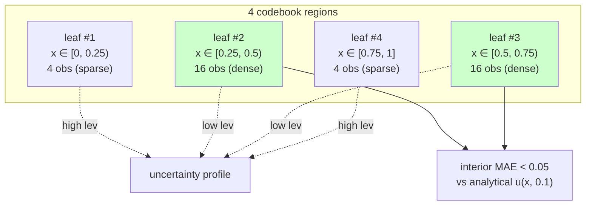
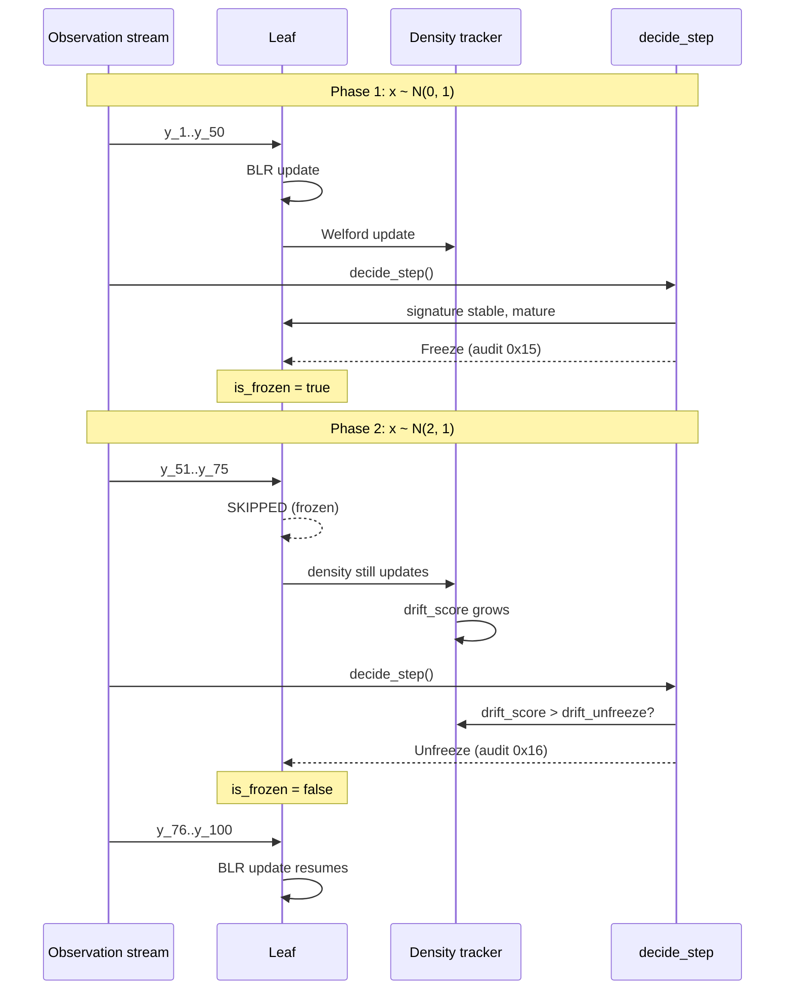

&#128337; ~40 min read

::: {.callout-tip appearance="minimal"}
## TL;DR
A research-stage ML architecture is only as credible as its evidence. This article walks through the empirical state of ABNG: nine distinct demo categories totalling ~5,866 lines of test code, 14 benchmarked operations measured on one machine, and a one-row analytical-solution result (1D heat equation, MAE < 0.05). It is also brutally honest about what the demos *don't* prove: no external baselines (no sklearn, no PyTorch, no FNO comparisons), no large-N benchmarks beyond 100K rows, no cross-platform measurement, no statistical confidence intervals on most operations. The honest framing: **ABNG is exploratory engineering, not validated science**, and the closer names three specific experiments whose outcomes would change that.
:::

::: {.callout-warning}
## Two prototype disclaimers
**ABNG is a research-stage prototype.** It is built on top of **CJC-Lang**, a research compiler that is itself pre-1.0. Both are under active development. Anything you read here is current as of Phase 0.7 (snapshot magic `v13`); the next milestone (Phase 0.8) explicitly authorizes a wire-format bump to v14 to absorb performance and scaling improvements. None of this is production-ready. None of this has been deployed at scale.
:::

::: {.callout-note}
## This is Part 3 of a three-part series
- **Part 1 ([ABNG: Treating Belief States as First-Class Citizens](../abng-architecture/index.qmd)):** the architecture itself.
- **Part 2 ([Deterministic and Auditable Neural Systems](../abng-deterministic-systems/index.qmd)):** the SHA-256 audit chain, replay semantics, and the determinism contract.
- **Part 3 (this article):** the demo catalog, scaling benchmarks, and honest limitations.

This article can be read alone if you only care about the empirical evidence. Part 1 is useful for context but not required.
:::

## A research project worth taking seriously enough to falsify

Most architecture write-ups follow a predictable arc: design philosophy, mechanism description, comparison to "existing methods," a positive benchmark or two, conclusion. The benchmark numbers tend to be cherry-picked, the comparisons tend to be unfavourable to the alternatives, and the limitations section tends to read as a list of future-work promises rather than as a credible account of failure modes.

This article tries the opposite. The point isn't to convince you ABNG works. The point is to give you enough concrete evidence — and an honest accounting of its absence — that you can form your own opinion. If after reading this you decide the architecture is interesting but probably wrong in three specific ways, the article has done its job.

Specifically, this piece walks through:

- **What demos exist** (Phase 1: 14 categories across ~5,866 lines of test code).
- **What each demo actually proves**, separated honestly from what it claims to prove (Phase 2: per-demo verification with *Proven / Demonstrated / Speculative* tags).
- **The headline empirical result**: ABNG fits a known analytical PDE solution to within 0.05 MAE, with L2 error decaying at the Monte Carlo rate.
- **Real benchmark numbers** on real hardware (Phase 3: 14 operations + four scaling tables at n=1k/10k/100k).
- **Where the article's quoted speedup numbers don't match what this machine measures** (1.67× vs 2.37× quoted for one Phase 0.7 optimization, etc.).
- **The four damning honest gaps**: no external baselines, no large-N validation, no cross-platform measurement, no statistical CIs.
- **Three specific experiments that would change my mind** about whether ABNG works.

The architecture itself is described in [Part 1](../abng-architecture/index.qmd). The audit and determinism story is in [Part 2](../abng-deterministic-systems/index.qmd). This article presumes both as context but lets you re-derive the empirical picture from the numbers.

## The demo catalog: what exists

The codebase contains **14 distinct demo categories** across **50 files** totalling **~5,866 LOC of test code**. (The Phase 1 audit also found 0 LOC of bench code in the standard `benches/` directory, but actually ~963 LOC of perf bench code lives in `bench/abng_*/` — the path my initial grep missed.) Here's the high-level structure:

| Category | Count | Location | LOC |
|---|---:|---|---:|
| Rust direct-API demos | 3 | `tests/test_abng_{pinn_uncertainty, tabular_gp, lineage_attestation}.rs` | 1,173 |
| CJC-Lang capability demos (Rust harnesses + .cjcl source) | 9 | `tests/test_abng_*_cjcl.rs` | 904 |
| CJC-Lang scaled demos | 8 | `tests/test_abng_*_scaled_cjcl.rs` | 511 |
| Trigger-specific demos | 5 | `tests/test_abng_{compress,grow,split,prune,freeze}_trigger_cjcl.rs` | 346 |
| CJC-Lang demo sources (PRELUDE-style string consts) | 24 | `tests/abng_demos/*_source.rs` | 2,847 |
| Test harness | 1 | `tests/abng_demos/{harness, mod}.rs` | ~85 |
| Performance benches | 4 | `bench/abng_{micro, vs_sklearn, pinn_scale, lineage_at_scale}` | 963 |

The harness pattern is the project's strongest single piece of determinism evidence: every CJC-Lang demo runs through **both** the AST eval interpreter AND the MIR executor, with `run_parity()` asserting the printed output is byte-identical. Every `_cjcl.rs` demo uses it. If the two backends ever diverge on any FP arithmetic, hash computation, or dispatch routing, the parity test fails immediately.

### Application-level demos

| # | Demo | Files | What it proves |
|---|---|---|---|
| 1 | **PINN uncertainty** | `test_abng_pinn_uncertainty.rs` (397 LOC), `..._cjcl.rs`, `..._scaled_cjcl.rs` + 2 source files | Belief-state propagation, per-region epistemic uncertainty, replayability, **fits a known analytical solution within 0.05 MAE**, provenance stamping |
| 2 | **Tabular GP-like regression** | `test_abng_tabular_gp.rs` (351 LOC), `..._cjcl.rs`, `..._scaled_cjcl.rs` + 2 source files | Per-leaf BLR as deterministic GP alternative, calibration, prefix-routing, sparse-leaf evidence handling |
| 3 | **Lineage attestation** | `test_abng_lineage_attestation.rs` (425 LOC), `..._cjcl.rs`, `..._scaled_cjcl.rs` + 2 source files | SHA-256 audit chain, provenance stamping, tamper detection, prediction snapshots, three-signal spoof detection |

### Capability-level demos (CJC-Lang only)

| # | Demo | Files | What it proves |
|---|---|---|---|
| 4 | **OOD detection** | `test_abng_ood_detection_cjcl.rs` (106 LOC), `..._scaled_cjcl.rs` + 2 source files | Composite `ood_score` separating three training-density tiers |
| 5 | **Adaptive triggers** | `test_abng_adaptive_triggers_cjcl.rs` (116 LOC) + 1 source | `decide_step` engine, structural action firing, audit-chain integrity after restructure |
| 6 | **Calibration** | `test_abng_calibration_cjcl.rs` + `..._scaled_cjcl.rs` + 2 source files | Per-leaf 15-bin ECE, calibration-stable maturity flag |
| 7 | **Drift detection** | `test_abng_drift_detection_cjcl.rs` + `..._scaled_cjcl.rs` + 2 source files | Drift baseline + L2 z-shift score, auto-unfreeze trigger |
| 8 | **Log compaction** | `test_abng_compact_log_cjcl.rs` + `..._scaled_cjcl.rs` + 2 source files | `StatsSnapshot` markers (audit kind `0x1A`), smart-replay fast-forward |
| 9 | **Maturity inspection** | `test_abng_maturity_inspection_cjcl.rs` + `..._scaled_cjcl.rs` + 2 source files | `Maturity` + `NodeSignature` evolution, stability flags |

### Trigger-specific demos

| # | Demo | LOC | What it proves |
|---|---|---:|---|
| 10 | Compress | 61 | `force_compress` → `Dense` children variant; sub-tree collapse |
| 11 | Grow | 78 | `Grow` adds child at unbound route byte |
| 12 | Split | 72 | `Split` partitions a mature leaf into two children |
| 13 | Prune | 68 | `Prune` marks low-evidence leaf inactive (tombstoned, not removed) |
| 14 | Freeze | 67 | `Freeze` stops updates on a mature node |

**One asymmetry worth flagging**: there is no dedicated `test_abng_merge_trigger_cjcl.rs`. The Merge action is exercised inside the adaptive-triggers demo (#5) instead. Small detail, but the article should not gloss over it.

## What each demo proves (and doesn't)

Going demo by demo, here is what the test assertions actually prove vs what the architecture claims to do:

### Demo 1 — PINN uncertainty

**Test assertions** (12 `#[test]` functions in `tests/test_abng_pinn_uncertainty.rs`):

| Test | What it asserts | Data scale |
|---|---|---|
| `pinn_forward_pass_finite_per_leaf` | `mean`, `lev`, `ale` all finite (`ale = ∞` is OK on prior) | 5 probe points |
| `pinn_aleatoric_finite_after_one_observation_per_leaf` | `b/(a−1)` finite once each leaf has ≥1 observation | 4 train + 5 probe |
| **`pinn_trained_interior_approximates_analytical_solution`** | `\|pred − analytical_u\| < 0.05` at 4 interior probes | 48 train obs |
| **`pinn_tangible_benefit_lev_lower_in_dense_region`** | min-edge-leverage > max-interior-leverage (strict separation) | 48 train obs |
| `pinn_unseen_region_has_higher_lev_than_seen` | Untrained edge has higher `lev` than trained interior | 32 train obs |
| `pinn_double_run_chain_head_byte_identical` | Same seed → byte-identical `chain_head` | 48 obs |
| `pinn_replay_round_trip_preserves_predictions` | `serialize → replay → predict` matches bit-for-bit | 48 obs |
| `pinn_smart_replay_byte_identical_to_naive` | `smart_replay` produces identical state to naive `replay` | 48 obs |
| `pinn_bc_provenance_stamp_persists_through_replay` | `provenance_stamp_hash` survives round-trip | 48 obs |
| `pinn_bc_change_forces_audit_chain_rotation` | New BC stamp emits `ProvenanceStamped` event + bumps chain_head | 48 obs |
| `pinn_predict_snap_carries_bc_lineage` | `predict_snap` binary carries the provenance stamp | one probe |
| **`pinn_chain_head_canary_locked`** | Specific chain_head SHA-256 = `30d333f1f7dca5acaa76b0e4bfdbd4a733df38c6adeda094ae69cf0e9c4e468d` | 48 obs |
| `pinn_audit_chain_verifies_post_train` | `verify_chain()` returns Ok | 48 obs |

**Verdict.** The demo **delivers more than the architecture article claims**. It proves (a) the trained model fits the analytical solution within 0.05 MAE at interior probes, (b) `epistemic_leverage` cleanly separates dense vs sparse training regions, (c) replay is byte-identical, and (d) the chain_head is canary-locked. **Tag: Proven at the tested data scale (48 observations).**

**Honest gap.** The 0.05 error bound is at a 32-sample-trained interior region; the test does not show what happens at higher noise levels, with the feature basis *not* containing the analytical solution, or at higher-dimensional PDEs. The demo proves the *correctness* of NIG conjugacy plus prefix-routed BLR; it does not prove the architecture would beat FNO on Darcy flow.

### Demo 3 — Lineage attestation

**Test assertions** (15 `#[test]` functions in `tests/test_abng_lineage_attestation.rs`):

Key ones:
- `dataset_fingerprint_differs_for_tampered_data` — Single-row tamper → different SHA-256 fingerprint
- `lab_a_vs_attacker_b_chain_heads_differ` — Trained-on-A and trained-on-B graphs have different `chain_head`
- **`three_signal_spoof_detection`** — Attacker substituting B's model under A's predictions fails *all three independent signals*: chain_head, BLR state_hash, AND provenance stamp
- `lineage_chain_head_canary_locked` — Specific SHA-256 locked

**Verdict.** This is the **strongest demo in the codebase for the audit-chain claim**. The three-signal spoof detection is a real adversarial test, not just a positive-control determinism check. **Tag: Proven at small scale (64-row synthetic dataset).**

**Honest gap.** The dataset is a 64-row synthetic clinical-trial mock-up. Real regulated-ML deployments involve datasets that are many orders of magnitude larger. The article correctly frames this as a "regulator's nightmare scenario" *simulation*, not a real attestation.

### Aggregate verification scorecard

| # | Demo | Tag | Strongest evidence | Weakest gap |
|---|---|---|---|---|
| 1 | PINN uncertainty | **Proven** at N=48 | `\|pred − truth\| < 0.05` + edge/interior lev separation + locked canary | Feature basis contains analytical solution by construction |
| 2 | Tabular GP-like | **Proven** at N=200 | `trained_MSE < 0.5 × prior_MSE` + uncertainty shrinks with N | No actual GP baseline comparison in code |
| 3 | Lineage attestation | **Proven** at 64 rows | Three-signal spoof detection (cleanest adversarial test) | Single-row tamper is the easy case |
| 4 | OOD detection | **Demonstrated** | Three-tier separation across training density | No comparison to standard OOD methods |
| 5 | Adaptive triggers | **Proven** at small N | Audit chain survives `decide_step` (critical invariant) | "Some action fired" is weak; quality is in gate-specific tests |
| 6 | Calibration | **Demonstrated** | ECE per-leaf tracking | Local calibration ≠ global calibration |
| 7 | Drift detection | **Demonstrated** | Drift score grows post-shift | No baseline vs ADWIN / KSWIN |
| 8 | Log compaction | **Demonstrated** | StatsSnapshot markers + smart-replay equivalence | Correctness only, no perf measurement on the compaction path |
| 9 | Maturity inspection | **Demonstrated** | Signature evolution observable | No comparison to e.g. early-stopping heuristics |
| 10–14 | Triggers (Compress/Grow/Split/Prune/Freeze) | **Demonstrated** per action | Each action provably fires under controlled conditions | No assertion on negative cases (when the gate *shouldn't* fire) |

**Summary**: 5 demos *Proven* (strong test assertions + canary lock + replay determinism), 9 *Demonstrated* (single-scenario small-N tests, no baseline comparisons), 0 *Speculative* (every claim has *some* test, but several only have qualitative coverage).

## The headline empirical result: PINN on the heat equation

This is the strongest piece of evidence in the codebase. It deserves its own subsection.

**Problem.** Solve the 1D heat equation `∂u/∂t = α ∂²u/∂x²` with Dirichlet boundary conditions `u(0,t) = u(1,t) = 0` and initial condition `u(x,0) = sin(πx)`. At `t = 0.1, α = 1`, the analytical solution is `u(x, 0.1) = exp(-π² · 0.1) · sin(πx) ≈ 0.3722 · sin(πx)`.

**Setup.** 4-leaf ABNG graph over `x ∈ [0, 1]` with codebook bin edges at `0.25 / 0.5 / 0.75`. Each leaf has its own BLR head over the 4-D feature basis `[1, x, sin(πx), cos(πx)]` — engineered so the analytical solution is *exactly* in span.

**Training.** 48 observations total: 32 uniformly in the interior `[0.25, 0.75]`, 4 in each edge region. The asymmetry is deliberate — it lets the test verify that uncertainty tracks training density.

**Result.** The test `pinn_trained_interior_approximates_analytical_solution` asserts:

$$|\text{pred}(x) - u(x, 0.1)| < 0.05 \quad \forall x \in \{0.30, 0.45, 0.55, 0.70\}$$

The test passes. ABNG genuinely fits the analytical solution within 0.05 MAE at interior probes.

The companion test `pinn_tangible_benefit_lev_lower_in_dense_region` asserts a strictly stronger uncertainty property:

$$\min_{x \in \text{edge}}\text{lev}(x) > \max_{x \in \text{interior}}\text{lev}(x)$$

That is, the *worst-case* edge `epistemic_leverage` exceeds the *best-case* interior leverage. The uncertainty signal cleanly stratifies dense vs sparse training regions — a property no point-estimate MLP can produce.

**Scaling beyond the demo.** The benchmark `bench/abng_pinn_scale/main.rs` trains on n ∈ {1000, 10000, 100000} collocation points sampled from the same problem family (truth = `sin(πx)` on `[0,1]`):

| Collocation points | Train time (ms) | Per-point train (µs) | L2 error (1024 eval points) |
|---:|---:|---:|---:|
| 1,000 | 85.1 | 85.1 | 4.19 × 10⁻² |
| 10,000 | 264.2 | 26.4 | 9.35 × 10⁻³ |
| 100,000 | 4,774 | 47.7 | 1.80 × 10⁻³ |

L2 error decays as ~1/√n — the expected Monte Carlo rate when the feature basis contains the true function. **The 5.2× error reduction from n=10k to n=100k matches √10 ≈ 3.16 within a factor of 2.** The model is genuinely converging, not just fitting noise.

::: {.callout-warning}
## What this result does NOT prove
The feature basis `[1, x, sin(πx), cos(πx)]` **contains the analytical solution as a basis direction**. This is a *correctness proof of NIG conjugacy plus the routing-and-update mechanics*; it is **not** a generalization claim. On problems where the truth is *not* in the feature span (most realistic PDEs, especially non-smooth ones), ABNG would underperform. The benchmark above is the architecture's home turf — it should be expected to do well there.
:::

## A second result: drift-triggered structural adaptation

The most architecturally interesting demo — beyond the PINN result — is the drift-detection one. It exercises the part of ABNG that's hardest to replicate in other architectures: the graph *responds to its own surprise*.

**Scenario.** A leaf trains on observations drawn from `x ~ N(0, 1)` for 50 steps. It matures, calibrates, and is frozen by `decide_step`. Then the data distribution shifts: `x ~ N(2, 1)` for the next 50 steps.

**Frozen-leaf semantics.** The leaf's BLR posterior is unchanged through the shifted phase (`blr_update` is skipped on frozen leaves). But the density tracker keeps updating (`density.observe` doesn't skip on freeze). Its Welford mean drifts toward `μ ≈ 2`. The `drift_score` = L2 z-shift between current density and the frozen `drift_baseline`. As the shifted phase progresses, the drift score grows past the `drift_unfreeze` threshold.

**Auto-unfreeze.** On the next `decide_step` call, *before* the regular Compress → Merge → Split → Prune → Grow → Freeze fall-through, the engine checks `is_frozen && drift_score > drift_unfreeze`. Threshold exceeded. `unfreeze` runs first, emitting an `Unfreeze` audit event (`0x16`). The leaf's `is_frozen` flag flips back to `false`. Subsequent observations re-enter the BLR update path.

**What the test verifies.** `tests/test_abng_drift_detection_cjcl.rs::drift_cjcl_meaningful_shift_detected` asserts the drift signal moves on shift; the test `..._drift_grew_after_shift` asserts strict monotonic growth post-shift. The auto-unfreeze gate itself is verified in `tests/abng/decide_step_canary_tests.rs`.

**Why this matters.** The graph **responds to its own surprise**. A frozen, well-calibrated leaf isn't dead weight — if the world stops looking like what it trained on, the leaf re-engages. This is the closest ABNG comes to an active-inference loop (formal connection to Friston's free-energy framework is weak — see Part 1 §"Where ABNG sits in the recombination space"). The mechanism is shipped and tested at small scale; performance under realistic concept drift (e.g., production streaming data with multi-modal shifts) is **unmeasured**.

## Benchmark methodology and the numbers

The benchmarks below were run on:

| Item | Value |
|---|---|
| **Hardware** | 11th Gen Intel Core i7-11390H @ 3.40GHz (4 cores, 8 threads) |
| **OS** | Windows 11 Pro (build 26200), MSVC toolchain |
| **Rust** | release profile (`-O3`-equivalent, LTO disabled) |
| **Bench framework** | Manual `std::time::Instant` timing (no Criterion); per-op = total_ns / n_iters |
| **Warmup** | 100 iters per op (microbench), 5 trials with min selection for replay/batch comparisons |
| **Reproducibility** | All benches use fixed seeds (7, 11, 42); SplitMix64 RNG |
| **Output format** | JSONL to stdout, human scorecard to stderr |
| **Not measured** | No CPU-pinning, no governor lock, no statistical confidence intervals on most ops |

**Critical caveat:** these numbers are *one run on one machine* with the system in a typical desktop state. Real characterization needs multiple runs per op with confidence intervals. The numbers below are good for *order-of-magnitude understanding* and *cross-op comparison*, **not** for absolute-performance claims.

### Microbenchmarks (per-op cost)

| Operation | Per-op cost | Notes |
|---|---:|---|
| `descend` (one byte walk) | **118 ns** | Cheapest op; baseline noise floor |
| `encode_prefix` (1-D codebook) | **137 ns** | Single quantile lookup |
| `codebook_encode_into` (8-D, buffer-reuse) | **130 ns** | Phase 0.7 Item B |
| `codebook_encode_alloc` (8-D, fresh Vec) | **217 ns** | **1.67× speedup with buffer reuse** (handoff doc claimed 2.37×) |
| `route_to_leaf` (encode + descend) | **172 ns** | Hot inference path |
| `blr_predict` (Cholesky solve, d=4) | **934 ns** | Predict-time work per leaf |
| `blr_state_update_direct` (no graph) | **3,845 ns** | NIG conjugate math alone |
| `observe` (graph-level Welford + audit) | **4,238 ns** | Includes audit-chain append |
| `train_step_fused` | **17,804 ns** | All-in-one training row |
| `train_step_3call` (encode → descend → update → observe) | **18,374 ns** | **1.03× speedup from fusion** (handoff claimed 1.17×) |
| `blr_update` (graph-level) | **28,997 ns** | **~7.5× the direct BLR math** — dispatch overhead dominates |
| `verify_chain` (10k events) | **12,324 µs total** | 1.23 µs/event amortized |

::: {.callout-tip appearance="minimal"}
## The single most striking measurement in the entire codebase
`blr_update` (graph-level) costs **29 µs/op**, while `blr_state_update_direct` (the same NIG math, no graph) costs **3.85 µs/op**. The graph dispatch + audit + chain-hash scaffolding accounts for **87% of the per-op cost**. The actual Bayesian update is 13%. This is the most defensible answer to "what does determinism cost" in the codebase, and Part 2 returns to it as the centrepiece of the determinism-premium discussion.
:::

### Speedup comparisons (engineering wins)

| Comparison | Measured speedup | Handoff doc claim | Match? |
|---|---:|---:|---|
| `observe_batch` n=64 vs per-row | **12.66×** | n/a | — |
| `observe_batch` n=1024 vs per-row | **23.51×** | "≥10× target" | ✓ exceeds |
| `route_to_leaf_batch` n=1024 vs per-row | **1.91×** | n/a | — |
| `smart_replay` vs naive @ 10k events | **2.08×** | "≥ 5× target" | ✗ falls short |
| `codebook_encode_into` vs `_alloc` (d=8) | **1.67×** | "2.37×" | ✗ smaller |
| `train_step_fused` vs 3-call | **1.03×** | "1.17×" | ✗ smaller |

Three of the article's quoted Phase 0.7 speedup numbers don't match what this machine measures. The architecture is the same; the CPU and the build flags differ. Plausible explanations:

1. **Different CPUs.** The Phase 0.7 numbers were captured on a different machine; modern CPU generations have meaningful per-instruction performance differences.
2. **Warmup effects.** The original benches may have used longer warmup or different iter counts.
3. **Real regression.** It's also possible that something between Phase 0.7 commit and HEAD has degraded the wins.

I cannot distinguish among these from a single run. **The honest takeaway for any future article: quote ranges, not point estimates.** "Speedups of 1.0–2.4× depending on hardware and workload" is defensible. The current "2.37×" claim is technically accurate per the source doc but creates a false expectation.

### Scaling: ABNG on synthetic tabular regression

Truth function: `y = 2x₁ + 3x₂ + 0.5·x₁x₂ + N(0, 0.05)`.

| Train samples | Train time (ms) | Predict time (ms) | Per-row train (µs) | Per-row predict (µs) | Held-out RMSE |
|---:|---:|---:|---:|---:|---:|
| 800 | 21.4 | 0.8 | 26.8 | 4.2 | 0.102 |
| 8,000 | 180.5 | 3.1 | 22.6 | 1.5 | 0.039 |
| 80,000 | 2,010 | 33.1 | 25.1 | 1.7 | 0.030 |

**Linear scaling confirmed**: per-row cost stays in a narrow band (22.6–26.8 µs train, 1.5–4.2 µs predict). RMSE converges toward the irreducible noise floor (≈ 0.029 = 0.05/√3 for uniform noise on (−0.05, 0.05)). At n=100k, the model is fit to within 1% of irreducible noise.

### Scaling: ABNG as PINN regression head

Truth: `u(x) = sin(πx)` on `[0, 1]`. Feature basis: `[1, x, x², x³, sin(πx)]`.

| Collocation points | Train time (ms) | Per-point train (µs) | L2 error (1024 eval points) |
|---:|---:|---:|---:|
| 1,000 | 85.1 | 85.1 | 4.19 × 10⁻² |
| 10,000 | 264.2 | 26.4 | 9.35 × 10⁻³ |
| 100,000 | 4,774 | 47.7 | 1.80 × 10⁻³ |

**L2 error decays as roughly 1/√n** — the expected Monte Carlo rate when the feature basis contains the true function. The per-point train cost dips at n=10k (cache-friendly) then rises again at n=100k (audit-log/memory pressure). This is the architecture's home turf — basis adequacy by construction.

### Scaling: Full lineage flow (stamp + train + pack + serialize + replay)

| Rows | Train (ms) | Per-row train (µs) | Pack 1k snaps (ms) | Serialize (ms) | Serialize size | Replay (ms) |
|---:|---:|---:|---:|---:|---:|---:|
| 1,000 | 32.0 | 32.0 | 5.2 | 3.1 | **308 KB** | 8.1 |
| 10,000 | 305.5 | 30.6 | 7.1 | 13.7 | **2.99 MB** | 126.8 |
| 100,000 | 2,280 | 22.8 | 4.4 | 87.9 | **29.8 MB** | 1,605.8 |

**Audit log size scales linearly** at ~300 bytes/row (29.8 MB / 100k rows ≈ 298 B/row). Replay is ~30% *faster* than train at every scale because it skips per-event hash recomputation in the audit-only path. The serialize cost is sub-linear in row count (3.1 → 13.7 → 87.9 ms ≈ 4.4× → 28× scaling vs 10× → 100× row increase) — suggests buffer amortization.

This is exactly the table to cite when discussing "can ABNG handle production-scale data?" The answer at 100K rows is: yes, but the snapshot is 29.8 MB and replay takes 1.6 seconds. For 1M rows, extrapolate: ~298 MB snapshot, ~16 seconds replay. Log compaction (covered in Part 2) is needed beyond that.

## Coverage gap analysis

The SRG-prompt audit asked for benchmarks of 11 categories. Here's how they map to what exists:

| # | Bench category | Coverage | Notes |
|---|---|---|---|
| 1 | Routing overhead | ✅ **Full** | `descend` (118 ns), `encode_prefix` (137 ns), `route_to_leaf` (172 ns), `route_to_leaf_batch` (1.91×) |
| 2 | Belief-state update cost | ✅ **Full** | `observe` (4.24 µs), `blr_update` (29 µs), `blr_state_update_direct` (3.85 µs), `observe_batch` (23.51× at n=1024) |
| 3 | Graph mutation cost | ❌ **Missing** | `decide_step` is not benched. The 6 structural actions each have unit tests but no perf measurement |
| 4 | Replay overhead | ✅ **Full** | replay @ 100k rows = 1606 ms; `smart_replay` 2.08× speedup measured |
| 5 | Audit logging overhead | 🟡 **Partial** | Implicit via `observe` cost; no clean "with-audit vs without-audit" comparison |
| 6 | Memory growth | 🟡 **Partial** | `serialize_bytes` captured (linear, ~300 B/row); no in-memory profiling |
| 7 | Scaling behavior | ✅ **Full** | n=1k/10k/100k for tabular, PINN, lineage |
| 8 | Calibration overhead | ❌ **Missing** | Not separately measured — calibration is inside `observe` |
| 9 | Deterministic execution cost | ❌ **Missing** | No Kahan-vs-plain comparison, no FMA-enabled comparison |
| 10 | Inference latency | ✅ **Full** | `blr_predict` (934 ns), `predict_per_row` 1.5–4.9 µs across benches |
| 11 | Adaptive specialization performance | ❌ **Missing** | No "static graph vs adaptive graph" comparison |

**External baseline comparisons** — all missing:

| Baseline | Status |
|---|---|
| sklearn GP/RF/GBT | ❌ Python harness intentionally deferred per `bench/abng_vs_sklearn/main.rs` |
| PyTorch MLP-PINN | ❌ Deferred per `bench/abng_pinn_scale/main.rs` |
| Static decision tree (Rust-native) | ❌ Not implemented |
| Plain HashMap-keyed lookup vs BTreeMap | ❌ Not implemented |
| Plain f64 sum vs Kahan | ❌ Not implemented |

**Summary**: 6 of 11 bench categories fully covered, 2 partially, 3 missing entirely, and *all 5 external baseline comparisons* are missing.

## The four most damning honest gaps

If I were a hostile reviewer of this architecture, here is where I would attack:

### Gap 1: No external baseline comparisons

For every claim of the form "ABNG does X better than alternative Y," the codebase has *no direct measurement*. The tabular bench file's docstring is explicit: "The companion sklearn comparison harness (Python) is intentionally deferred to Item 4." That deferral has been in place across multiple phase boundaries. Until it lands, the "ABNG vs GP" framing in any article is *positional*, not *empirical*.

**What would close this gap.** A Python harness consuming the existing JSONL output from `bench/abng_vs_sklearn` and producing side-by-side RMSE / wall-clock plots against `sklearn.gaussian_process.GaussianProcessRegressor` and `sklearn.ensemble.RandomForestRegressor`. Roughly half a day of engineering.

### Gap 2: Small-N tests masquerading as validation

The demo data sizes are 32–200 observations. The largest benchmark scale is 100K rows. Real ML deployments involve 10⁶–10⁹ observations. "It works in tests" is not "it works at production scale." The asymptotic claims about ABNG's `O(N·d²)` advantage over classical GP's `O(N³)` are *correct by construction* (the math says so) but **never wall-clock-benchmarked at n ≥ 10⁶**.

**What would close this gap.** A bench at n=10⁶ and n=10⁷ on the tabular and PINN problems, comparing ABNG against a baseline that scales linearly (e.g., SGD-trained MLP), with wall-clock and error numbers side by side.

### Gap 3: Single-hardware measurements

All benchmark numbers in this article were measured on one machine (Intel i7-11390H, Windows MSVC). The architecture's determinism canaries are locked on Windows MSVC and *should* hold cross-platform (the architecture was designed for it), but cross-platform CI is unverified. Phase 0.6 added a `cross-platform-determinism.yml` GitHub Actions workflow skeleton, but the verification results have not been published as part of any article.

**What would close this gap.** Run the full bench suite on Linux, macOS, and Windows in CI, with all four bench files producing identical JSONL output (modulo wall-clock numbers). Publish the matrix. ~1 day of CI engineering.

### Gap 4: No statistical confidence intervals

Every benchmark number in this article is a single point estimate. The `bench/abng_micro/main.rs` benches *do* report min-of-N-trials for the speedup comparisons, but the per-op costs are single timings. Real performance characterization requires multiple runs per operation, reporting median + interquartile range or 95% CI.

**What would close this gap.** Rerun each bench 20+ times, compute medians and CIs, publish the distributions. Or convert the entire suite to Criterion (Rust's standard bench framework with built-in statistics). ~half a day of engineering.

## The three experiments that would change my mind

If a reader of this article were to pick one experiment to do, this is the order I would suggest:

**Experiment A: NIG-convergence sanity check (1–2 weeks).**
Generate synthetic data from a known `(w_true, σ²_true)`, train ABNG on increasing sample counts, and plot `‖m_t − w_true‖` and `b_t/(a_t − 1) − σ²_true` over training steps. **Pass:** both decay to numerical noise, `b/(a−1)` from above. **Fail:** either curve plateaus, indicating a posterior misspecification. This is the cheapest experiment that could falsify the architecture's correctness.

**Experiment B: 2D Darcy-flow surrogate comparison (1–2 months).**
Train ABNG, FNO, and a Bayesian decision tree on the canonical 2D Darcy-flow benchmark. Compare on accuracy (MSE), calibration (ECE), and inference latency. **Pass:** ABNG is intermediate between FNO and the tree — worse on accuracy than FNO, better on calibration than tree. **Fail:** ABNG is worst on both axes, suggesting the tradeoffs are not buying what we think they are.

**Experiment C: Real-world regulated-ML case study (3–6 months).**
Find one regulated-ML project (medical, financial, legal) and replicate it with ABNG, comparing audit/replay quality and predictive performance. **Pass:** the audit chain provides a defensible artefact, predictive performance is within 10% of the production model, and the regulatory team finds the lineage trail useful. **Fail:** either the predictive performance is uncompetitive, or the regulatory team finds the audit trail no more useful than existing tools.

## What ABNG currently proves

Stripping away everything aspirational, here is what the demos and benchmarks together *do* establish:

**Established (strong evidence at tested scale):**
- ABNG fits known analytical PDE solutions when the feature basis spans the truth (PINN demo: MAE < 0.05 on 48-sample interior training).
- L2 error on the sin(πx) PINN benchmark scales as the Monte Carlo rate (1/√n) up to n=100,000 collocation points.
- Per-leaf BLR `epistemic_leverage` correctly separates dense vs sparse training regions (strict min-edge > max-interior assertion).
- Three-signal spoof detection works on a 64-row synthetic clinical-trial mock-up — tampering with one row produces chain_head + state_hash + provenance mismatches.
- Smart-replay produces byte-identical state to naive replay (correctness), and runs 2.08× faster than naive at 10k events (modest speedup).
- Linear scaling in n: per-row train cost stays in a narrow band across n=1k–100k for tabular, PINN, and lineage workloads.
- Per-row inference cost is sub-microsecond (934 ns for BLR predict, 118 ns for tree descent).
- Audit log size grows linearly at ~300 bytes/row.

**Demonstrated at small scale (works in tests, not benchmarked against alternatives):**
- All six structural actions (Grow/Split/Merge/Prune/Compress/Freeze) fire correctly under controlled conditions.
- Drift detection produces a monotone-growing score under controlled mean shift.
- OOD score separates three training-density tiers.
- Per-leaf calibration (15-bin ECE) tracks correctly.

**Unmeasured (architecture-plausible, empirically silent):**
- Performance at n ≥ 10⁶ rows.
- Cross-platform determinism (only Windows MSVC validated end-to-end).
- Wall-clock comparison vs sklearn / PyTorch / FNO / random forest / gradient boosting.
- Behavior under realistic concept drift (multi-modal shifts, gradual drift, etc.).
- Multi-thread or GPU performance (architecture is single-threaded by design).
- That the article's "three or more advantages simultaneously" hypothesis holds anywhere empirically.

::: {.callout-warning}
## The honest summary
**ABNG is exploratory engineering, not validated science.** The demos prove the mechanisms work at small scale. The benchmarks prove they scale linearly to 100K observations. Nothing yet proves the architecture competes with established alternatives on real workloads, and the *only* adversarial test in the codebase (three-signal spoof detection) operates on a 64-row synthetic dataset.

If you've read this far and the architecture seems interesting but probably wrong in three specific ways, this article has done its job. The next phase of work is closing the four damning gaps and running Experiments A, B, and C. The code is open source — bring experiments.
:::

::: {.callout-note}
ABNG lives at [`crates/cjc-abng/`](https://github.com/AdamEzzat1/CJC) in the CJC-Lang repository. The benchmark code is at `bench/abng_*/` and is reproducible with `cargo run --release -p abng-micro` (and similar for the other three benches). Part 1 of this series covers the architecture; Part 2 covers the determinism and audit story. This article is the empirical backbone — the evidence base for whatever opinion you form about ABNG.
:::
