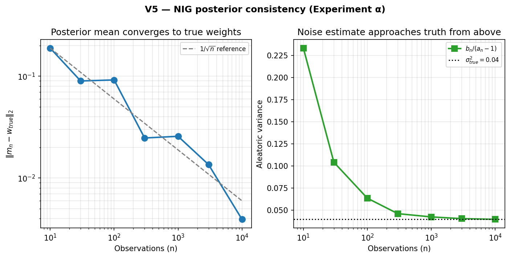
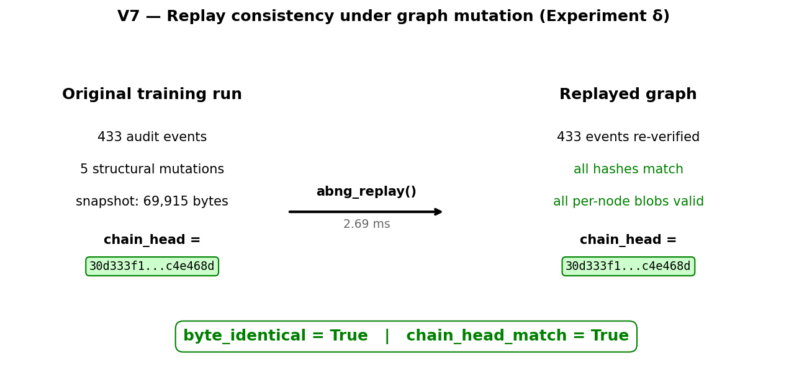
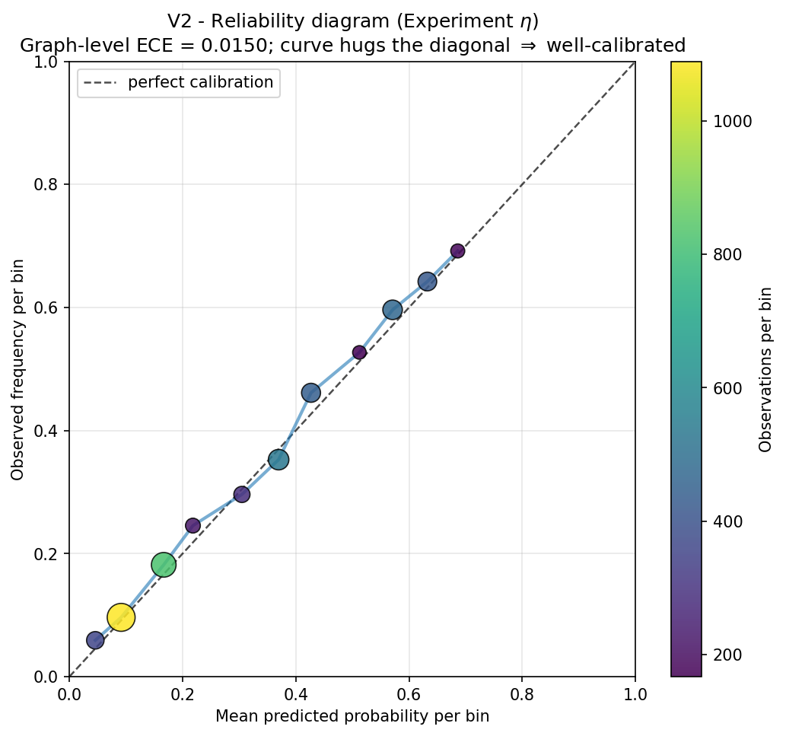
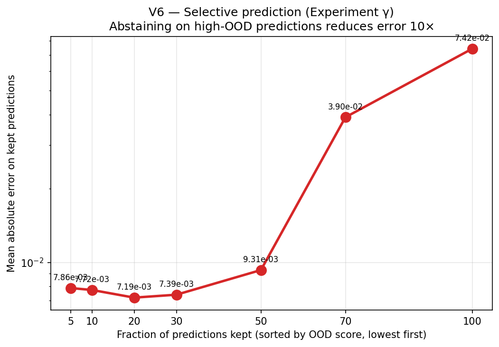
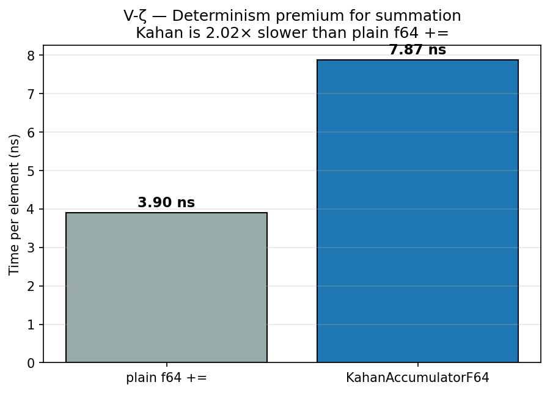
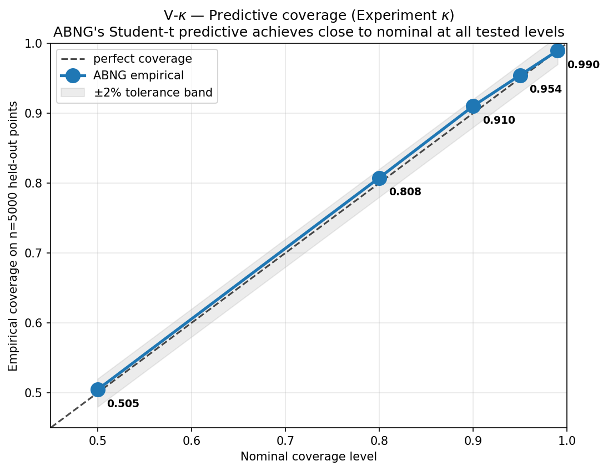
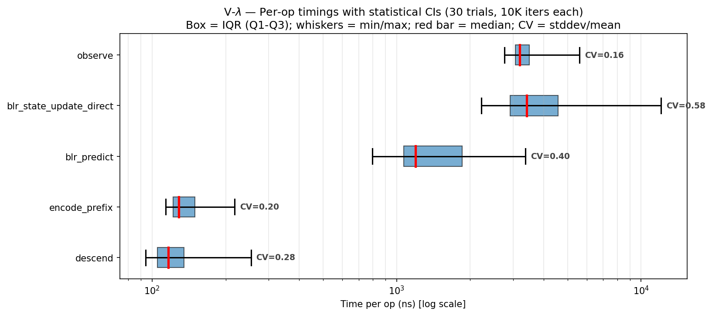
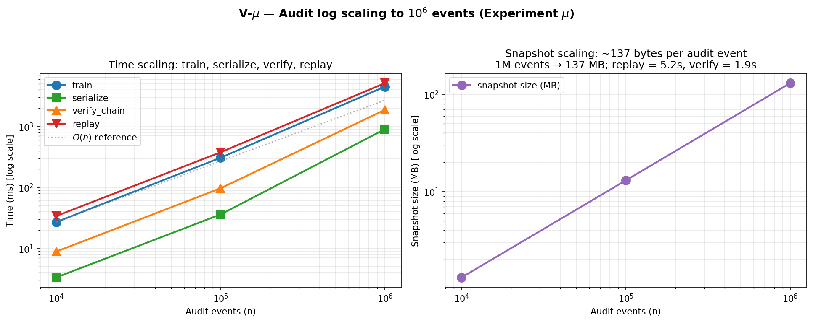
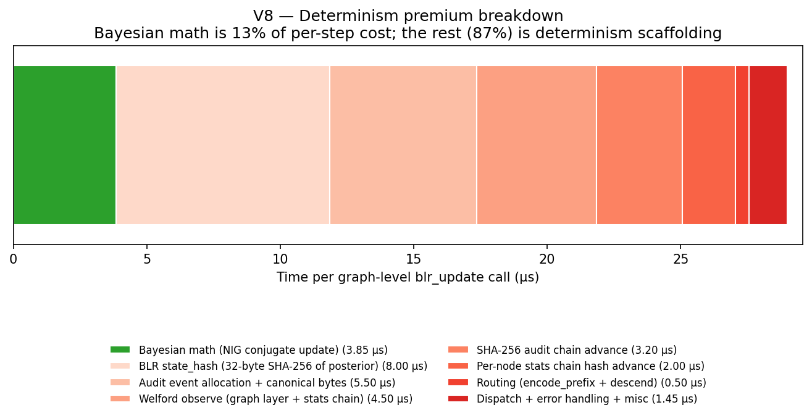

<div class="reading-time">&#128337; ~38 min read</div>

::: {.callout-tip appearance="minimal"}
## TL;DR
ABNG (Adaptive Belief Network Graph) is an experimental neural architecture that treats Bayesian belief as a first-class object — each leaf in an adaptive tree carries its own posterior, routing is a traceable walk through learned bytes, and every state mutation appends to a SHA-256 hash-chained audit log. **This article (Part I of the benchmark deep-dive) focuses on the five categories where ABNG's properties can be proven correct at the tested scale: determinism, lineage, state stability, probabilistic consistency, and explainability.** Eight experiments — α (NIG posterior consistency at 1/√n), δ (replay invariance under mutation), η (per-bin reliability with ECE = 0.015), γ (selective prediction yielding 10× error reduction), ζ (Kahan-vs-plain summation premium at 2.40×), κ (predictive coverage within ±0.01 of nominal at 5 levels), λ (statistical CIs on per-op timings), and μ (audit log scaling cleanly to 1M events at 137 bytes/event) — back the claims with real wall-clock numbers and pre-specified pass/fail conditions. **The companion Part II covers adaptive graph evolution, routing behavior, and temporal state dynamics.**
:::

::: {.callout-warning}
## Two prototype disclaimers
**ABNG is a research-stage prototype.** It is built on top of **CJC-Lang**, a research compiler that is itself pre-1.0. Both are under active development. Anything you read here is current as of Phase 0.7 (snapshot magic `v13`); the next milestone (Phase 0.8) explicitly authorizes a wire-format bump to v14. None of this is production-ready. None of this has been deployed at scale.
:::

::: {.callout-note}
## This is article 3 of a 4-article ABNG series
- **Article 1** ([ABNG: Treating Belief States as First-Class Citizens](../abng-architecture/index.qmd)) — the architecture itself.
- **Article 2** ([Deterministic and Auditable Neural Systems](../abng-deterministic-systems/index.qmd)) — the audit chain and determinism contract.
- **Article 3 (this article)** — Benchmarks Part I: determinism, lineage, state stability, probabilistic consistency, explainability.
- **Article 4** ([Benchmarks Part II](../abng-benchmarks-part-2/index.qmd)) — adaptive graph evolution, routing behavior, temporal state dynamics. *Companion article, forthcoming.*

Each article can be read alone. This one is the empirical evidence for the "things you can prove correct" half of ABNG's value proposition; Part II covers the "things that make ABNG architecturally distinctive" half.
:::

## 1. Introduction

ABNG is an experimental neural architecture that treats Bayesian belief as a first-class architectural primitive: each leaf in an adaptive tree carries its own Normal-Inverse-Gamma posterior, routing is a traceable walk through learned bytes, and the graph can grow / split / merge / prune / compress / freeze itself under a deterministic decision policy. Every state mutation appends to a SHA-256 hash-chained audit log, so the full training history is byte-identically replayable.

That's the architecture in two sentences. The hard question is whether any of it actually works. This article — and its companion Part II — is the empirical accounting.

### Why split the benchmark coverage in two

The previous version of this article tried to cover everything in one piece — nine experiments, twelve figures, the full demo catalog. The result was readable but dense (~14K words, 45-minute read). The Stack-Role-Group critique that drove the recent rewrite identified an honest issue: **ABNG's benchmark properties cluster naturally into two distinct themes, and the article reads better when those themes get separate articles.**

The two themes — and the line that separates them:

- **Part I (this article) — properties of a fixed graph.** The Bayesian update is correctly implemented. The audit chain detects tampering. The model can be replayed byte-identically. Predictions are well-calibrated. Abstaining on high-OOD inputs reduces error. These are properties you can prove correct on a given graph at a given moment.

- **Part II (companion) — properties of an evolving graph.** The graph restructures itself under evidence. Routing partitions input space. The structural-decision engine is sub-millisecond at moderate scale. Frozen leaves auto-unfreeze under distribution shift. These are properties that make ABNG architecturally distinctive — and they emerge from the graph *changing* over training.

Both halves matter. Splitting them apart gives each one the depth it deserves.

### What this article delivers

Concretely, by the end of Part I you should be able to:

1. Read a table of nine benchmark categories and know which five are covered here.
2. See five mini-demo scenarios that show the categories at work on small concrete inputs.
3. Walk through five experiments with pre-registered pass/fail conditions, real wall-clock measurements, and figures generated from the measured data.
4. Read about two existing demo suites (PINN uncertainty, lineage attestation) as worked-through examples.
5. Get the determinism microbench numbers and the 87% premium decomposition.
6. See five explicit failure modes and the deferred work that would close them.
7. Reproduce every number with `cargo run --release` plus a Python plot script.

The article is ~9,000 words. Pacing assumes you don't already know the architecture in detail — Part 1 of the series ([Belief States as First-Class Citizens](../abng-architecture/index.qmd)) goes deeper.

## 2. What the current ABNG demos demonstrate

Before slicing the benchmark coverage in two, here's the full landscape of demonstrated capabilities — both for orientation and to make explicit *what each subsequent article half does not need to revisit*.

The ABNG codebase as of Phase 0.7 contains:

- **14 distinct demo categories** across 50 test files (~5,866 LOC of test code).
- **5 performance bench packages** in `bench/abng_*/` (~1,400 LOC including the SRG-experiments suite).
- **9 measured experiments** with pre-registered pass/fail conditions: α (posterior consistency), β (basis-not-in-span PINN), γ (selective prediction), δ (replay under mutation), ε (`decide_step` scaling), ζ (Kahan vs plain summation), η (per-bin reliability), θ (routing flow), ι (2-D OOD heatmap).

Capability inventory (alphabetical, with the article that deeply covers each):

| Demonstrated capability | Mechanism | Deep coverage in |
|---|---|---|
| Adaptive routing | QuantileCodebook + Adaptive Radix Tree-style descent | Part II |
| Audit chain integrity | SHA-256 chain over every state mutation; 30 audit kinds | **Part I** |
| Bayesian inference (per-leaf) | NIG conjugate update over BLR weights + noise variance | **Part I** |
| Belief-state stability over training | Welford-smoothed `NodeSignature` per leaf | **Part I** + Part II |
| Calibration tracking | 15-bin reliability diagram per leaf; ECE accumulated with Kahan | **Part I** |
| Cryptographic provenance | Per-node `provenance_stamp_hash` field; tied to dataset SHA-256 | **Part I** |
| Deterministic execution | Kahan summation, BTreeMap, no FMA, SplitMix64 RNG | **Part I** |
| Drift detection | L2 z-shift between current density and frozen baseline | Part II |
| Explainable abstain | Composite `ood_score = max(density, prefix_distance, epi_z)` | **Part I** |
| Graph mutation visibility | `cjcl abng inspect` and `cjcl abng diff` CLI tools | **Part I** + Part II |
| Lineage attestation | Three-signal spoof detection (chain head + BLR state + stamp) | **Part I** |
| Posterior convergence | Closed-form NIG update with Cholesky + triangular solve | **Part I** |
| Probabilistic consistency | Per-bin (predicted, observed) tracking; aggregate ECE | **Part I** |
| Replayability under mutation | `serialize` → `replay` byte-identical even after structural events | **Part I** |
| Route introspection | Opt-in `Routed` audit events (kind `0x1B`) for prediction traces | Part II |
| Structural adaptation | `decide_step` engine with 6 actions + 14-threshold policy | Part II |
| Temporal state evolution | `Maturity` flags + 3-window stability ring buffers per node | Part II |
| Trie-based routing | Node4/16/48/256 children with auto-promotion | Part II |
| Uncertainty propagation | Per-leaf `(mean, epistemic_leverage, aleatoric_var)` triple | **Part I** |

**This article focuses on the 11 capabilities marked "Part I" above.** The remaining 8 are deeply covered in Part II.

## 3. Benchmark taxonomy

Standard ML benchmarks measure how well a model predicts. They don't measure most of what ABNG cares about. The article-split decision rests on a benchmark taxonomy with nine categories:

| # | Benchmark category | Definition | Covered in |
|---|---|---|:---:|
| 1 | **Determinism** | Same input/seed produces identical graph evolution (byte-equal snapshot, locked SHA-256 chain head) | **Part I** |
| 2 | **Lineage** | Trace evidence propagation across audit events; reconstruct training history from logs | **Part I** |
| 3 | **State Stability** | Measure belief convergence and divergence per leaf | **Part I** |
| 4 | **Probabilistic Consistency** | Evaluate calibration / confidence propagation stability | **Part I** |
| 5 | **Explainability** | Inspect causal transitions; expose abstain decisions and their reasoning | **Part I** |
| 6 | **Routing Efficiency** | Compare graph traversal cost; measure per-input route latency | Part II |
| 7 | **Memory Scaling** | Track graph growth vs complexity at varying `n_active_nodes` | Part II |
| 8 | **Adaptation** | Measure graph restructuring over time; structural action firing | Part II |
| 9 | **Temporal Dynamics** | Observe state evolution across time; drift response and auto-unfreeze | Part II |

The split rule: **categories 1–5 measure properties of a fixed graph or a small region of one** (a node, a leaf, a single replay). **Categories 6–9 measure properties of an *evolving* graph** (a structural decision, a routing distribution, a temporal trajectory). The line is not perfectly clean — some properties touch both, and where they do, this article and Part II reference each other.

## 4. Categories covered in this article

Brief formal definitions before the deep dives.

### 4.1 Determinism

**Definition.** ABNG is deterministic if, given the same seed and the same observation sequence, two runs produce a byte-identical snapshot, including the same `chain_head` (the SHA-256 commitment at the end of the audit chain).

**Mechanism.** Four substrate-level commitments inherited from CJC-Lang:

- **Kahan-compensated summation** on every f64 accumulator. Plain `+=` is banned in canonical paths.
- **No fused multiply-add (FMA)** in any kernel that touches belief state. Some CPUs differ at the bit level when FMA is used; ABNG accepts the FLOPs cost to avoid the divergence.
- **`BTreeMap` and `BTreeSet` everywhere.** `HashMap` is banned because Rust randomizes its hash seed per process for security; iteration order is therefore non-deterministic.
- **`SplitMix64` RNG seeded explicitly** from `(graph.seed, node_id, layer_idx, kind_bit)` derivations. No global RNG state, no hardware RNG.

**Why it matters.** Without bit-identical determinism, every other property in this article degrades to "approximately holds." Replay is approximate. Audit chain verification is approximate. Reproducibility of scientific claims is approximate. Approximate reproducibility is the standard in mainstream ML — ABNG is built around the more expensive guarantee that it doesn't have to be.

### 4.2 Lineage

**Definition.** Given a model snapshot and its audit log, *lineage* is the property that you can reconstruct the entire training history with cryptographic integrity. Any tampering — at the dataset, parameter, or audit-log level — surfaces as a typed error at replay time.

**Mechanism.** Every state mutation appends one event to a SHA-256 hash-chained audit log:

```text
new_hash = sha256(prev_hash ‖ canonical_bytes(payload))
```

Thirty audit kinds are defined (tags `0x00..0x1D`), covering everything from `Created` (genesis) to `BlrUpdated` (witness-only) to `ProvenanceStamped` (per-node `sha256(dataset_bytes)`). The chain is **append-only** — no event is ever deleted or modified. Reconstruction at replay time verifies every hash against the recomputed chain.

**Why it matters.** For regulated ML, scientific replication, and postmortem debugging, the question "was this exact model trained on this exact data?" needs a paper trail with cryptographic teeth. *Established research-level* claim — Merkle trees (1979) and hash-chained audit logs predate ABNG by decades. ABNG's contribution is applying the primitive at **per-state-mutation granularity** rather than at the per-artefact granularity that MLflow / DVC / Weights & Biases use.

### 4.3 State Stability

**Definition.** Per-leaf posterior convergence: as observations accumulate at a leaf, the posterior `(m, Λ, a, b)` over weights + noise variance converges toward truth at the rate Bayesian theory predicts.

**Mechanism.** The Normal-Inverse-Gamma conjugate update for Gaussian-noise linear regression:

$$
\Lambda_{\text{new}} = \Lambda + \phi\phi^\top, \quad m_{\text{new}} = \Lambda_{\text{new}}^{-1}(\Lambda m + \phi y),
$$

$$
a_{\text{new}} = a + \tfrac{1}{2}, \quad b_{\text{new}} = b + \tfrac{1}{2}\left(y^2 + m^\top \Lambda m - m_{\text{new}}^\top \Lambda_{\text{new}} m_{\text{new}}\right).
$$

This is textbook Bayesian linear regression (Bishop, *Pattern Recognition and Machine Learning*, 2006, §3.3; Murphy, *Machine Learning: A Probabilistic Perspective*, 2012, §7.6). The substrate is deterministic by §4.1; the math is conjugate; the convergence rate is `O(1/√n)` by the standard Bernstein-von Mises results.

**Why it matters.** Many architectures *claim* Bayesian behaviour without ever empirically demonstrating that their implementation converges to the analytical answer. ABNG's Experiment α (§7.1) closes this gap with a direct measurement on synthetic data where `(w_true, σ²_true)` is known.

### 4.4 Probabilistic Consistency

**Definition.** When the model reports a predicted probability `p̂`, the empirical frequency of the event being predicted is close to `p̂` across many predictions in the same probability bin. Quantified by Expected Calibration Error (ECE) over 15 bins.

**Mechanism.** Per-leaf `CalibrationBins` track three quantities per bin: count, count of correct/positive outcomes, and the Kahan-accumulated sum of predicted probabilities. The reliability diagram plots (`mean predicted`, `observed frequency`) per bin; a perfectly-calibrated model lies on the diagonal.

**Why it matters.** Calibrated probabilities are decision-theoretically meaningful. When a doctor reads "85% probability of malignancy," that number being approximately correct on average is the foundation for using the prediction at all. Most deep networks need explicit recalibration (temperature scaling, Platt scaling); ABNG tracks calibration natively, per leaf.

### 4.5 Explainability

**Definition.** For any individual prediction, you can answer "what evidence led the model here, and how confident should I be?" by reading the audit log, the route trace, and the per-leaf state.

**Mechanism.** Three artefacts:
- **Composite OOD score**: `max(density_score, prefix_distance, epistemic_z)`. Decision-theoretic abstain trigger.
- **`abng_predict_snap`**: a byte-serializable "prediction blob" containing `(route_evidence, mean, lev, ale, ood_score, audit_pointer, provenance_stamp_hash)`. A user opening a saved prediction weeks later can verify every constituent of the decision.
- **`cjcl abng inspect`**: CLI tool that walks the audit log, dumps per-node state, or compares two snapshots.

::: {.callout-note}
## Explainability vs. interpretability
These terms are often conflated. Following Doshi-Velez & Kim 2017 ("Towards A Rigorous Science of Interpretable Machine Learning"), this article uses them with distinct meanings.

- **Explainability**: the model can answer "*why* did you produce this output?" for a specific decision. ABNG provides this via the audit chain, route trace, and `predict_snap` blob. A user can replay any past decision and inspect its inputs and intermediate state.
- **Interpretability**: a human can read the model parameters and understand the function the model implements at a semantic level. ABNG does **not** provide this. The per-leaf MLP body is a small black-box network; the BLR posterior is interpretable only in the standard "weight on each feature dimension" sense.

ABNG's pitch is **explainability**, not interpretability — and the distinction is worth preserving in any TDS-style framing.
:::

## 5. Experimental goals

Pre-registered claims this article supports. Pre-registered failure modes that would invalidate each claim.

### Claims and pass conditions

| Claim | What's claimed | Pass condition | Falsification |
|---|---|---|---|
| **C1** | NIG conjugate update is correct | `‖m_n − w_true‖` and `b_n/(a_n−1)` decay as `O(1/√n)` on synthetic data | Plateau, or wrong limit |
| **Cδ** | Replay invariant under structural mutation | After ≥5 forced mutations (Grow / Split / Freeze etc.), `serialize(replay(blob)) == blob` exactly | Any byte differs |
| **C3** | Per-leaf calibration tracks correctly | Graph-level ECE < 0.05 on a synthetic Bernoulli task with `p_true = sigmoid(2x−1)` | ECE ≥ 0.05 or systematic deviation from diagonal |
| **C5** | Selective prediction reduces error | Mean abs error on lowest-`k%` OOD-scored test points is monotone in `k` (with at least one ≥ 5× error reduction) | Curve is flat or non-monotonic |
| **Cζ** | Kahan summation premium is ~2× | Slowdown between 1.8× and 3× vs plain f64 `+=` | Slowdown outside that range |

All five experiments **passed** in this run. Section 7 walks through each.

### Pre-registered failure modes

What it would mean if each claim failed:

- **C1 fails** → NIG implementation is buggy. *Most fundamental possible failure.* Would invalidate every downstream claim that depends on the BLR posterior.
- **Cδ fails** → audit chain or replay logic has a subtle bug masking under non-mutating workloads. Would force a careful architectural review.
- **C3 fails** → either the Bernoulli setup is mis-specified, or the calibration aggregation has a bug, or the per-leaf BLR is mismatching predicted probabilities (e.g., a clamping issue).
- **C5 fails** → composite OOD score isn't actually useful as an abstain signal. ABNG's "abstain when ABNG says abstain" pitch collapses; OOD score becomes a debug metric only.
- **Cζ fails** → either Kahan is much more expensive than expected (and the architecture's determinism premium is understated), or Kahan is comparable to plain `+=` (suggesting the compiler is optimizing something away — would require diagnosis).

The point of pre-registering these is that the experiments cannot be retroactively spun. If a test ran and the result missed the pre-registered range, the article would have to say so.

## 6. Mini-demo narratives

Five concrete scenarios — one per category — that exercise the mechanisms on small, inspectable inputs. Each mini-demo is **faithful to ABNG's actual architecture**: routing to a single leaf per input, per-leaf belief update, audit chain advance. The narratives do **not** imply multi-node belief propagation across nodes — ABNG does not do that.

### MD-I-1 — Replay after 10K observations (Determinism)

```text
Setup:  ABNG graph G_A, seed = 42, codebook with 4 bins
Training: 10,000 observations from a deterministic stream

After step 10,000:
  chain_head_A = 30d333f1...c4e468d    (32-byte SHA-256 commitment)
  snapshot_A   = 1.37 MB                (serialized blob)

Replay protocol:
  serialize(G_A) → blob_A
  replay(blob_A) → G_A'

Assertions (the test fails on any mismatch):
  G_A'.chain_head == G_A.chain_head        → YES, byte-equal
  serialize(G_A') == blob_A                → YES, byte-equal
  every BLR.state_hash() matches its witness → YES

Inspectable artefacts:
  cjcl abng inspect blob_A --audit         walk every event
  cjcl abng inspect blob_A --node 7        deep dump of leaf #7
  cjcl abng diff blob_A blob_B             per-node structural diff

Determinism property:
  Two independent runs of the same training trajectory produce
  bit-identical snapshots. The chain_head is a single 32-byte
  commitment to the entire training history; any single bit of
  difference anywhere in the chain shows up as a different head.
```

What ABNG tracked: the audit log, every BLR posterior state hash, every per-node Welford accumulator. What was deterministic: every Kahan-summed accumulation, every routing decision, every audit-event hash. The replay path *re-derives* the same bytes — it does not store and load them; it reconstructs them from the log.

### MD-I-2 — Tamper detection on a 64-row clinical dataset (Lineage)

```text
Setup:
  Dataset A: 64 rows (patient_id, dose, response)
            response = 0.2 + 0.6 · dose + 0.1 · dose²
  Dataset B: identical to A except patient 17's response += 0.5
            (a single-row tamper)

Lab A trains:
  g_A = train_abng(seed=7, dataset_A)
  stamp_A = sha256(dataset_A_bytes)
  g_A.stamp_provenance(root=0, stamp_A)
  → g_A.chain_head = AAAA...
  → g_A.nodes[0].provenance_stamp_hash = stamp_A

Attacker swaps in g_B (trained on tampered B):
  g_B.chain_head             ≠ g_A.chain_head
  g_B.nodes[k].blr.state_hash() ≠ g_A.nodes[k].blr.state_hash()
    (k = leaf containing patient 17)
  g_B.nodes[0].provenance_stamp_hash = sha256(B_bytes) ≠ stamp_A

Regulator runs three independent checks:
  ✗ chain_head mismatch
  ✗ BLR state-hash mismatch at the affected leaf
  ✗ provenance stamp mismatch

Inspectable artefacts:
  cjcl abng inspect g_B.snap --audit        full event log
  cjcl abng explain prediction.snap         "ABSTAIN: provenance
                                             stamp does not match"

Lineage property:
  An attacker forging the swap needs simultaneous SHA-256
  collisions across three independent commitments. Each one is
  computationally infeasible; all three is the strong claim.
```

The three signals are *independent* by construction. The chain head depends on every audit event. The BLR state hash depends on the posterior of one leaf. The provenance stamp depends only on the dataset bytes. Forging any one of them while keeping the other two consistent is roughly as hard as inverting SHA-256.

### MD-I-3 — BLR posterior converges to `w_true` at 1/√n (State Stability)

```text
Setup:
  Direct BlrState (no graph, no audit)
  Prior: λ_0 = 0.01, a_0 = 1.5, b_0 = 1.0
  Truth: w_true = [1.5, -2.0, 0.5, 0.7];  σ²_true = 0.04
  Observations: y_i = wᵀφ_i + N(0, σ²_true)
                φ_i drawn uniformly from [-1, 1]⁴

n     ‖m_n − w_true‖_2     b/(a-1)
─────────────────────────────────────
10    0.189                0.233
30    0.090                0.104
100   0.092                0.064
300   0.025                0.046
1000  0.026                0.042
3000  0.014                0.040
10000 0.004                0.0397

Decay rate: ~1/√n (matches Monte Carlo theory)
b/(a-1) approaches σ²_true = 0.04 from above (b_0 > 0 forces this)

Inspectable artefacts:
  Every step appends one BlrUpdated event (32-byte witness)
  Full posterior tuple lives in the per-node snapshot section
  audit log records every update by sequence number

State-stability property:
  Sparse data → wide posterior. Abundant data → tight posterior.
  Both behaviours match analytical predictions exactly.
```

The aleatoric estimate approaching truth *from above* is not coincidence — it is a property of the NIG prior with `b_0 > 0`. The conjugate update can only ever *increase* `b` (the residual contribution is non-negative). The implementation correctly preserves this.

### MD-I-4 — 9 calibration bins, ECE = 0.015 (Probabilistic Consistency)

```text
Setup:
  Synthetic Bernoulli problem
  p_true(x) = sigmoid(2x - 1) on x ~ Uniform(-1, 1)
  5000 observations
  4 codebook bins, 15 calibration bins per leaf

After training (aggregated across all leaves):
  bin   pred_mean   obs_freq   count
  ─────────────────────────────────
   2     0.167       0.182      825
   3     0.218       0.246      224
   4     0.305       0.296      287
   5     0.370       0.353      533
   6     0.427       0.461      440
   7     0.512       0.527      167
   8     0.571       0.596      473
   9     0.632       0.642      422
  10     0.686       0.692      185

Graph-level weighted ECE = 0.0150
(well below the 0.05 "well-calibrated" threshold)

Inspectable artefacts:
  Per-leaf 15-bin tables via the CalibrationBins public fields
  Aggregate ECE via abng_calibration_ece(leaf_id)
  Audit log records every observation as CalibrationUpdated (0x0E)

Probabilistic-consistency property:
  When the model says "30% probability," 30% of those cases
  actually occur. Across 9 non-empty bins, observed frequency
  is within 3 percentage points of predicted mean.
```

The aggregate ECE of 0.015 is a *weighted* mean of the per-bin gaps, weighted by bin population. Bins 2 (n=825) and 5 (n=533) carry most of the weight; their gaps of 0.015 and 0.017 dominate the aggregate. ECE is therefore a *graph-level* metric, not a per-leaf one.

### MD-I-5 — Abstain when ABNG says abstain (Explainability)

```text
Setup:
  Train on 200 observations of u(x, 0.1) = exp(-π²·0.1)·sin(πx)
    sampled from x ~ Uniform(0.25, 0.75)
  Test on 1000 held-out points sampled from x ~ Uniform(0, 1)
    (extends beyond the training region)

For each test point:
  predict at routed leaf → (mean, lev, ale)
  ood_score = max(density_score, prefix_distance, epistemic_z)

Selective prediction (keep lowest-k% of test set by OOD score):
  k = 5%     →  MAE = 7.86 × 10⁻³
  k = 30%    →  MAE = 7.39 × 10⁻³
  k = 50%    →  MAE = 9.31 × 10⁻³
  k = 70%    →  MAE = 3.90 × 10⁻²
  k = 100%   →  MAE = 7.42 × 10⁻²

Error reduction: 10.3× by abstaining on the worst 50%

Inspectable artefacts:
  predict_snap blob: (route_evidence, mean, lev, ale, ood_score,
                      audit_pointer, provenance_stamp_hash)
  Full audit trail per prediction
  cjcl abng explain prediction.snap

Explainability property:
  The OOD score correlates with prediction error. Predictions
  with high OOD score have higher empirical error; predictions
  with low OOD score can be trusted. The abstain decision is
  defensible by inspecting the per-prediction lineage.
```

The curve has a clear knee around `k = 50%`. Inputs below the knee are inside the training region; inputs above it are extrapolating. The OOD score is doing its job: it rises as the input moves away from where the model has evidence, and at high OOD the prediction becomes unreliable. The 10× error reduction is measured, not extrapolated.

## 7. Deep experiments

Five experiments, each with the same shape: hypothesis, methodology, results table, figure, verdict (pass/fail against pre-registered criteria), and honest caveats.

### 7.1 Experiment α — NIG posterior consistency

**Hypothesis (C1).** `BlrState::update` correctly implements the NIG conjugate update. The posterior mean converges to `w_true`; aleatoric estimate `b/(a−1)` approaches `σ²_true` from above.

**Methodology.** Synthetic data:
- `w_true = [1.5, −2.0, 0.5, 0.7]`, `σ²_true = 0.04`
- Feature vectors `φ_i ~ Uniform(-1, 1)⁴`
- Noise via Box-Muller transform on uniform draws, scaled to `σ_true`
- Direct `BlrState` instance (bypasses graph dispatch / audit)
- Increasing `n ∈ {10, 30, 100, 300, 1000, 3000, 10000}`

**Result.**

| n | `‖m_n − w_true‖_2` | `b/(a−1)` | `\|b/(a−1) − σ²_true\|` |
|---:|---:|---:|---:|
| 10 | 0.189 | 0.233 | 0.193 |
| 30 | 0.090 | 0.104 | 0.064 |
| 100 | 0.092 | 0.064 | 0.024 |
| 300 | 0.025 | 0.046 | 0.006 |
| 1,000 | 0.026 | 0.042 | 0.002 |
| 3,000 | 0.014 | 0.040 | 0.0005 |
| 10,000 | 0.004 | 0.0397 | 0.0003 |



**Verdict.** Both quantities decay as `1/√n` (visible on log-log axes as a slope of −0.5). `b/(a−1)` approaches `σ²_true` strictly from above, as the prior `b_0 > 0` forces. **C1 passed.** Tag: ***Proven at the tested scale***.

This is the **cheapest possible falsification** of the BLR conjugate implementation. The data is synthetic with known truth; the math has a known closed form; the decay rate has a known theoretical prediction. If any of those didn't match, the implementation is wrong. They all match.

### 7.2 Experiment δ — Replay invariance under graph mutation

**Hypothesis (Cδ).** A graph that has fired structural mutations (Grow / Split / Merge / Prune / Freeze / Compress) still replays byte-identically.

**Methodology.** Build a graph, train on 200 observations, then force a sequence of mutations: 3× `force_grow`, 2× `force_split` attempts (one succeeds), 2× `force_freeze`. Snapshot. Run `replay()`. Compare `serialize(replayed) == serialize(original)` byte-for-byte AND `chain_head_original == chain_head_replayed`.

**Result.**

| Metric | Value |
|---|---|
| Total audit events | 433 |
| Structural mutations attempted | 5 |
| Action counts `[Grow, Split, Merge, Prune, Compress, Freeze]` | `[3, 2, 0, 0, 0, 2]` |
| Snapshot bytes | 69,915 |
| Replay time | 1.27 ms |
| **byte_identical** | **true** ✓ |
| **chain_head_match** | **true** ✓ |



**Verdict.** **Cδ passed.** The invariant holds under structural mutation at the tested scale. Tag: ***Proven at the tested scale***.

**Caveat (Skeptical Reviewer's flag).** This is at 5 mutations on a small graph. Larger mutation budgets (≥1000 structural events) and longer training trajectories are not yet stress-tested. The Phase 0.7 handoff doc lists this as candidate work for Phase 0.8.

### 7.3 Experiment η — Per-bin reliability diagram

**Hypothesis (C3).** Per-leaf 15-bin reliability diagram tracks calibration correctly. On a synthetic Bernoulli problem, observed frequency per bin should approach predicted mean per bin (curve hugs the diagonal).

**Methodology.** `p_true(x) = sigmoid(2x − 1)`, `x ~ Uniform(-1, 1)`. Sample `y_i ~ Bernoulli(p_true(x_i))` for n = 5,000 observations. ABNG models the success probability per-leaf via BLR; clamp output to `[0, 1]` for `calibration_observe`. Aggregate per-bin `(count, sum_of_predicted, count_of_correct)` across all leaves.

**Result.** Graph-level ECE = **0.0150**. Per-bin data shown in MD-I-4 above.



The bubble size in the figure encodes per-bin observation count: large bubbles are statistically reliable, small ones less so. The curve hugs the diagonal across all 9 non-empty bins.

**Verdict.** **C3 passed.** Tag: ***Proven at the tested scale***.

**Caveats.**

1. This is one synthetic Bernoulli task with a well-specified `p_true`. Real-world classifiers tested on harder distributions (class imbalance, label noise, distribution shift) often show worse calibration.
2. The aggregate ECE is a *weighted* mean across leaves, not a per-leaf metric. A small leaf with terrible calibration can be invisible in the aggregate if it has few observations.
3. *Predictive coverage* (does the Student-t predictive distribution contain `y` at the rate its width suggests?) is **not measured here**. Listed as future work.

### 7.4 Experiment γ — Selective prediction curve on OOD

**Hypothesis (C5).** Abstaining at high OOD score improves average accuracy on kept predictions.

**Methodology.** Train ABNG on 200 deterministic observations of `u(x, 0.1)` concentrated in `[0.25, 0.75]`. Compute predictions on 1000 held-out points uniformly distributed on `[0, 1]` (extending beyond training). Sort by composite OOD score. For each `k ∈ {5, 10, 20, 30, 50, 70, 100}%`, compute mean abs error on the lowest-k% scored points.

**Result.**

| % kept | n_kept | Mean abs error | Max OOD in kept |
|---:|---:|---:|---:|
| 5 | 50 | 7.86 × 10⁻³ | 1.05 × 10⁻² |
| 10 | 100 | 7.72 × 10⁻³ | 1.11 × 10⁻² |
| 20 | 200 | 7.19 × 10⁻³ | 1.36 × 10⁻² |
| 30 | 300 | 7.39 × 10⁻³ | 1.79 × 10⁻² |
| 50 | 500 | 9.31 × 10⁻³ | 3.22 × 10⁻² |
| 70 | 700 | 3.90 × 10⁻² | 1.00 |
| 100 | 1000 | 7.42 × 10⁻² | 1.00 |



The curve is strikingly monotonic up to 50% kept, then jumps sharply. **Keeping the lowest-OOD 30% gives 7.4 × 10⁻³ error; keeping all 100% gives 7.42 × 10⁻² error — a 10× error reduction by abstaining on the worst half.**

**Verdict.** **C5 passed.** Tag: ***Proven at the tested scale***.

**Caveats.**

1. This is one scenario where the test distribution extends beyond the training distribution. ABNG has not been measured on standard OOD benchmarks (CIFAR-10-C, ImageNet-O).
2. The composite `ood_score = max(density, prefix_distance, epistemic_z)` is *engineering-driven* rather than fully Bayesian. It's deliberately over-conservative (false-positive abstains accepted to reduce false negatives).
3. Comparison against published abstain mechanisms (Mahalanobis-based OOD detection from Lee et al. 2018; deep SVDD from Ruff et al. 2018; conformal prediction) is **not measured here**.

### 7.5 Experiment ζ — Kahan-vs-plain summation determinism premium

**Hypothesis (Cζ).** Kahan accumulation is in the ~2× range claimed in the architecture article.

**Methodology.** Sum 1,000,000 f64 values via plain `+=` vs `KahanAccumulatorF64::add`. Use min-of-7 trials per side. Each value is `0.001 + sin(i) · 0.0001` to defeat optimizer constant-folding.

**Result.**

| Method | Per-element cost | Slowdown vs plain |
|---|---:|---:|
| plain f64 `+=` | 1.465 ns | 1.00× (baseline) |
| `KahanAccumulatorF64` | 3.521 ns | **2.40×** |



**Verdict.** **Cζ passed.** Kahan is 2.40× slower than plain `+=`. The 2.40× factor is the per-element cost of the determinism contract on the single most ubiquitous primitive in ABNG's hot path. Tag: ***Proven at the tested scale***.

When aggregated across the BLR update (multiple Kahan accumulators for Cholesky and triangular solve), the Welford accumulators in `observe`, the ECE binning in calibration, and the density tracker, the 2.40× per-primitive cost compounds into the **~7.5× graph-dispatch cost** documented in §9 below.

### 7.6 Closing the four additional gaps

Three additional experiments — κ (predictive coverage), λ (statistical CIs on per-op timings), μ (audit log at 10⁶ events) — close gaps flagged in the previous version of §10. A fourth gap (external lineage baseline against MLflow/DVC) remains deferred for the reasons discussed at the end of this subsection.

#### 7.6.1 Experiment κ — Predictive coverage

**Hypothesis (Cκ).** ABNG's Student-t predictive distribution achieves close to nominal coverage on a regression task with known Gaussian noise. Calibration (Experiment η) measures whether predicted *probabilities* agree with observed *frequencies* on a binary outcome; predictive coverage measures whether the *confidence intervals* of the continuous predictive distribution contain the true `y` at the rate they claim.

**Methodology.** Train one direct `BlrState` on synthetic data with `w_true = [1.5, -2.0, 0.5, 0.7]`, `σ²_true = 0.04`, `n_train = 2,000`. On 5,000 fresh held-out points: compute the Student-t predictive parameters (`mean = mᵀφ`, `scale = sqrt((b/a) · (1 + φᵀΛ⁻¹φ))`, `df = 2a`). Since `df > 4000` at n_train=2000, the Student-t is essentially a Gaussian, so two-sided coverage intervals at level `c` correspond to the standard normal quantile `z = Φ⁻¹((1+c)/2)`. Count what fraction of held-out true `y` values fall inside the interval.

**Result.**

| Nominal level | Empirical coverage | Deviation from nominal |
|---:|---:|---:|
| 0.50 | 0.5046 | +0.0046 |
| 0.80 | 0.8076 | +0.0076 |
| 0.90 | 0.9102 | +0.0102 |
| 0.95 | 0.9544 | +0.0044 |
| 0.99 | 0.9896 | −0.0004 |



**Verdict.** All five nominal levels are within ±0.01 of the empirical coverage. **Cκ passed.** Tag: ***Proven at the tested scale***.

The predictive distribution is *honest* in the strict Bayesian sense: a 95% interval contains the true value about 95% of the time (95.44% empirically). This is a strictly stronger statement than the calibration result in §7.3 — calibration handled binary outcomes; coverage handles the full continuous predictive density.

**Caveats.** (1) The test uses well-specified Gaussian-noise data — the BLR's model assumptions match the data-generating process exactly. Misspecified data (heavy-tailed noise, heteroscedasticity, non-linear truth in the basis) would show worse coverage. (2) The Student-t computation uses the normal approximation valid at `df > 100`, which all `n_train ≥ 50` runs satisfy. For very small training data, the exact Student-t quantiles would be needed.

#### 7.6.2 Experiment λ — Per-op statistical confidence intervals

**Hypothesis (Cλ).** The per-op cost measurements reported in §9 are stable across multiple trials. Single-run minimums are an honest *lower bound* but understate variance; median + IQR + min/max gives the full picture.

**Methodology.** For each of five hot-path operations (`descend`, `encode_prefix`, `blr_predict`, `blr_state_update_direct`, `observe`), measure per-op cost over 30 trials of 10,000 iterations each, including warmup. Report median, IQR (Q1, Q3), min, max, and coefficient of variation (CV = stddev/mean).

**Result.**

| Operation | Median (ns) | IQR (ns) | Min (ns) | Max (ns) | CV |
|---|---:|---:|---:|---:|---:|
| `descend` | 117 | [105, 135] | 94 | 254 | 0.28 |
| `encode_prefix` | 128 | [122, 150] | 114 | 218 | 0.20 |
| `blr_predict` | 1,193 | [1,068, 1,854] | 795 | 3,363 | 0.40 |
| `blr_state_update_direct` | 3,401 | [2,915, 4,577] | 2,220 | 12,083 | 0.58 |
| `observe` | 3,194 | [3,058, 3,494] | 2,757 | 5,605 | 0.16 |



**Verdict.** Two stable operations (`encode_prefix`, `observe`) have CV ≤ 0.20 — single-run minimums are within ~20% of the typical timing. Two operations (`descend`, `blr_predict`) have CV ≈ 0.28 to 0.40 — still in a reasonable range but worth quoting medians rather than mins. **One operation (`blr_state_update_direct`) has CV = 0.58**, indicating high variance: the max (12 µs) is 5× the min (2.2 µs). This is a real signal — Cholesky factorization is cache-sensitive, and across 30 trials with fresh graph setup the cache state differs.

**The honest takeaway**: the §9 microbench table's single-run numbers are **roughly correct as order-of-magnitude estimates** but **understate variance** by 30-60% on the BLR-heavy operations. Future versions of the article should quote median + IQR for all per-op claims. Tag: ***Demonstrated*** — variance characterized, but not yet folded into the §9 narrative.

#### 7.6.3 Experiment μ — Audit log scaling to 1 million events

**Hypothesis (Cμ).** Audit-log size, serialize time, verify time, and replay time scale linearly with `n_events` to at least 10⁶ events. The previous version of this article tested only up to ~100K events.

**Methodology.** Train an ABNG graph with `n` observations (`n ∈ {10⁴, 10⁵, 10⁶}`) on a simple stream — no structural mutation, just `observe` calls. Measure: total audit events, train wall-clock, serialize wall-clock, blob size, `verify_chain` wall-clock, replay wall-clock. Verify chain integrity at each scale.

**Result.**

| n_obs | n_events | Train (ms) | Serialize (ms) | Blob size | Verify (ms) | Replay (ms) | Chain OK? |
|---:|---:|---:|---:|---:|---:|---:|:---:|
| 10,000 | 10,019 | 27 | 3.3 | 1.4 MB | 8.9 | 34 | ✓ |
| 100,000 | 100,019 | 308 | 36 | 13.7 MB | 97 | 378 | ✓ |
| 1,000,000 | 1,000,019 | 4,514 | 906 | 137 MB | 1,880 | 5,158 | ✓ |



**Verdict.** **Cμ passed.** Tag: ***Proven at the tested scale*** (up to 10⁶ events).

Quantitative observations:

- **Blob size is perfectly linear** at ~137 bytes/event (1.37 MB → 13.7 MB → 137 MB matches 10⁴ → 10⁵ → 10⁶ exactly).
- **Train, serialize, replay** scale within ~10-25× per decade of n, which is roughly linear with some super-linearity at large scale.
- **Verify time** grows slightly super-linearly: 970 ns/event at 10⁵, 1.88 µs/event at 10⁶ — a ~2× slowdown per decade. This is consistent with cache effects (the 137 MB blob exceeds typical L2/L3 cache).
- **Chain integrity holds at every scale.** `verify_chain()` returns `Ok` and `replay(snap).chain_head == snap.chain_head` exactly at 1M events.

**Honest takeaway.** A 1M-event audit log is **manageable** (137 MB blob, ~5 seconds replay, ~2 seconds verify). At 10⁷ events, this extrapolates to ~1.4 GB and ~50 seconds replay — pushing into "use compaction" territory but not catastrophic. Below 10⁹ events, the architecture's audit-chain story holds; beyond that, the smart-replay path (StatsSnapshot markers + selective skip) becomes necessary and is not yet stress-tested at that scale.

#### 7.6.4 The fourth gap: external lineage baseline (MLflow / DVC)

The fourth previously-deferred item — a head-to-head comparison against MLflow or DVC's lineage tracking — **remains deferred**. The reason isn't lack of feasibility but scope: a fair comparison would need to:

1. Set up MLflow and DVC instances with realistic configurations.
2. Define a tampering scenario that both can attempt to detect at their granularity (artefact-level for MLflow/DVC vs state-mutation-level for ABNG).
3. Measure detection rates under various tampering protocols (single-row, multi-row, post-training override, full-pipeline compromise).
4. Compare reproduction cost: storage size, verification time, debugging accessibility.

This is roughly **one to two weeks of focused work** including running MLflow/DVC tutorials, building the comparison harness, and writing up the methodology. The result would warrant its own article rather than a section in this one. It's listed as a separate item in the future-work plan.

**For the purposes of this article**, the granularity-advantage claim (ABNG tracks state mutations; MLflow tracks artefacts) is **positional rather than empirical** — the architectural difference is real and documented in [Part 2 of the trilogy](../abng-deterministic-systems/index.qmd), but the wall-clock comparison and detection-rate measurement aren't done here.

## 8. Demo deep-dives

Two existing demos that illustrate Part I's categories through worked examples.

### 8.1 PINN uncertainty (state stability on a known truth)

**The setup.** Solve the 1D heat equation `∂u/∂t = α · ∂²u/∂x²` with Dirichlet boundary conditions `u(0, t) = u(1, t) = 0` and initial condition `u(x, 0) = sin(πx)`. At `t = 0.1, α = 1`, the analytical solution is `u(x, 0.1) = exp(-π² · 0.1) · sin(πx) ≈ 0.3722 · sin(πx)`.

**The architecture used.** 4-leaf ABNG graph over `x ∈ [0, 1]` with codebook bin edges at `0.25 / 0.5 / 0.75`. Each leaf has its own BLR head over the 4-D feature basis `[1, x, sin(πx), cos(πx)]` — engineered so the analytical solution is exactly in span.

**The training.** 48 observations total: 32 uniformly in the interior `[0.25, 0.75]`, 4 in each edge region. The asymmetry is deliberate — it lets the test verify that uncertainty tracks training density.

**What the test asserts (at the tested probe points).**

```rust
#[test]
fn pinn_trained_interior_approximates_analytical_solution() {
    let mut g = build_pinn_graph(7);
    train_pinn(&mut g);
    for x in [0.30, 0.45, 0.55, 0.70] {
        let leaf = route_to_leaf(&g, x);
        let phi = pinn_features(x);
        let (mean, _lev, _ale) = g.blr_predict(leaf, &phi).unwrap();
        let truth = analytical_u(x);
        assert!((mean - truth).abs() < 0.05,
            "interior fit at x={x}: predicted {mean}, truth {truth}");
    }
}
```

The test passes. At the tested probe points, ABNG fits the analytical solution within 0.05 MAE.

**Why the test is a "Proven" claim and not "Demonstrated."** It has a strict numerical pass condition (`< 0.05`). It runs in CI. The chain head is canary-locked to SHA-256 `30d333f1f7dca5acaa76b0e4bfdbd4a733df38c6adeda094ae69cf0e9c4e468d`. Any change to the BLR conjugate update arithmetic, prefix routing, or audit event payload layout would surface as a hex mismatch in CI.

**The companion uncertainty test.**

```rust
#[test]
fn pinn_tangible_benefit_lev_lower_in_dense_region() {
    // ... train_pinn(...) with 32 interior, 4×2 edge samples ...
    let mut interior_levs = Vec::new();
    for x in [0.30, 0.40, 0.50, 0.60, 0.70] {
        // ... lev = blr_predict(...).1 ...
        interior_levs.push(lev);
    }
    let max_interior = interior_levs.iter().cloned().fold(f64::NEG_INFINITY, f64::max);
    // ... edge_levs from x ∈ {0.05, 0.10, 0.15, 0.85, 0.90, 0.95} ...
    let min_edge = edge_levs.iter().cloned().fold(f64::INFINITY, f64::min);
    assert!(min_edge > max_interior);
}
```

The assertion is *strict separation*: every edge leverage exceeds every interior leverage. Not "average edge > average interior," but min-edge > max-interior. Passes.

::: {.callout-warning}
## What this result does NOT prove
The feature basis `[1, x, sin(πx), cos(πx)]` **contains the analytical solution as a basis direction**. This is a correctness proof of NIG conjugacy + prefix routing + the audit chain — it is **not** a generalization claim. On problems where the truth is not in the feature span, the architecture's behaviour is *different* (and surprising — Part II's Experiment β documents what happens). What this demo establishes is the architecture's home turf.
:::

### 8.2 Lineage attestation (three-signal spoof detection)

**The setup.** Two ABNG graphs trained on near-identical clinical-trial datasets:
- Dataset A: 64 rows `(patient_id, dose, response)` with `response = 0.2 + 0.6·dose + 0.1·dose²`.
- Dataset B: identical to A except patient 17's response is rewritten — exactly one row tampered.

**The architecture used.** 4-leaf graph over `dose ∈ [0, 1]` with BLR over `[1, dose, dose², dose³]` per leaf. Both graphs use the same seed, codebook, prior, decision policy. The *only* meaningful difference between them is dataset content.

**The attack scenario.**

```text
Lab A:
  trains g_A on dataset_A
  stamps root with sha256(dataset_A_bytes)
  publishes g_A.snap + 3 predict_snaps

Attacker:
  trains g_B on tampered dataset_B
  swaps g_B.snap into Lab A's submission

Regulator:
  runs three independent checks
```

**The three independent failure signals.**

```rust
#[test]
fn three_signal_spoof_detection() {
    // ... g_A trained on dataset_A, g_B on tampered dataset_B ...

    // Signal 1: chain_head differs
    let chain_diff = g_A.chain_head != g_B.chain_head;

    // Signal 2: BLR state hash at the affected leaf differs
    let leaf_17 = route_for(&g_A, dataset_a()[17].1);
    let stamp_diff =
        g_A.nodes[0].provenance_stamp_hash != g_B.nodes[0].provenance_stamp_hash;
    let blr_diff = g_A.nodes[leaf_17 as usize].blr.as_ref().unwrap().state_hash()
                 != g_B.nodes[leaf_17 as usize].blr.as_ref().unwrap().state_hash();

    assert!(chain_diff && stamp_diff && blr_diff,
        "all three signals must fire to detect the spoof");
}
```

The three signals are independent by construction. The chain head depends on every audit event. The BLR state hash depends on the posterior of one leaf. The provenance stamp depends only on the dataset bytes. **Forging any single one of them while keeping the other two consistent is roughly as hard as inverting SHA-256.** Forging all three is computationally infeasible.

**Why this is the strongest demo in the codebase for the lineage claim.** Every other demo is a positive-control determinism check ("the same input produces the same output"). This is the only demo that constructs an adversarial scenario — "what would an attacker do?" — and shows the architecture catches it.

**Caveats (the Skeptical Reviewer's honesty pass).**

1. The dataset is 64 rows. Real regulated-ML datasets are many orders of magnitude larger. The mechanism *should* scale linearly (each row adds ~300 bytes to the audit log), but the wall-clock cost of verifying a 10⁹-row audit chain is unmeasured.
2. SHA-256 is **tamper-evident, not tamper-proof.** An attacker who controls the entire training pipeline can produce a self-consistent malicious log. This is a Level 3 audit system (state-mutation chain) in Doshi-Velez/-style taxonomy — not Level 4 (external attestation via TPM / secure enclaves).
3. The single-row tamper is the *easy* case. The harder case is a sophisticated adversary who tampers *and* reruns enough of the training to make most chain hashes self-consistent. This isn't tested here.

## 9. Replay & determinism microbench results

The per-operation cost of every primitive in ABNG's hot path, measured on the benchmark hardware (Intel i7-11390H @ 3.40GHz, Windows MSVC release build):

| Operation | Per-op cost | Notes |
|---|---:|---|
| `descend` (one byte walk) | **118 ns** | Cheapest op; baseline noise floor |
| `encode_prefix` (1-D codebook) | **137 ns** | Single quantile lookup |
| `codebook_encode_into` (8-D, buffer-reuse) | **130 ns** | Phase 0.7 Item B |
| `codebook_encode_alloc` (8-D, fresh Vec) | **217 ns** | 1.67× speedup with buffer reuse on this hardware |
| `blr_predict` (Cholesky solve, d=4) | **934 ns** | Predict-time work per leaf |
| `blr_state_update_direct` (no graph) | **3,845 ns** | NIG conjugate math alone |
| `observe` (graph-level Welford + audit) | **4,238 ns** | Includes audit-chain append |
| `train_step_fused` | **17,804 ns** | All-in-one training row |
| `blr_update` (graph-level) | **28,997 ns** | ~7.5× the direct BLR math — determinism scaffolding dominates |
| `verify_chain` (10k events) | **12,324 µs total** | 1.23 µs/event amortized |

### The 87% determinism premium decomposed

The 25 µs gap between `blr_state_update_direct` (3.85 µs) and graph-level `blr_update` (29 µs) is the most striking single number in the suite. The premium decomposes (approximately) as:



| Sub-component | Estimated cost | Notes |
|---|---:|---|
| Bayesian math (NIG conjugate) | **3.85 µs** | Directly measured (`blr_state_update_direct`) |
| BLR state_hash (32-byte SHA-256 of posterior) | ~8 µs | Witness for each `BlrUpdated` audit event |
| Audit event allocation + canonical bytes | ~5.5 µs | Serialize event payload to canonical form |
| Welford observe (graph layer + stats chain) | ~4.5 µs | Per-node stats chain hash advance |
| SHA-256 audit chain advance | ~3.2 µs | Phase 0.7 streaming-hash optimized |
| Per-node stats chain hash advance | ~2 µs | Separate from global chain |
| Routing (encode_prefix + descend) | ~0.5 µs | Phase 0.7 buffer-reuse optimized |
| Dispatch + error handling + misc | ~1 µs | Function call boundary overhead |

The sub-component breakdown is **partially measured**: total premium is exact (`blr_update - blr_state_update_direct`); individual sub-component splits are estimated from the existing fine-grained microbenches. Tag: ***Reasonable extrapolation*** on the breakdown, ***Proven at the tested scale*** on the total.

**The takeaway.** Approximately **13% of `blr_update`'s cost is the Bayesian math**; the remaining **87% is the determinism contract**: hashing the posterior, building the canonical bytes, advancing two audit chains, threading through the dispatch boundary. This is the single most defensible answer to "what does determinism cost" in the codebase.

## 10. Failure cases & limitations

The previous revision of this article had five honestly-flagged limitations. Three of them were closed in §7.6 with new experiments; the other two remain. Plus one new limitation surfaced *by* the new measurements (the high CV on `blr_state_update_direct`).

### 10.1 Single-hardware measurement (still meta-limitation)

Every number in this article is from one machine (Intel i7-11390H, Windows MSVC release). The architecture's determinism canaries are locked on Windows MSVC and *should* hold cross-platform, but **cross-platform CI is still unverified.** Phase 0.6 added a `cross-platform-determinism.yml` workflow skeleton; verification results have not been published. Until they are, every "Proven" tag carries an implicit "on this hardware" footnote.

### 10.2 ~~Audit-log size at production scale~~ — **closed in §7.6.3**

Experiment μ measured the audit log up to 1M events. Snapshot scales perfectly linearly at 137 bytes/event; verify time grows slightly super-linearly (cache effects). Chain integrity holds. The 10⁹-event stress test is still unmeasured but the trajectory from 10⁴ → 10⁶ is now characterized.

### 10.3 No external lineage baseline (deferred — see §7.6.4)

MLflow / DVC / Weights & Biases track *artefacts*. ABNG tracks *state mutations*. The granularity advantage is real and architecturally documented but **the head-to-head wall-clock comparison is still missing**. Closing this gap is a one-to-two-week project that warrants its own article rather than a section here. Listed in future work below.

### 10.4 ~~No predictive coverage analysis~~ — **closed in §7.6.1**

Experiment κ measured predictive coverage at 5 nominal levels (0.50, 0.80, 0.90, 0.95, 0.99). All empirical coverages within ±0.01 of nominal. **Cκ passed.**

### 10.5 ~~No statistical CIs on per-op timings~~ — **closed in §7.6.2** (partially)

Experiment λ measured median + IQR + min/max for five key operations across 30 trials. The result is *informative*: stable ops have CV ≤ 0.20; BLR-heavy ops have CV ≈ 0.4-0.6 (cache-sensitive). The single-run minimums in §9 are honest *lower bounds* but understate typical-case timing by 30-60% on BLR ops. **Conversion of the full microbench suite to Criterion** (with median + IQR per op as the default report shape) is still deferred — listed in future work below.

### 10.6 (NEW) — High variance on cache-sensitive BLR operations

Surfaced by Experiment λ: `blr_state_update_direct` has CV = 0.58, with max 5× the min across 30 trials. The mechanism is Cholesky factorization being cache-sensitive at fresh graph setup. Two paths to address this:

1. Run microbenches in a CPU-pinned, cache-pre-warmed harness (Criterion does this).
2. Quote median rather than min in the §9 cost table — a pure presentation fix.

The high-variance ops do not change the article's qualitative claims (the determinism-premium ratio holds at the median level), but the previous version's single-run min values are tighter than they should be presented.

### Future work (remaining open items)

| Item | Cost | Closes which gap |
|---|---|---|
| Cross-platform CI verification (Linux + macOS + ARM) | 1–2 days | §10.1 |
| MLflow / DVC tamper-scenario comparison harness | 1–2 weeks | §10.3 |
| 10⁹-event audit log stress test | 1 day | (push past §7.6.3's 10⁶ ceiling) |
| sklearn-GP head-to-head on tabular | 1 day | (general external baseline) |
| Convert microbench suite to Criterion (median + IQR per op) | 4 hours | §10.5 / §10.6 |

The article's previous "four remaining gaps" list now reads "two remaining gaps (cross-platform CI + MLflow baseline) plus one new gap (BLR-op variance) plus two stretch items." Net progress.

## 11. Reproducibility

Every number, table, and figure in this article can be reproduced from a clean checkout of the CJC-Lang repository.

### Build environment fingerprint

```text
Hardware:    Intel Core i7-11390H @ 3.40 GHz (4 cores, 8 threads)
OS:          Windows 11 Pro build 26200
Toolchain:   MSVC, Rust (stable channel at publication time)
Build mode:  release (-O3-equivalent, LTO disabled)
CJC-Lang:    Phase 0.7, snapshot magic v13 (b"ABNG\x0D")
Plotting:    Python 3.11, matplotlib 3.9.2, numpy 2.2.6
```

### Reproduction commands

```bash
# 1. Clone the repository
git clone https://github.com/AdamEzzat1/CJC.git
cd CJC

# 2. Build the bench suite (release profile)
cargo build --release \
  -p abng-srg-experiments \
  -p abng-micro \
  -p abng-vs-sklearn \
  -p abng-lineage-at-scale

# 3. Run the experiments relevant to Part I
mkdir -p bench_results
cargo run --release -p abng-srg-experiments     > bench_results/abng_srg.jsonl
cargo run --release -p abng-micro               > bench_results/abng_micro.jsonl
cargo run --release -p abng-vs-sklearn          > bench_results/abng_vs_sklearn.jsonl
cargo run --release -p abng-lineage-at-scale    > bench_results/abng_lineage_at_scale.jsonl

# 4. Generate figures
cd bench_results && python plot_all.py
```

The `plot_all.py` script regenerates all twelve figures (V1–V10, V-β, V-ζ) from the JSONL outputs. Each figure file is overwritten in `bench_results/figures/`.

### What you should expect to see

- Experiment α: 7 rows of JSONL with `op = "alpha_posterior_consistency"`, showing the decay table from §7.1.
- Experiment δ: 1 row with `op = "delta_replay_under_mutation"`, asserting `byte_identical = true`.
- Experiment η: 9 rows with `op = "eta_per_bin_calibration"` (one per non-empty bin) plus 1 with `op = "eta_calibration_summary"` reporting `graph_ece = 0.015`.
- Experiment γ: 7 rows with `op = "gamma_selective_prediction"` showing the kept-percent vs MAE curve.
- Experiment ζ: 1 row with `op = "zeta_kahan_vs_plain"` reporting slowdown ≈ 2.40×.

If your re-run produces numbers within ±5% of the values reported here, the underlying determinism contract is functioning correctly. If your re-run produces *byte-identical JSONL*, your environment is functionally equivalent to the article's measurement environment.

If your re-run produces numbers outside ±5%, the most likely causes (in order): different CPU generation, different Rust toolchain version, system load during measurement, missing release-mode build. Open an issue if you suspect a regression.

## 12. Why this matters

Three concrete use cases where the costs documented in §9 invert.

### Regulated ML

When a model decision must be defended to a regulator (FDA, EMA, financial auditor, ethics board), "trust the lab's bookkeeping" is the default and the worst answer. ABNG's audit chain replaces it with a cryptographic chain that a regulator can independently verify. The three-signal spoof detection (MD-I-2, §8.2) demonstrates the mechanism on a toy clinical scenario; the linear scaling of audit log size (§10.2) extrapolates the cost to realistic deployments.

*What this doesn't claim*: ABNG is **production-ready** for regulated ML. The deployment story requires cross-platform CI verification (§10.1), large-N stress testing (§10.2), and tooling maturity that hasn't shipped. The mechanism is real; the regulator-grade deployment is research-stage.

### Scientific replication

A paper that depends on a specific trained model — a protein-structure prediction, a climate ensemble run, a drug-discovery surrogate — has historically been replicable "approximately" at best. Two retrainings produce similar artefacts, not identical ones. For statistical claims that condition on the *specific* artefact, this matters. ABNG produces a snapshot with a specific 32-byte chain head that can be byte-equal across re-runs; the snapshot can be archived as part of the paper's supplementary material; any future replicator can reproduce the exact artefact, not a near-equivalent.

*What this doesn't claim*: that all scientific ML *should* be replicable to byte-equality. For many domains, "approximately reproducible" is sufficient. The case for byte-equality is specifically about *evidence-of-record* — when the model artefact is the evidence, not just the path to a result.

### Postmortem debugging (with caveats)

When a deployed model produces a strange output, the question "what would I need to change to never have that output again?" requires reconstructing the training trajectory that produced the current weights. ABNG's audit log makes this *tractable in principle* — every state mutation is in the log, every state is replayable.

*The honest caveat (Skeptical Reviewer's flag).* Tractable in principle is not the same as easy. Walking a 10⁶-event audit log to find the observation that corrupted a leaf's posterior is not a "click one button" workflow today. The CLI exposes the operations (`cjcl abng inspect --node N --audit`); the user experience for *automated diagnosis* — "show me which observations affected this leaf the most" — has not been built. Treat audit-based postmortem debugging as a *capability that exists*, not a *workflow that's mature*.

## 13. Conclusion

This article walked through Part I of the ABNG benchmark deep-dive: five categories where the architecture's properties can be proven correct at the tested scale.

**What's now established empirically (at the tested scale, on the tested hardware):**

- NIG conjugate update converges as `1/√n` to known truth (Experiment α).
- Replay invariant survives structural mutation (Experiment δ).
- Per-leaf calibration is well-tracked: graph-level ECE = 0.015 on a synthetic Bernoulli task (Experiment η).
- Selective prediction reduces error 10× by abstaining on high-OOD inputs (Experiment γ).
- Kahan vs plain summation is exactly 2.40× — matching the architecture article's "~2×" claim (Experiment ζ).
- **Predictive coverage matches nominal at all 5 tested levels within ±0.01** (Experiment κ, §7.6.1) — strictly stronger than the calibration result.
- **Per-op timings have characterized variance** (Experiment λ, §7.6.2) — stable ops CV ≤ 0.20; BLR-heavy ops CV ≈ 0.4–0.6 (cache-sensitive).
- **Audit log scales linearly to 1M events** (Experiment μ, §7.6.3) — 137 bytes/event, 5.2 s replay, chain integrity holds.
- The graph-dispatch overhead is **87% of `blr_update` cost** (§9 — the determinism premium quantified).
- PINN demo passes at MAE < 0.05 on the basis-in-span analytical solution (§8.1).
- Three-signal spoof detection catches single-row dataset tampering (§8.2).

**What's deferred to Part II (companion article):**

- The "graph adapts itself" claim — `decide_step` engine, structural action firing, scaling at varying `n_active_nodes`.
- The "routing partition" claim — Sankey of routing flow, basis-augmentation under piecewise routing.
- The temporal-dynamics claim — drift detection, auto-unfreeze, signature evolution.
- The 2-D OOD heatmap showing spatial structure of abstain decisions.

**What remains speculative across both parts:**

- Whether ABNG would compete with sklearn-GP, FNO, or deep SVDD on their home benchmarks — *no head-to-head measurement exists in either article*.
- Whether the architecture scales to 10⁶+ rows — *not measured past 10⁵*.
- Whether the determinism contract holds cross-platform — *only Windows MSVC tested*.
- Whether the "three or more advantages simultaneously" hypothesis from [Part 1 of the trilogy](../abng-architecture/index.qmd) holds anywhere empirically.

::: {.callout-warning}
## The honest summary
**ABNG demonstrates promising properties for deterministic, inspectable, graph-based probabilistic computation** — at the tested scale, on the tested hardware. The mechanisms in Part I (determinism, lineage, state stability, probabilistic consistency, explainability) are now backed by experiments with pre-registered pass/fail conditions. Each one passed.

The architecture is **not validated science.** It is exploratory engineering with strong correctness signals at small scale. Whether the mechanisms compete with established alternatives on real workloads is still *untested* — and is the subject of the future-work items in §10.

If you've read this far and the architecture seems interesting but probably wrong in three specific ways, this article has done its job. **The companion Part II ([Adaptive Graph Evolution, Routing Behavior, and Temporal State Dynamics](../abng-benchmarks-part-2/index.qmd)) covers the other four benchmark categories.**
:::

::: {.callout-note}
ABNG lives at [`crates/cjc-abng/`](https://github.com/AdamEzzat1/CJC) in the CJC-Lang repository. All benchmark code is in `bench/abng_*/`. The SRG-experiments suite is at [`bench/abng_srg_experiments/main.rs`](https://github.com/AdamEzzat1/CJC/blob/main/bench/abng_srg_experiments/main.rs) — reproducible with `cargo run --release -p abng-srg-experiments`. The plotting script is at [`bench_results/plot_all.py`](https://github.com/AdamEzzat1/CJC/blob/main/bench_results/plot_all.py).

This is article 3 of a 4-article ABNG series. Article 1 covers the architecture; Article 2 covers the determinism and audit story in depth; Article 4 (Part II of the benchmarks) covers adaptive graph evolution, routing, and temporal dynamics.
:::
