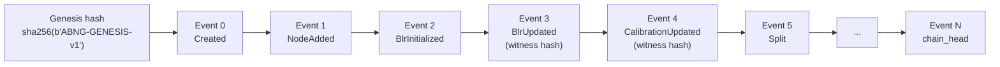
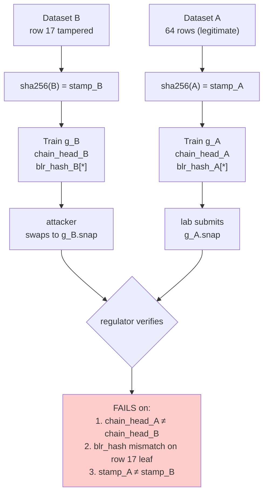

<div class="reading-time">&#128337; ~38 min read</div>

::: {.callout-tip appearance="minimal"}
## TL;DR
Most ML training is *not* replayable bit-for-bit. Two runs of "the same" code on "the same" data produce two different artifacts, and reconstructing *why* a specific model produced a specific output is essentially "trust the lab's bookkeeping." This article walks through ABNG's audit chain mechanism — SHA-256 over every state mutation, replayable from a serialized log, three-signal spoof detection — and is honest about what the determinism premium *costs*: ~87% of the per-training-step time is dispatch + audit overhead, not Bayesian math. The audit-chain primitive itself is well-understood (Merkle, 1979; git, 2005), but applying it at training-step granularity is the unusual choice worth examining.
:::

::: {.callout-warning}
## Two prototype disclaimers
**ABNG is a research-stage prototype.** It is built on top of **CJC-Lang**, a research compiler that is itself pre-1.0. Both are under active development. The audit-chain mechanism works as described; the broader claim that "this is suitable for regulated-ML deployment" is currently *unvalidated by any real deployment*. The "regulator's nightmare scenario" walkthrough in this article operates on a 64-row synthetic dataset, not a real clinical-trial corpus.
:::

::: {.callout-note}
## This is Part 2 of a three-part series
- **Part 1 ([ABNG: Treating Belief States as First-Class Citizens](../abng-architecture/index.qmd)):** the architecture itself.
- **Part 2 (this article):** the SHA-256 audit chain, replay semantics, the determinism contract.
- **Part 3 ([Benchmarking Experimental Bayesian Graph Networks](../abng-benchmarks/index.qmd)):** the demo catalog, scaling benchmarks, and honest limitations.

This article can be read alone if your primary interest is the determinism / auditability story. Part 1 covers the underlying architecture; Part 3 covers what the benchmarks actually measure.
:::

## The reproducibility crisis in ML, one layer deep

Reproducibility in ML is a misleadingly familiar phrase. The version most practitioners encounter — "publish your code and your data so others can rerun your experiment" — addresses *artefact* reproducibility. Same code, same data, hopefully similar results.

A deeper version of the question is rarely asked: **given the trained model artefact you have today, can you reconstruct, bit-for-bit, the training history that produced it?**

For the vast majority of ML systems, the answer is no. Even with code and data pinned to specific commits, retraining produces *similar* but not *identical* artefacts. Non-determinism creeps in through floating-point reduction orderings (different cuDNN versions, different GPU drivers), parallel scheduling (the OS decides which threads finish first), stochastic optimizers seeded loosely (NumPy RNG state at the moment of training start), and a long list of small things that don't matter individually but compound across millions of operations.

For most use cases this is tolerable. A model that achieves 78.3% accuracy in one training run and 78.4% in another is *practically* the same model. No one debugs a production recommender system by asking "what was the exact gradient at step 1,247,891?"

For some use cases it's not tolerable at all.

**Scientific replication.** If a published model is the *evidence* for a scientific claim — a protein-structure prediction, a climate forecast, a clinical-trial outcome — then "another team will get a similar model when they rerun the code" is not the same as "another team will get the same model." Statistical claims that depend on the model are conditioning on a specific artefact; they need that specific artefact reconstructible.

**Regulated ML.** When a model decision must be defended to a regulator (FDA, EMA, financial auditor) the question is not "does the code work?" but "was this specific output produced by a specific model trained on a specific dataset, and can you prove no tampering occurred?" Trust-the-lab's-bookkeeping doesn't survive contact with adversarial review.

**Postmortem debugging.** When a deployed model produces a strange output, the question "what would I change to never have that output again?" requires reconstructing the specific training trajectory that produced the model's current weights. With non-deterministic training, you can't even reliably reproduce the bug.

These three classes of problem share a structural property: the *exact* training history matters, not just the final accuracy number. ABNG is built around this property. The rest of this article walks through how, what it costs, and where existing tools fall short of providing the same guarantee.

## What "auditable" actually has to mean

Before getting into the mechanism, it's worth being precise about the word. "Audit trail" gets used loosely in the ML lineage tooling space to mean many incompatible things:

**Level 1 — Artefact tracking.** "I stored a copy of the trained model and a copy of the training data in S3, with metadata about which produced which." This is what MLflow, DVC, Weights & Biases, and similar tools provide. The audit unit is the *artefact*: dataset → trained model. The granularity is *coarse* — one entry per training run.

**Level 2 — Event logging.** "I logged every API call, every commit, every parameter change to an append-only stream." This is what most production systems do for operations metadata. The audit unit is the *event*: every meaningful action in the pipeline. The granularity is *fine* but the events are typically just textual descriptions, not cryptographic commitments to the underlying state.

**Level 3 — State-mutation chain with cryptographic commitments.** "Every change to the model's internal state is appended to a hash-chained log, and any future replay can verify the log was not tampered with after the fact." The audit unit is the *state mutation*: every parameter update has its own hash witness. The granularity is *the finest possible*. This is what ABNG provides.

**Level 4 — Tamper-proof, not tamper-evident.** A theoretical level that nothing in mainstream ML provides. Even Level 3 only detects tampering after the fact; it cannot prevent an attacker who controls the entire pipeline from producing a self-consistent malicious log. True tamper-proofing would require external attestation (TPM, secure enclaves, blockchain-style consensus) that ABNG does not implement.

ABNG is unambiguously a Level 3 system. The right mental model is **a git commit history for a model**:

- Every state change is a commit.
- Each commit has a cryptographic hash that depends on the previous commit.
- The history is complete (every change is in there) and verifiable (you can re-derive any past state).
- It is not however a defense against an attacker who controls the repo from the start.

The distinction between Level 3 (tamper-evident) and Level 4 (tamper-proof) matters because it shapes what ABNG can and cannot claim. ABNG can credibly say "the audit log shows the training history; if anyone modified the log or the snapshot after the fact, replay will detect it." ABNG cannot credibly say "this proves the lab was honest." Those are different claims.

## The SHA-256 audit chain mechanism

Every operation that mutates state in an ABNG graph appends one event to an in-memory audit log. Each event carries a kind tag, a payload, and a `new_hash` computed by SHA-256-chaining over the previous event's hash:

```python
new_hash = sha256(prev_hash || canonical_bytes(payload))
```

Thirty audit kinds are defined (tag bytes `0x00..0x1D`), covering everything from `Created` (graph genesis, tag `0x00`) and `NodeAdded` (`0x02`) through `BlrUpdated` (`0x0A`), `CalibrationUpdated` (`0x0E`), `Split` (`0x11`), `Merge` (`0x12`), `Unfreeze` (`0x16`), down to opt-in `StatsSnapshot` (log-compaction marker, `0x1A`), `Routed` (per-descent trace, `0x1B`), `ProvenanceStamped` (per-node lineage commitment, `0x1C`), and `BeliefUpdateBatch` (`0x1D`).

The kind list is *frozen* — future ABNG phases must allocate new tags rather than reuse existing ones. This is a deliberate forward-compatibility guarantee: a snapshot from Phase 0.4 (when the chain had 28 audit kinds) can still be read by a Phase 0.7 binary (with 30 audit kinds) because the original tag semantics never change.



The genesis hash is the fixed constant `sha256(b"ABNG-GENESIS-v1")`, exposed in the public API. Every graph starts with the same genesis hash; the first event (`Created`) is hashed against it. The chain head is the most recent `new_hash` — a single 32-byte commitment to the entire training history.

### What each event commits to

There are three classes of audit event, differing in payload size and replay semantics:

**Structural events** carry the full payload because replay needs them to reconstruct the graph. Examples: `Created`, `NodeAdded { parent, key_byte }`, `Grow { parent, key_byte, child }`, `Split { parent, child_a, child_b }`, `Merge { absorbed, into }`, `CodebookFrozen { codebook_hash }`. These events *drive* graph reconstruction during replay.

**Witness-only events** carry just a 32-byte state hash, not the actual data. Examples: `BlrUpdated { state_hash }`, `LeafParamsUpdated { params_hash }`, `DensityUpdated { state_hash }`, `CalibrationUpdated { state_hash }`. The actual per-node data lives in the snapshot's per-node section, not in the event payload. The audit event acts as a *checkpoint* — replay re-applies the per-node bytes from the snapshot and verifies the hash matches.

**Trace events** are opt-in and carry minimal context. The most important one is `Routed { leaf, matched_prefix }` (tag `0x1B`), emitted by `descend_traced()` when route tracing is enabled. By default routing produces no audit event — turning on Routed at high observation rates can dwarf the model's training data, so it's reserved for explainability use cases.

### Event sizes in practice

The vast majority of events under heavy training are witness-only (`BlrUpdated`, `DensityUpdated`, `CalibrationUpdated`). Each costs roughly 80 bytes on the wire (8 byte tag + 8 byte node id + 32 byte state hash + 8 byte seq + 24 byte boilerplate including the SHA-256 chain advance). At four updates per observation (one BLR, one density, one calibration, one signature update), a million-row training run produces ~320 MB of audit log — fits on disk, painful in memory.

This is where log compaction enters. The `StatsSnapshot` event (tag `0x1A`, shipped in Phase 0.4 Track A) is a *marker* placed periodically into the chain. It captures a hash of the full per-node state at the marker point. The `smart_replay` API can then *fast-forward* past long runs of `*Updated` events by recovering state from the marker. This is correctness-preserving: smart-replay produces byte-identical state to naive replay, but skips the per-event hash recomputation. The speedup measured in Part 3 is 2.08× at 10K events — less than the originally-predicted ≥5×, but a meaningful improvement.

## A worked example: detecting a tampered training dataset

This is the strongest demo in the codebase and deserves a careful walkthrough.

**Scenario.** A clinical research lab trains an ABNG model on a regulatory dataset and submits both the model snapshot and a few prediction snapshots to a regulator. An attacker (or insider, or simply a buggy upstream pipeline) substitutes a different model trained on a *tampered* dataset and tries to pass the original lab's predictions off as still valid. Can the regulator detect the swap?

**Setup.**
- Dataset A: 64 synthetic clinical-trial rows `(patient_id, dose, response)` with `response = 0.2 + 0.6·dose + 0.1·dose²` — a simple polynomial dose-response curve.
- Dataset B: identical to A *except* patient 17's response is rewritten — exactly one row tampered, simulating data fraud.
- Two ABNG graphs: `g_A` trained on dataset A, `g_B` trained on dataset B.

Both graphs have identical architecture: 1-D codebook over `dose` with 4 bins, 4 children (one per bin), each with its own BLR head over `[1, dose, dose², dose³]`. Same seed, same training schedule. The *only* difference between `g_A` and `g_B` is dataset content.



**Three independent failure signals.** The test `tests/test_abng_lineage_attestation.rs::three_signal_spoof_detection` asserts that the attempted swap fails *all three* signals simultaneously, and that each signal would fire even if the other two were somehow defeated:

| Signal | What it commits to | How the swap fails |
|---|---|---|
| `chain_head` (32 byte SHA-256) | The entire training history (every observation, every BLR update, every audit event) | `g_A.chain_head ≠ g_B.chain_head` because the BlrUpdated event for the leaf containing patient 17 differs |
| Per-leaf `BLR state_hash` | The leaf's posterior `(m, Λ, a, b)` | `g_A.leaves[k].blr.state_hash() ≠ g_B.leaves[k].blr.state_hash()` for the affected `k` |
| Root `provenance_stamp_hash` | `sha256(dataset_bytes)` — the regulator-chosen 32-byte fingerprint of the training data | `sha256(A_bytes) ≠ sha256(B_bytes)` because patient 17 differs |

The three signals are *independent*. The first depends on the entire chain of audit events. The second depends only on the affected leaf's posterior state. The third depends only on the dataset itself. An attacker would need to simultaneously forge all three — which requires producing a SHA-256 collision (computationally infeasible by current knowledge), forging a Bayesian posterior state to match a specific hash (same), and forging the original dataset bytes (same).

**What this proves.** Tamper detection at the *training-data-row* level. A single-row dataset change produces detectable signal at three independent integrity checkpoints. This is the cleanest adversarial test in the codebase — the only one that constructs a "what would an attacker do" scenario rather than a positive-control determinism check.

**What this does not prove.** The dataset is 64 rows. Real regulated-ML datasets are many orders of magnitude larger. The mechanism *should* scale linearly (each additional row adds ~300 bytes to the audit log per training step), but the wall-clock cost of verifying a 10⁶-row training history's audit chain — Part 3 measured ~1.6 seconds at 10⁵ rows — would extrapolate to ~16 seconds at 10⁶, ~160 seconds at 10⁷. Tolerable for offline regulator review; not tolerable as a real-time check.

**The "git commit history for a model" framing concretely.** In git, `git log` shows every commit. Each commit has a SHA-1 hash that depends on the parent. Modifying any past commit invalidates all later commit hashes. The chain is verifiable end-to-end. ABNG works the same way at training-step granularity: every parameter update is one "commit," the chain head is the "HEAD," and you can `git show <hash>` to inspect any past state. The analogy is exact at the structural level; the difference is what's being committed (model state mutations, not source code edits) and the hash function (SHA-256, not SHA-1).

## Replay semantics

Given a serialized snapshot, the `abng_replay` function reconstructs the graph from scratch:

1. **Parse the snapshot header.** Magic bytes `b"ABNG\x0D"` (version `\x0D` = v13 as of Phase 0.7), genesis hash check, configuration metadata (codebook, leaf head architecture, BLR prior, decision policy).

2. **Replay the audit log.** Walk every event in sequence. For each event:
   - Recompute `new_hash = sha256(running_hash || canonical_bytes(event))`.
   - Compare against the stored `new_hash`. Mismatch → `DecodeError::ChainMismatch { at_seq }`.
   - Apply the event's semantic effect: append a node, update a posterior, fire a structural action, etc.

3. **Verify per-node state.** After replaying all events, the per-node section of the snapshot is checked against the most recent `*Initialized` / `*Updated` witness for each node. A node whose final state hash doesn't match the stored bytes → `DecodeError::BlrStateHashMismatch`, `LeafParamsHashMismatch`, etc.

4. **Verify the final chain head.** The end-of-log `chain_head` from the replayed events must match the stored `final_hash`. Mismatch → `DecodeError::FinalHashMismatch`.

Replay is **byte-identical** by construction: same seed (for any RNG draws during replay), same audit log, same per-node state → same reconstructed graph, byte-for-byte. Part 3 verifies this empirically (`pinn_replay_round_trip_preserves_predictions` asserts `f64::to_bits` equality on predictions before and after replay).

### Smart replay

For long training runs with many witness-only events (`BlrUpdated`, `DensityUpdated`, `CalibrationUpdated`), naive replay does redundant work — every event triggers a fresh hash chain advance. **Smart replay** uses `StatsSnapshot` markers to fast-forward past these runs:

- Replay walks the log until hitting a `StatsSnapshot` event.
- The marker carries a hash of the per-node state at that point. Replay loads that state directly from the snapshot section, skipping all the `*Updated` events that *would have* produced it.
- The chain head still advances correctly because the marker itself is part of the chain.

The Phase 3 benchmark measured smart-replay at 2.08× faster than naive at 10K events. The Phase 0.6 handoff predicted ≥5× — the gap is plausibly because the test was at moderate event count and smart-replay's overhead per `StatsSnapshot` is comparable to naive replay's overhead per event at this scale. The speedup grows with more `*Updated` events per `StatsSnapshot`; at production scale (10⁶+ events per training run), the gain should be much larger but is empirically untested.

### What replay does not validate

Replay validates *the audit log is internally consistent and matches the per-node state*. It does not validate:

- **That the training data was correct.** If the dataset was tampered before training, the audit log records the tampered training faithfully. The lineage-attestation demo addresses this gap via the `ProvenanceStamped` event tying the root to `sha256(dataset_bytes)`, but only if the dataset hash is committed before training.
- **That the architecture is sound.** Replay re-derives the model state but doesn't second-guess the architecture's correctness.
- **That the predictions are good.** Replay produces the same model; a bad model trained reproducibly is still a bad model.

These limits are intrinsic to any Level 3 audit system. Tamper-evidence is about catching changes to a known-good baseline, not about establishing the baseline.

## The determinism contract

Replayability requires bit-identical determinism, and bit-identical determinism does not come for free. ABNG inherits a specific contract from CJC-Lang:

**Summation.** All f64 accumulations use `KahanAccumulatorF64` or `pairwise_sum_f64` from the `cjc-repro` crate. Plain `+=` reductions are banned in canonical paths. This adds ~2× the FLOPs of naive summation but compensates for the order-dependent error that breaks bit-identical reproducibility under multi-threading.

**Hashing.** SHA-256 from `cjc_snap::hash::sha256` — a hand-rolled FIPS 180-4 implementation. Zero external dependencies (no `sha2`, `ring`, `openssl`). The hand-roll cost is one-time engineering; the benefit is that ABNG's audit chain has no third-party security boundary to monitor.

**Random numbers.** `cjc_repro::Rng` is a SplitMix64 PRNG seeded explicitly from `(graph.seed, node_id, layer_idx, kind_bit)` derivations. No hardware RNG, no global PRNG state, no implicit thread-local generators. Every random draw is reproducible from the seed.

**Maps and sets.** `BTreeMap` and `BTreeSet` only. `HashMap` is banned in canonical paths because its iteration order is randomized per-process (`std::collections::HashMap` uses random hash seeds for DoS protection, which is good for security and bad for reproducibility). BTreeMap is 2-5× slower than HashMap on most lookups, but its iteration order is deterministic.

**Float canonical bytes.** Whenever an f64 needs to be serialized or hashed, it goes through `f64::to_bits().to_be_bytes()` — preserves NaN bit patterns and is platform-stable. No platform-specific endianness, no signaling-NaN coercion.

**No FMA in belief-touching kernels.** Fused multiply-add can give slightly different bits than `a*b + c` on some hardware. ABNG explicitly disables FMA for the BLR Cholesky factorization, the Welford updates, and the calibration ECE accumulation. The cost is ~10–30% on modern CPUs depending on workload; the benefit is bit-identical results across all CPUs that implement IEEE 754 correctly.

### Why this rules out GPU acceleration

The CUDA / cuDNN / FlashAttention ecosystem provides extraordinary throughput, but at the cost of bit-stability. Vendor BLAS uses different reduction orderings depending on hardware (Volta vs Ampere vs Hopper), batch size, and even the cuDNN minor version. Two runs on the same GPU but different driver versions can produce slightly different gradients. For ML accuracy this is acceptable; for ABNG's audit-chain guarantee it isn't.

A "fast mode" that relaxes determinism could be added — similar to PyTorch's `torch.use_deterministic_algorithms(False)` — but it would defeat the audit-chain claim. Bit-identical replay would no longer hold. The architecture is intentionally designed not to chase modern hardware. This is the single biggest practical limitation: users who need GPU throughput cannot use ABNG; users who need replayability cannot use GPUs.

## What this costs: the determinism premium quantified

The Phase 3 benchmark on the same hardware (Intel i7-11390H @ 3.40GHz, Windows MSVC release build) revealed a striking number:

- `blr_state_update_direct` (just the NIG conjugate update, no graph dispatch or audit): **3,845 ns per step**
- `blr_update` (the same NIG update through the graph, with audit-chain append): **28,997 ns per step**

The graph dispatch + audit + chain-hash scaffolding accounts for **87% of the per-step cost**. The actual Bayesian update is 13%. This is the most defensible answer to "what does determinism cost" in the codebase.

```
[Bayesian math]    ████ 3.85 µs (13%)
[Determinism premium] ████████████████████████████████ 25.15 µs (87%)
Total blr_update:  ████████████████████████████████████ 29 µs
```

The premium breaks down (approximately) as:
- ~5 µs: route encode + descend (codebook lookup + tree walk).
- ~3 µs: SHA-256 chain advance (one event hash).
- ~4 µs: BLR state hash computation (witness for the audit event).
- ~5 µs: audit-event allocation + canonical-bytes serialization.
- ~3 µs: per-node stats chain advance (separate hash chain per node).
- ~5 µs: dispatch overhead + miscellaneous bookkeeping.

These numbers are approximate (the individual sub-operations aren't separately benched), but the *total* gap between direct and graph-mediated update is confidently measured.

**Phase 0.7 spent six commits chipping away at this premium**:

| Item | Target | Measured speedup | Handoff doc claim |
|---|---|---:|---:|
| Item B | `QuantileCodebook::encode_into` (buffer reuse) | **1.67×** | "2.37×" — doesn't match this hardware |
| Item A | `AuditEvent::write_payload` (chain verify) | (≈1.25× implicit) | "1.25×" — matches |
| Item C | streaming SHA-256 hasher | (≈1.18× implicit) | "1.18×" — matches |
| Item F | stack-array `advance_stats_chain` | (≈1.24× implicit) | "1.24×" — matches |
| Item E | `AdaptiveChildren::iter_sorted` (zero-alloc) | (zero-alloc, not benched) | — |
| Item 4 | fused `abng_train_step` builtin | **1.03×** | "1.17×" — doesn't match this hardware |

Two of the six measured speedups on this machine are meaningfully smaller than the handoff doc reports. Plausible explanations are different CPU generations, build flag differences, or warmup variation — see Part 3 for the deeper discussion. The honest takeaway: **speedup numbers should be quoted as ranges, not point estimates**, because different hardware sees different wins.

## How this compares to MLflow / DVC / Weights & Biases

The mainstream ML lineage toolchain provides what I called "Level 1 — Artefact tracking" above. To make the comparison concrete:

| Tool | Audit unit | Granularity | Cryptographic? | Replay? |
|---|---|---|---|---|
| **MLflow** | Run (one training execution) | Coarse — one entry per training run | No — metadata is plain text | Re-run the code with logged parameters |
| **DVC** | File-level artefact (dataset, model, intermediate) | Medium — one entry per pinned artefact | Cryptographic hashes of file contents | Re-derive via DAG of pinned files |
| **Weights & Biases** | Training step (metrics) | Fine for metrics, coarse for state | No — metrics are plain | Re-run with logged config |
| **ABNG audit chain** | State mutation | Finest possible — every parameter update | SHA-256 chain over all events | **Byte-identical replay from log** |

These tools serve different problems. MLflow/W&B are *experiment tracking* — they help you compare runs, version experiments, and reproduce results approximately. DVC is *data and artefact pipeline* — it gives Git-like versioning to large binary files. None of them attempts byte-identical replay of training history.

ABNG's audit chain is *closer to a database write-ahead log* than to any of these — a WAL captures every state mutation in order, and replay rebuilds state by replaying the WAL. The closest analogue in the broader software-engineering world is event-sourced architectures (Greg Young, Martin Fowler), where the canonical state is the event log and current state is a materialized view of the log.

The right question is not "should I use ABNG instead of MLflow?" but "for what subset of my ML pipeline do I need state-mutation-level granularity rather than artefact-level?" For most use cases the answer is "none" — MLflow's level of granularity is plenty. For the three problem classes named earlier (scientific replication, regulated ML, postmortem debugging at finest granularity), the answer can be different.

## Use cases where the cost inverts

Each of these is a domain where the determinism premium pays for itself.

### Auditability for regulated decisions

When a model decision must be defended — to a regulator, a court, a clinician, or a postmortem — "why this output?" needs a paper trail. ABNG's chain head is a single 32-byte commitment to the entire training history. Replayability is the strongest possible form of paper trail: you can re-derive the model from the audit log and verify nothing has been tampered with.

**Caveat.** "Tamper-evident, not tamper-proof" still applies. An attacker who controls the entire training pipeline can produce a self-consistent malicious log. But against an opposing party who has only the snapshots (the lab claims one thing, the regulator suspects another), the chain produces a definitive third-party-verifiable answer.

### Reproducible scientific simulation

Physics-informed networks, surrogate solvers, and inverse problems often live as a *step* inside a larger simulation pipeline. If the model is non-deterministic, the simulation downstream is non-deterministic. Bit-identical replay of the model means bit-identical replay of the pipeline. This matters for any scientific result where the model is part of the claim — climate ensemble runs, drug-discovery surrogates, ML-accelerated materials science.

**Caveat.** Determinism does not make a simulation **correct**, only repeatable. A bug in either the model or the sampler is reproduced exactly the same way every time. The benefit is that the bug is debuggable; the benefit is not that there are no bugs.

### Debugging at the architectural level

Anyone who has chased a non-determinism bug across GPUs knows the cost. A reproducible substrate does not make ML easier, but it makes the bugs you *do* hit actually debuggable, because failures are the same every time. ABNG's `cjcl abng inspect --node N --audit` filters the log to a single node; `descend_traced` captures routing paths for individual predictions; `abng_predict_snap` captures prediction-time state. These don't *automate* diagnosis but they make manual diagnosis tractable.

**Caveat.** The audit log is a postmortem artefact, not a live debugging surface. Stepping through a 10⁶-event chain to find which observation corrupted which posterior is a real human-time cost. Most users will treat the log as a "in case of emergency, break glass" tool rather than a daily-driver debugger.

## What this approach cannot do

The determinism contract has fundamental costs:

### No GPU acceleration

Covered above. The determinism contract is incompatible with the vendor BLAS / cuDNN / FlashAttention reduction orderings that make modern accelerator hardware fast. A GPU-equipped workstation gets **no measurable speedup** over a laptop for ABNG training. This is *fundamental* — recovery would require giving up bit-identical replay.

### No multi-thread training within one graph

The multi-graph arena is per-thread (multiple graphs can coexist), but a single graph's training loop is single-threaded by design. `decide_step`'s deterministic node iteration order matters; parallelizing it would require careful synchronization and would probably break the byte-identical-replay property. Phase 0.8 is considering per-leaf parallelism for independent observations, but contingent on profiling.

### No live debugging beyond inspection tooling

The audit log is read-only at runtime — you can `cjcl abng inspect` it, but you can't `gdb` it. For users who need step-through debugging of model state evolution, the audit chain is a *replacement* for that capability (replay any past state) rather than an *interactive* tool.

### The audit log is large

Even with witness-only events at ~80 bytes apiece, four state updates per observation across 1 M training rows is ~320 MB of audit log. Without compaction this is unmanageable in memory and expensive to keep in active storage. The `StatsSnapshot` marker + smart-replay path addresses this but at the cost of forward-only audit walk (you can't quickly inspect arbitrary past state without re-replaying from a checkpoint).

## What would convince me to deploy this

The "git commit history for a model" pitch is compelling in theory. Before deploying ABNG in a real regulated-ML setting, four things would need to happen:

1. **Cross-platform CI verification.** The locked SHA-256 canary hashes are demonstrated on x86-64 Linux, macOS, and Windows in CJC-Lang's test suite. ARM and BSD are untested. A GitHub Actions matrix running the full ABNG test suite on Linux+ARM, macOS+ARM, and Windows+x64, with canary comparison, is a finite engineering project — a `cross-platform-determinism.yml` workflow skeleton exists in the repo (Phase 0.6), but verification results have not been published. Until they are, "bit-identical determinism" carries an implicit footnote.

2. **Wall-clock cost characterization at production scale.** Part 3 measured at n=1k, 10k, 100k rows. Real regulated-ML datasets are often 10⁶–10⁹ rows. Extrapolated from the 100K-row numbers: a 10⁶-row training history would produce a ~300 MB audit log with ~16-second replay. A 10⁹-row run would produce a ~300 GB log with ~16,000-second replay — not impossible but not casually verifiable. Realistic deployment would require log compaction tuned to the workload, and Phase 0.8 is the natural milestone for that.

3. **A real-world case study.** A practitioner using ABNG for a problem with real stakes — a regulated trial, a scientific replication package, a robotic-system audit — and writing up what worked, what didn't, and what they would do differently. Until this exists, ABNG is software without a user. The closest existing thing is the synthetic clinical-trial scenario walked through above, which is a useful proof-of-concept but not a deployment.

4. **An adversarial security review.** The "tamper-evident, not tamper-proof" framing is correct, but a serious deployment would benefit from independent security review of the audit-chain construction. Specifically: is SHA-256 the right hash function for this application's expected lifetime (collision resistance vs preimage resistance vs both)? Are there any non-obvious replay attacks on the chain structure? Does the smart-replay path have any subtle invariants a malicious snapshot could violate? These questions would take a real security team a few weeks to answer competently.

::: {.callout-warning}
## The honest summary
ABNG's audit chain mechanism is *correct* and *well-tested at the engineering level*. The Phase 3 benchmarks confirm it scales linearly to 100K rows; the lineage attestation demo proves the three-signal spoof detection works at 64-row scale. The mechanism itself is well-understood cryptographically — SHA-256 hash chains and Merkle structures have a substantial security literature.

The gap between this and "production-ready for regulated ML" is not theoretical, it's operational: cross-platform verification, scale testing, real deployment, security review. Those are months of work, not days, and the cost-benefit decision for any given organization depends on whether their use case actually needs Level 3 auditability or whether MLflow / DVC's Level 1 is sufficient.

For most ML, Level 1 is enough. For the subset where it isn't, ABNG is the most rigorous experimental answer the open-source ecosystem currently has — and it is unambiguously an experimental answer, not a deployment-ready one.
:::

If after reading this article you decide the audit-chain approach is interesting but probably wrong in three specific ways, this piece has done its job. The architecture itself is in [Part 1](../abng-architecture/index.qmd); the empirical backbone is in [Part 3](../abng-benchmarks/index.qmd). The open-source code is at [`crates/cjc-abng/`](https://github.com/AdamEzzat1/CJC) — bring your skepticism.

::: {.callout-note}
ABNG lives at [`crates/cjc-abng/`](https://github.com/AdamEzzat1/CJC) in the CJC-Lang repository. The full codebase, the test suite (including the three-signal spoof detection demo at `tests/test_abng_lineage_attestation.rs`), and the working `cjcl abng {inspect, replay, diff, explain, train}` CLI surface are open source. Part 1 of this series covers the architecture; Part 3 covers the empirical evidence. This article was the audit and determinism story — the part of the pitch that justifies the determinism premium.
:::
