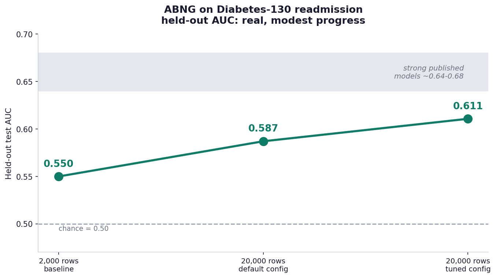
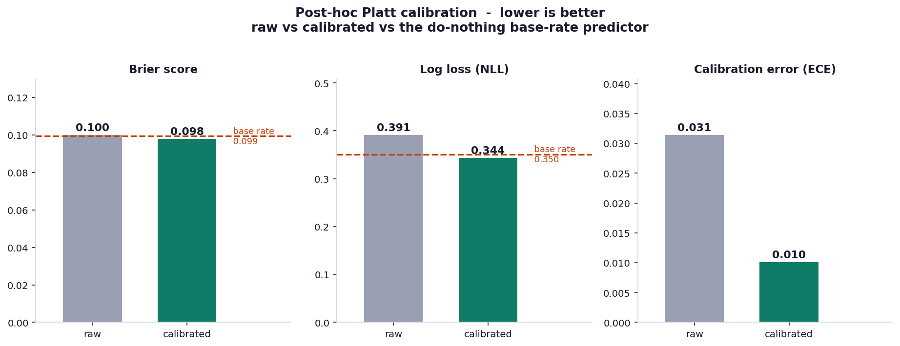
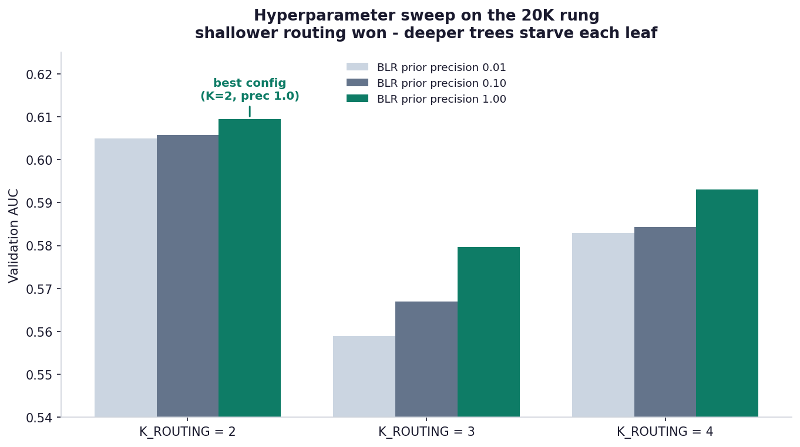

<div class="reading-time">&#128337; ~13 min read</div>

::: {.callout-tip appearance="minimal"}
## TL;DR
I put **ABNG** — the Adaptive Belief Network Graph, an experimental, deterministic, auditable belief-graph model built in CJC-Lang — onto a **real medical dataset**: UCI *Diabetes 130-US Hospitals*, 101,766 hospital encounters, predicting 30-day readmission. It's a genuinely hard, heterogeneous, ~11%-imbalanced clinical benchmark.

Held-out test **AUC went 0.550 → 0.587 → 0.611** as I scaled the data and ran a validation-only hyperparameter sweep. Post-hoc **Platt calibration** then moved the probabilistic metrics from *worse than the do-nothing baseline* to *better than it* — Brier 0.100 → 0.098, log-loss 0.391 → 0.344, calibration error 0.031 → **0.010**.

**The honest headline: none of ABNG's core architecture changed.** The gains came from a leakage-free evaluation protocol, tuning ABNG's *configuration*, and a harness-side calibration step. Determinism and the audit chain held throughout — precisely *because* the core was left untouched. AUC 0.611 is modest (strong published models reach ~0.64–0.68); this is an honest baseline, not a record. And ABNG remains experimental — I'm still iterating.
:::

::: {.callout-warning}
## Prototype disclaimer
**ABNG is a research-stage prototype**, built on **CJC-Lang**, a research compiler that is itself pre-1.0. Both are under active development. The numbers here are a single, fully-reproducible snapshot from one experiment campaign — not a validated benchmark, not deployed, not peer-reviewed. Read them as honest exploratory engineering.
:::

::: {.callout-note}
## Where this sits in the ABNG series
- [ABNG: Treating Belief States as First-Class Citizens](../abng-architecture/index.qmd) — the architecture.
- [Deterministic and Auditable Neural Systems](../abng-deterministic-systems/index.qmd) — the audit chain + determinism contract.
- [Benchmarks Part I](../abng-benchmarks/index.qmd) and [Part II](../abng-benchmarks-part-2/index.qmd) — the controlled benchmark deep-dive.
- **This post** — the first time ABNG meets a *real, messy, external* dataset rather than a controlled benchmark.
:::

## 1. Why a real dataset, and why this one

The earlier ABNG benchmark posts measured the architecture on *controlled* problems — synthetic PINNs, designed routing distributions, scripted drift scenarios. Those answer "does the mechanism work?" They do not answer "does it survive contact with real, messy data?"

So this post takes ABNG to a dataset I did not design: **UCI Diabetes 130-US Hospitals for Years 1999–2008**. It is a genuine, widely-cited clinical benchmark — de-identified records of **101,766 hospital encounters of diabetic patients across 130 US hospitals over ten years**, introduced by Strack et al. (2014). The prediction task is the published one: will this patient be **readmitted within 30 days**?

It is a deliberately unforgiving choice on three axes at once:

- **It is genuinely complex.** 50 heterogeneous columns: demographics, **23 medication columns**, **three ICD-9 diagnosis codes with 700+ distinct values each** (very high cardinality), lab results, admission / discharge / source codes, visit counts. Missingness is heavy — `weight` is ~97% missing; `payer_code` and `medical_specialty` are largely missing.
- **It is class-imbalanced.** Only **~11.2%** of encounters are 30-day readmissions.
- **It is a hard target.** Whether a patient is readmitted depends on post-discharge factors — social support, follow-up care, medication adherence — that simply are not in the data. That is *irreducible* noise. It is why strong published models on this task top out around **AUC 0.64–0.68**; nothing reaches 0.9 here, and a model that claimed to would be suspect.

That last point matters for reading everything below. On a dataset like this, **a modest honest number is the correct outcome**, and inflated numbers are the warning sign.

## 2. The evaluation protocol (the part that has to be right)

Before any result is worth reporting, the protocol has to be leakage-free. ABNG's harness for this dataset does the following, and the discipline here is more important than any single metric:

- **The feature transform is fit on the training split only.** Category vocabularies, one-hot widths, routing-feature selection — all learned from train rows, never from validation or test.
- **A 70 / 15 / 20-style stratified split** into train / validation / test, stratified on the readmission label so all three splits share the ~11% positive rate.
- **Every tuning decision is made on validation, never on test.** The decision threshold and the model hyperparameters are both selected by validation score; the test split is touched exactly once, for the final reported numbers.
- **Deterministic throughout.** Fixed seed (42), deterministic SplitMix64 shuffles, deterministic reductions. Re-running reproduces every digit (see §7).

This is unglamorous, and it is the whole game. The most common way to get a flattering number on an imbalanced dataset is to let the test set leak into a tuning decision; the protocol above is designed so that cannot happen.

## 3. What changed to reach these numbers — honestly

Here is the question I most want to answer straight, because it would be easy to dress it up: **what architectural changes did ABNG need to work at these numbers?**

**None. ABNG's core architecture did not change.**

The belief graph, the per-leaf Bayesian Linear Regression (BLR) heads with their closed-form conjugate updates, the SHA-256-hash-chained audit log, the deterministic execution contract — all of it is exactly as described in the earlier architecture post. Not one core data structure or update rule was modified to produce the results below.

What *did* change lives entirely **around** ABNG, not **inside** it:

| Lever | What it is | Layer |
|---|---|---|
| More data | 2,000 → 20,000-row stratified sub-sample | Experiment design |
| Routing depth | `K_ROUTING` tuned by validation sweep (see §5) | ABNG *configuration* |
| BLR prior strength | Prior precision tuned by the same sweep | ABNG *configuration* |
| Decision threshold | Tuned on validation, not left at 0.5 | Harness post-processing |
| Probability calibration | Post-hoc Platt scaling (see §4) | Harness post-processing |

`K_ROUTING` and the BLR prior are *configuration knobs* — dials ABNG already exposes, not new mechanisms. The threshold and the calibration are *harness-side post-processing* — they read ABNG's outputs and never touch its state.

This is not a disappointing answer; it is the point. **Determinism and auditability survived this entire experiment campaign precisely because the core was untouched.** If "improving the metrics" had meant rewriting the BLR update or adding a new audit event kind, every replay guarantee and every hash-chain canary would have had to be re-validated. Instead, the 28 SHA-256 determinism canaries never moved, because nothing they cover was edited. The honest engineering lesson: *reach for evaluation rigor and post-processing before you reach for architecture surgery.*

## 4. The result — and what calibration fixed

### 4.1 Ranking: a real but modest signal



Held-out test **AUC climbed 0.550 → 0.587 → 0.611**: 2,000 rows with default settings, then 20,000 rows, then 20,000 rows with the validation-tuned configuration. That is real signal — the model orders patients by readmission risk better than chance — but it is **modest**, and it sits *below* the ~0.64–0.68 band where strong published models on this task live. I am reporting it as an honest baseline, not a result to headline.

### 4.2 Probabilities: the uncomfortable part, and the fix

AUC only measures *ranking*. The probabilistic metrics — Brier score and log-loss (NLL) — measure whether the predicted probabilities themselves are any good. And before calibration, they were not:

- Raw **Brier 0.100** — essentially *tied* with a do-nothing predictor that outputs the 11.2% base rate for everyone (its Brier is 0.099).
- Raw **NLL 0.391** — actually **worse** than that base-rate predictor (0.351).

The cause is structural: ABNG's BLR head is *linear regression*. Linear regression has no link function — its output is unbounded and is not a calibrated probability. On 11%-imbalanced data its predictions cluster in a narrow band near the base rate, and the occasional out-of-range prediction, clamped into [0, 1], wrecks the log-loss.

The fix is **post-hoc Platt calibration**: fit a one-feature logistic — `σ(a·raw + b)` — on the *validation* predictions, then apply it to test. Two parameters, fit by Newton's method, entirely harness-side.



The effect is exactly what the theory predicts:

| Metric | Raw | **Calibrated** | Base-rate baseline |
|---|---|---|---|
| AUC | 0.611 | **0.611** | 0.500 |
| Brier | 0.100 | **0.098** | 0.099 |
| Log-loss (NLL) | 0.391 | **0.344** | 0.351 |
| Calibration error (ECE) | 0.031 | **0.010** | 0 |

**AUC is bit-identical** — calibration is a monotonic transform, so it *cannot* change the ranking, and it didn't. What it did change is the probabilities: Brier and NLL both crossed from losing to the base-rate predictor to **beating** it, and calibration error fell to **0.010**. The model's probability outputs now genuinely carry information beyond "predict the average."

::: {.callout-note}
## A calibration honesty note
In an earlier draft of this analysis I described the *raw* ECE of 0.031 as "well-calibrated — a genuine strength." That was wrong, and worth flagging. Raw ECE looked good only because the predictions were clustered into one or two histogram bins — Brier and NLL, which clustering cannot flatter, told the real story. **After** Platt calibration all three probabilistic metrics agree and all three beat the baseline. Calibration didn't just improve numbers; it made the numbers *consistent with each other*. That internal consistency is what makes the result defensible.
:::

### 4.3 The operating point

At the validation-tuned decision threshold, the tuned + calibrated model reaches **balanced accuracy ≈ 0.58** and **F1 ≈ 0.24** on the held-out test set.

A word on what is *not* reported as a headline: **raw accuracy**. On an 11%-positive dataset, a model that predicts "no readmission" for everyone scores ~89% accuracy with zero learning. Accuracy is the *wrong* yardstick here — it rewards the majority class — which is exactly why this post leads with AUC, balanced accuracy, and the probabilistic metrics instead.

## 5. The hyperparameter sweep — measure, don't assume

The routing depth `K_ROUTING` controls how deep the belief tree's routing partition goes — `K` routing features means `4^K` leaves, each with its own BLR head. My prior assumption, baked into earlier defaults, was that *more* routing features (K = 4) would help.

A validation sweep over `K ∈ {2, 3, 4}` and three BLR prior strengths said otherwise:



**K = 2 won, decisively.** The mechanism is a data-starvation effect: with ~14,000 training rows, K = 2 gives 16 leaves (~875 rows each), while K = 4 gives 256 leaves (~55 rows each) — and each leaf trains its *own* BLR. Deeper routing buys "specialization" but starves every leaf of the data it needs. On this dataset, shallow wins. (Stronger prior regularization also helped, monotonically — unsurprising on a noisy target.)

This is a small but real instance of the discipline the whole project runs on: the assumption was wrong, the sweep was cheap, and the measurement settled it.

## 6. What ABNG features held up on real data

The metrics are modest, so I will not claim ABNG's architecture produced a great model — it produced an honest, weak-but-real one. What I *can* report is which of ABNG's properties **survived contact with a messy real dataset**:

- **Determinism held end-to-end.** Two independent runs of the full pipeline — fit, train on real data, evaluate, calibrate — produced **bit-identical** metrics, despite a 3× spread in wall-clock time between them (§7). On most ML stacks, "re-run it" gives approximately the same number; here it gives the *same bytes*.
- **The audit chain stayed intact.** Every training step appends to a SHA-256 hash chain. Across the full 101,766-row dataset and every experiment variant, the chain verified — auditability is not a toy-scale property that broke on real data.
- **The routing partition did real work.** The K-sweep confirms the per-leaf structure is functional — different routing depths give measurably different models, and the partition is interpretable (you can read which leaf a patient routed to).
- **The BLR heads gave a *probabilistic* output to fix.** Because each leaf is a Bayesian regressor rather than a bare classifier, there was a real-valued score for calibration to act on. A model with no probabilistic output would have had nothing for Platt scaling to repair.

In short: the architecture's *guarantees* — determinism, auditability — held up perfectly; its *predictive strength* on this hard task is honestly modest and is the thing still being worked on.

## 7. Reproducibility

The result is deterministic. It was re-run from scratch to confirm:

```text
Run 1:  finished in 30.0 s   AUC 0.6107  Brier 0.0980  NLL 0.3435  ECE 0.0101
Run 2:  finished in 90.9 s   AUC 0.6107  Brier 0.0980  NLL 0.3435  ECE 0.0101
```

The wall-clock differs 3× (machine contention); **every metric digit is identical**, and so is the fitted Platt `(a, b) = (4.2946, −2.6183)`. That is the determinism contract working: the result is a pure function of (code, seed, data), decoupled from timing.

```bash
# From a clean checkout of the CJC-Lang repository:
git clone https://github.com/AdamEzzat1/CJC.git && cd CJC

# The Diabetes-130 experiment harness (dataset is untracked; fetch
# UCI dataset 296 into tests/data/diabetes_130/):
cargo test --test abng --release diabetes130_calibrated \
  -- --ignored --nocapture
```

Build fingerprint: Rust 1.91.1 (stable, LLVM 21.1.2), seed 42, 20,000-row stratified sub-sample, n_test = 3,002. Figures plotted with Python 3.11 / matplotlib 3.9.

## 8. Honest limitations

::: {.callout-warning}
## What this result is *not*
- **Not a record.** AUC 0.611 is below the ~0.64–0.68 range of strong published Diabetes-130 models. It is an honest baseline.
- **Single seed.** All numbers are seed 42. A multi-seed sweep to quantify variance is pending — until it lands, treat the third decimal as indicative, not pinned.
- **A 20,000-row sub-sample**, not the full 101,766 rows. The full-dataset run is future work.
- **A linear model.** ABNG's BLR heads are linear; calibration fixes the *probabilities* but not the *ranking ceiling*. A nonlinear MLP-leaf-head variant is the next experiment — it may lift AUC, or may need a lot of tuning.
- **Not deployed, not validated.** This is exploratory engineering.
:::

## 9. Still experimenting

ABNG is, and is labelled, **experimental** — and this dataset is one stop on an ongoing campaign, not a finish line. Currently on the bench:

- **Nonlinear leaf heads.** Swapping the linear BLR leaf for an MLP leaf head (a capability ABNG already has) to see whether the *ranking* ceiling moves — the lever calibration provably cannot touch.
- **The full 101,766-row run** at the tuned configuration, for a headline number on all the data.
- **Multi-seed variance** — running the pipeline across many seeds to report mean ± spread instead of a single point.

Each of these is the kind of measured, leakage-free, deterministic experiment this post is built on. If they move the numbers, a follow-up will say so honestly; if they don't, it will say that too.

::: {.callout-note}
## The honest summary
On a real, hard, imbalanced clinical dataset, ABNG produced a **modest but genuine** result — ranking meaningfully above chance, and, after calibration, probability estimates that beat the do-nothing baseline on every measure. It got there **without any change to its core architecture**: rigorous evaluation methodology, configuration tuning, and post-hoc calibration did the work, and the determinism and auditability guarantees held throughout because the core was never touched.

That is the result I can defend: not a strong model yet, but an honest one, fully reproducible, with a clear and unembellished account of how it was reached and where it falls short.
:::

::: {.callout-note}
ABNG lives at [`crates/cjc-abng/`](https://github.com/AdamEzzat1/CJC) in the CJC-Lang repository; the Diabetes-130 harness is in `tests/abng/dataset_a_diabetes130.rs`. This post is part of the ongoing ABNG series — see the architecture and determinism posts for the foundations the results above rest on.
:::
